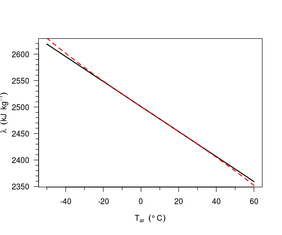
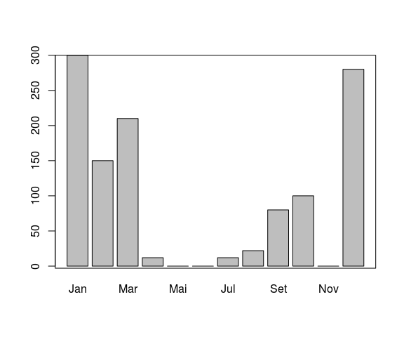
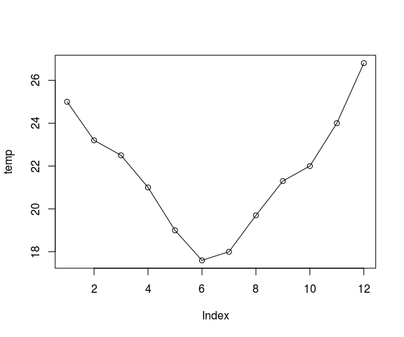
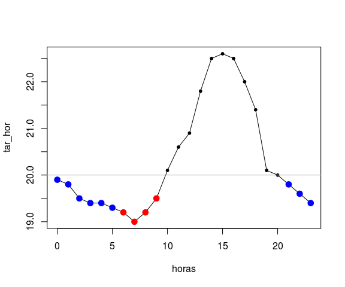

# Básico de R
Jônatan Tatsch  
19-03-2015  


- - -


- - -

# CalculadoRa

## Aritmética básica

Todas operações que realizamos com uma calculadora podem ser feitas diretamente na linha de comando do R.

```r
10 + 2 + 4
```

```
[1] 16
```

```r
# Exemplo de divisao 
(5 + 14)/2
```

```
[1] 9.5
```

```r
# exponenciação
2^3
```

```
[1] 8
```

```r
4^0.5
```

```
[1] 2
```

```r
# operador artimético para se determinar o resto de uma divisao
10 %% 2
```

```
[1] 0
```

```r
11 %% 2
```

```
[1] 1
```

```r
2001 %% 2
```

```
[1] 1
```

```r
## operador de divisão inteira
11 %/% 2
```

```
[1] 5
```

Conheça mais operadores aritméticos, digitando na linha de comando:

```r
?"Arithmetic"
```

## Constantes

O R tem 4 constantes pré-definidas:

```r
pi
```

```
[1] 3.141593
```

```r
## vetores prédefinidos no R
LETTERS
```

```
 [1] "A" "B" "C" "D" "E" "F" "G" "H" "I" "J" "K" "L" "M" "N" "O" "P" "Q"
[18] "R" "S" "T" "U" "V" "W" "X" "Y" "Z"
```

```r
letters
```

```
 [1] "a" "b" "c" "d" "e" "f" "g" "h" "i" "j" "k" "l" "m" "n" "o" "p" "q"
[18] "r" "s" "t" "u" "v" "w" "x" "y" "z"
```

```r
month.abb
```

```
 [1] "Jan" "Feb" "Mar" "Apr" "May" "Jun" "Jul" "Aug" "Sep" "Oct" "Nov"
[12] "Dec"
```

```r
month.name
```

```
 [1] "January"   "February"  "March"     "April"     "May"      
 [6] "June"      "July"      "August"    "September" "October"  
[11] "November"  "December" 
```


## Funções matemáticas internas

Existem diversas funções internas do R que permitem, por exemplo, sortear números aleatóriamente, arrendondar números, calcular o fatorial, calcular o seno, cosseno de um ângulo e etc. Para usar uma função no R apenas digite o nome da função seguido de parênteses:

```r
## funções trigonométricas
sin(pi/6)
```

```
[1] 0.5
```

```r
cos(pi)
```

```
[1] -1
```

```r
## raiz quadrada
sqrt(100)
```

```
[1] 10
```

```r
## exponencial
exp(1)
```

```
[1] 2.718282
```

```r
## fatorial
factorial(4)
```

```
[1] 24
```

No R você verá que parênteses são frequentemente utilizados. Isso ocorre eles estão sempre associados à funções. Qualquer palavra antecedendo um parênteses é uma função.

Para ver a lista completa de funções trigonométricas:

```r
?"Trig"
```

O código abaixo ilustra como sortear número(s) a partir de uma sequência numérica de 1 à 10. A função `set.seed()` especifica uma semente para geração de números aleatórios. Ao definirmos a semente (argumento *seed* da função `set.seed`) os números sorteados serão reproduzidos igualmente na sua máquina.

```r
set.seed(seed = 5)
## sorteio de um número dentro da sequência de 1 a 10
sample(x = 1:6, size = 1)
```

```
[1] 2
```

```r
## sorteio de 5 números dentro da sequência de 1 a 10
sample(x = 1:6, size = 5)
```

```
[1] 5 6 2 1 4
```

```r
## sorteio de 10 números dentro da sequência de 1 a 10
## resultado sem números repetidos
sample(x = 1:6, size = 5, replace = TRUE)
```

```
[1] 4 5 6 1 2
```

```r
## resultado com números repetidos
sample(x = 1:10, size = 10, replace = TRUE)
```

```
 [1] 5 4 6 3 3 4 9 6 9 9
```

```r
## sorteio de 20 números dentro da sequência de 1 a 10
## nesse caso a reposição deve ser feita (size > n) então podem 
## ocorrer números repetidos
sample(x = 1:10, size = 20, replace = TRUE)
```

```
 [1]  8  3  3  2  5  5 10  2 10  5  1  3  1  1  5  6  6  4  4  9
```

Os argumentos de uma função são obtidos pela função `args()`. Por exemplo quais são os argumentos da função `sample()`?

```r
args(sample)
```

```
function (x, size, replace = FALSE, prob = NULL) 
NULL
```


## Valores numéricos especiais

Um caso particular sobre operação aritméticas no R, são os valores numéricos `Inf`e `NaN` que resultam de operações como: 

```r
2/0
```

```
[1] Inf
```

```r
-12/0
```

```
[1] -Inf
```

```r
exp(-Inf)
```

```
[1] 0
```

```r
log(0)
```

```
[1] -Inf
```

```r
0/Inf
```

```
[1] 0
```

```r
(0:3)^Inf;
```

```
[1]   0   1 Inf Inf
```

```r
log(-0.5)
```

```
Warning in log(-0.5): NaNs produced
```

```
[1] NaN
```

```r
0/0 
```

```
[1] NaN
```

```r
Inf-Inf
```

```
[1] NaN
```

```r
Inf/Inf
```

```
[1] NaN
```
 
Na maioria das vezes precisamos trabalhar com números grandes e consequentemente acabamos usando uma notação científica ou exponencial. No R há diferentes formas de representar números com expoentes:

```r
1.2e-6
```

```
[1] 1.2e-06
```

```r
1.2E6
```

```
[1] 1200000
```

# Objetos

## Formas de atribuição 

### Objeto recebe valor

Até agora nós usamos expressões para fazer uma operação e obter um resultado. O resultado não foi armazenado para que pudéssemos reutilizá-lo posteriormente. Podemos armazenar dados em um objeto dentro do R. O que é um objeto? É um nome usado para guardar os dados, ou seja a nossa variável. Por exemplo para atribuir o valor 2 ao objeto chamado "a". Usamos a combinação dos símbolos menor (`<`) e menos (`-`) `<-`. Esse é o símbolo de atribuição a um objeto.

```r
## a recebe 2
a <- 2
a
```

```
[1] 2
```

O R diferencia letras maiúsculas de minúsculas. Portanto `a` e `A` são objetos diferentes.

```r
a
```

```
[1] 2
```

```r
A
```

```
Error in eval(expr, envir, enclos): object 'A' not found
```

Como criamos apenas o objeto **a**, o objeto A não foi encontrado. 

O objeto **a ** pode ser utilizado para criar outros objetos.

```r
x <- 10*a
x
```

```
[1] 20
```

A seta de atribuição pode ser usada em qualquer sentido. Parênteses são também utilizados para indicar a prioridade dos cálculos.

```r
 (7/3) + 0.6 -> y1
 y1
```

```
[1] 2.933333
```

```r
7/3 + 0.6 -> y2
 y2
```

```
[1] 2.933333
```

```r
7/(3 + 0.6) -> y3
 y3
```

```
[1] 1.944444
```

Vamos criar um objeto chamado `ndias3` que recebe o nº de dias no mês de Março e `ndias4` que recebe o nº de dias no mês de Abril.

```r
ndias3 <- 31
ndias4 <- 30
```

O total de dias nos meses de março e abril serão armazenados no objeto totdias:

```r
totdias <- ndias3 + ndias4
totdias
```

```
[1] 61
```

A atribuição de um mesmo valor para diferentes objetos pode ser feita da seguinte forma:

```r
## número de dias em cada mês
jan <- mar <- may <- jul <- ago <- out <- dez <- 31
abr <- jun <- set <- nov <- 30
## verificação
jan; mar; jul
```

```
[1] 31
```

```
[1] 31
```

```
[1] 31
```

```r
abr; jun; set
```

```
[1] 30
```

```
[1] 30
```

```
[1] 30
```

Nós estamos definindo o objeto, digitando o nome do objeto na linha de comando e teclando enter para ver o resultado. Há uma forma mais prática de definir um objeto e ao mesmo tempo já  mostrar o seu resultado. Isso pode ser feito cercando a atribuição por parênteses:

```r
(tar <- -50:60)
```

```
  [1] -50 -49 -48 -47 -46 -45 -44 -43 -42 -41 -40 -39 -38 -37 -36 -35 -34
 [18] -33 -32 -31 -30 -29 -28 -27 -26 -25 -24 -23 -22 -21 -20 -19 -18 -17
 [35] -16 -15 -14 -13 -12 -11 -10  -9  -8  -7  -6  -5  -4  -3  -2  -1   0
 [52]   1   2   3   4   5   6   7   8   9  10  11  12  13  14  15  16  17
 [69]  18  19  20  21  22  23  24  25  26  27  28  29  30  31  32  33  34
 [86]  35  36  37  38  39  40  41  42  43  44  45  46  47  48  49  50  51
[103]  52  53  54  55  56  57  58  59  60
```

Quando usamos o próprio objeto numa sequência de atribuições o seu valor é sobrescrito. Portanto não é bom usar nomes que já foram usados antes. Para saber nomes dos objetos já usados use a função `ls()`:

```r
ls()
```

```
 [1] "a"       "abr"     "ago"     "dez"     "jan"     "jul"     "jun"    
 [8] "mar"     "may"     "ndias3"  "ndias4"  "nov"     "out"     "pcks"   
[15] "set"     "tar"     "totdias" "x"       "y1"      "y2"      "y3"     
```

Os objetos criados também estão disponíveis no painel **Environment** do RStudio.

```r
totdias <- ndias3; totdias <- totdias + ndias4; totdias <- totdias + 365
 totdias
```

```
[1] 426
```

Quando fazemos a atribuição para diversas variáveis elas podem ser agrupadas com colchetes.

```r
{
  tmax <- 32
  tmin <- 23
  amp <- tmax - tmin
  tmed <- (tmax + tmin)/2
}
```

### Atribuição com a função `assign`

Outra forma de atribuição é através da função `assign()`:

```r
y1
```

```
[1] 2.933333
```

```r
assign(x = "x", value = 10*y1)
x
```

```
[1] 29.33333
```

Para ilustrar um caso em que a função `assign` pode ser útil, vamos supor que você tenha um vetor com os nomes que você deseja usar para definir alguns objetos, cujo resultado já está em um vetor previamente criado. 

Por exemplo, considere os nomes dos meses do ano (Jan, Feb, Mar, Apr, May, Jun, Jul, Aug, Sep, Oct, Nov, Dec) para serem usados como nomes para os novos objetos. E os valores a serem atribuídos estão armazenados no objeto `nums`, que poderia ser um vetor com resultados de uma análise para cada mês. Mas para fins de ilustração, no código abaixo, os valores do objeto `nums` são simplesmente uma sequência de 1 a 12. Ao invés de repetirmos 12 vezes a atribuição `Jan <- 1; Feb <- 2, Mar <- 3, ...`, podemos fazer um laço (ou *looping*) de 1 até o tamanho do vetor `nums` (ou seja 1:12) e usar o vetor `month.abb` para nomear os objetos.

```r
## vetor de 1 a 12
nums <- 1:12
## laço em cada elemento de nums
for (i in 1:length(nums)) assign(month.abb[i], i)
## verificando os valores dos objetos criados
Jan
```

```
[1] 1
```

```r
Feb
```

```
[1] 2
```

```r
Mar
```

```
[1] 3
```

```r
Apr
```

```
[1] 4
```

Não se preocupe se você não entendeu completamente a expressão acima, pois as funções `assign` e `for`(para fazer laços) serão mais exploradas futuramente.

## Nomeando objetos

É preciso ter cuidado ao nomear objetos no R porque existem algumas regras:

* não iniciar com um número e não conter espaços


```r
  1oAno <- 1990
#  raizDe10 <- srt(2)
#  variavel teste <- 67
  ## nomes alternativos para as variaveis
  ano1 <- 1990
  variavel_teste <- 67
  variavel.teste <- 68
```

* não conter símbolos especiais: 
    
        ^, !, $, @, +, -, /, ou *


```r
dia-1 <- 2
```

```
Error in dia - 1 <- 2: object 'dia' not found
```

```r
## alternativa
dia_1 <- 2
```

* evitar o uso de nomes usados em objetos do sistema (funções internas do R ou constantes como o número π):

        c q  s  t  C  D  F  I  T  diff  exp  log  mean  pi  range  rank  var

        FALSE  Inf  NA  NaN  NULL TRUE 
     
        break  else  for  function  if  in  next  repeat  while


* variáveis com acento são permitidas mas não recomendadas.


```r
verão <- "DJF"
verão
```

```
[1] "DJF"
```
   
--------------------------

> #### 
> #### <----------- **Aula 3 finalizada aqui** ------------->
> ####

--------------------------

# Espaço de trabalho (*Workspace*)

Enquanto trabalhamos em um sessão do R é importante sabermos os nomes dos objetos criados e o que elas contém. Para consultar os objetos criados usamos a função `ls()`. Por *default* os nomes dos objetos que iniciam com `.` não são listados, para vê-los o argumento `all.names = TRUE` deve ser passado a função:


```r
## criando objetos iniciando com "."
.y1 <- 100
.y2 <- 1000
## lista objetos
ls()
```

```
 [1] "a"       "abr"     "ago"     "Apr"     "Aug"     "Dec"     "dez"    
 [8] "dia_1"   "Feb"     "i"       "jan"     "Jan"     "jul"     "Jul"    
[15] "jun"     "Jun"     "mar"     "Mar"     "may"     "May"     "ndias3" 
[22] "ndias4"  "nov"     "Nov"     "nums"    "Oct"     "out"     "pcks"   
[29] "Sep"     "set"     "tar"     "totdias" "verão"   "x"       "y1"     
[36] "y2"      "y3"     
```

```r
## lista todos objetos criados
ls(all = TRUE)
```

```
 [1] "a"            "abr"          "ago"          "Apr"         
 [5] "Aug"          "Dec"          "dez"          "dia_1"       
 [9] "Feb"          "i"            "jan"          "Jan"         
[13] "jul"          "Jul"          "jun"          "Jun"         
[17] ".Last"        "mar"          "Mar"          "may"         
[21] "May"          "ndias3"       "ndias4"       "nov"         
[25] "Nov"          "nums"         "Oct"          "out"         
[29] "pcks"         ".Random.seed" "Sep"          "set"         
[33] "tar"          "totdias"      "verão"        "x"           
[37] "y1"           ".y1"          "y2"           ".y2"         
[41] "y3"          
```

```r
## lista todos objetos com y no nome
ls(pattern = "y")
```

```
[1] "may" "May" "y1"  "y2"  "y3" 
```

Depois de certo tempo, o seu espaço de trabalho pode ficar lotado. Nós podemos remover objetos por meio da função `rm()` (do termo em inglês *remove*): 


```r
## removendo objetos 
rm(abr, ago, Apr, Aug)
## conferindo lista de objetos atualizada
ls()
```

```
 [1] "a"       "Dec"     "dez"     "dia_1"   "Feb"     "i"       "jan"    
 [8] "Jan"     "jul"     "Jul"     "jun"     "Jun"     "mar"     "Mar"    
[15] "may"     "May"     "ndias3"  "ndias4"  "nov"     "Nov"     "nums"   
[22] "Oct"     "out"     "pcks"    "Sep"     "set"     "tar"     "totdias"
[29] "verão"   "x"       "y1"      "y2"      "y3"     
```

```r
## removendo tudo. tome cuidado!
rm(list = ls(all = TRUE))
ls()
```

```
character(0)
```

Vamos criar alguns objetos para salvar a sessão e depois abri-la novamente. Vamos calcular o calor latente de vaporização (kJ kg^-1^) que varia com a temperatura do ar (°C) por dois métodos (**Stull 2000, Rogers & Yau 1989**).


```r
(tar <- -50:60)
```

```
  [1] -50 -49 -48 -47 -46 -45 -44 -43 -42 -41 -40 -39 -38 -37 -36 -35 -34
 [18] -33 -32 -31 -30 -29 -28 -27 -26 -25 -24 -23 -22 -21 -20 -19 -18 -17
 [35] -16 -15 -14 -13 -12 -11 -10  -9  -8  -7  -6  -5  -4  -3  -2  -1   0
 [52]   1   2   3   4   5   6   7   8   9  10  11  12  13  14  15  16  17
 [69]  18  19  20  21  22  23  24  25  26  27  28  29  30  31  32  33  34
 [86]  35  36  37  38  39  40  41  42  43  44  45  46  47  48  49  50  51
[103]  52  53  54  55  56  57  58  59  60
```

```r
(lambda_s <- 2501 - 2.361*tar) 
```

```
  [1] 2619.050 2616.689 2614.328 2611.967 2609.606 2607.245 2604.884
  [8] 2602.523 2600.162 2597.801 2595.440 2593.079 2590.718 2588.357
 [15] 2585.996 2583.635 2581.274 2578.913 2576.552 2574.191 2571.830
 [22] 2569.469 2567.108 2564.747 2562.386 2560.025 2557.664 2555.303
 [29] 2552.942 2550.581 2548.220 2545.859 2543.498 2541.137 2538.776
 [36] 2536.415 2534.054 2531.693 2529.332 2526.971 2524.610 2522.249
 [43] 2519.888 2517.527 2515.166 2512.805 2510.444 2508.083 2505.722
 [50] 2503.361 2501.000 2498.639 2496.278 2493.917 2491.556 2489.195
 [57] 2486.834 2484.473 2482.112 2479.751 2477.390 2475.029 2472.668
 [64] 2470.307 2467.946 2465.585 2463.224 2460.863 2458.502 2456.141
 [71] 2453.780 2451.419 2449.058 2446.697 2444.336 2441.975 2439.614
 [78] 2437.253 2434.892 2432.531 2430.170 2427.809 2425.448 2423.087
 [85] 2420.726 2418.365 2416.004 2413.643 2411.282 2408.921 2406.560
 [92] 2404.199 2401.838 2399.477 2397.116 2394.755 2392.394 2390.033
 [99] 2387.672 2385.311 2382.950 2380.589 2378.228 2375.867 2373.506
[106] 2371.145 2368.784 2366.423 2364.062 2361.701 2359.340
```

```r
(lambda_ry <- 2500.8 - 2.36*tar + 0.0016*tar^2 - 0.00006*tar^3) 
```

```
  [1] 2630.300 2627.341 2624.402 2621.484 2618.586 2615.707 2612.849
  [8] 2610.009 2607.188 2604.385 2601.600 2598.833 2596.083 2593.350
 [15] 2590.633 2587.933 2585.248 2582.579 2579.924 2577.285 2574.660
 [22] 2572.049 2569.452 2566.867 2564.296 2561.738 2559.191 2556.656
 [29] 2554.133 2551.621 2549.120 2546.629 2544.148 2541.677 2539.215
 [36] 2536.763 2534.318 2531.882 2529.454 2527.033 2524.620 2522.213
 [43] 2519.813 2517.419 2515.031 2512.648 2510.269 2507.896 2505.527
 [50] 2503.162 2500.800 2498.442 2496.086 2493.733 2491.382 2489.032
 [57] 2486.685 2484.338 2481.992 2479.646 2477.300 2474.954 2472.607
 [64] 2470.259 2467.909 2465.558 2463.204 2460.848 2458.488 2456.126
 [71] 2453.760 2451.390 2449.016 2446.636 2444.252 2441.863 2439.467
 [78] 2437.065 2434.657 2432.242 2429.820 2427.390 2424.952 2422.506
 [85] 2420.051 2417.588 2415.114 2412.631 2410.138 2407.634 2405.120
 [92] 2402.594 2400.057 2397.508 2394.947 2392.372 2389.785 2387.185
 [99] 2384.571 2381.943 2379.300 2376.643 2373.970 2371.282 2368.578
[106] 2365.858 2363.121 2360.367 2357.596 2354.807 2352.000
```

Para **terminarmos uma sessão do R** basta executar o comando `q()`. Ao aparecer a caixa de diágolo responda `yes`  se deseja salvar os dados da sessão num arquivo, o que permite continuar o trabalho de onde paramos numa sessão futura. Respondendo `no` você sai do R sem salvar os dados da sessão. 

As informações salvas incluem o histórico de comandos executados durante a sessão (arquivo `.Rhistory`) e os objetos criados na sessão (`.RData`). 
Esses arquivos da sessão são salvos no diretório de trabalho atual, o qual pode ser obtido pelo comando `getwd()`. O diretório de trabalho pode ser modificado com a função `setwd()`.


```r
## diretório de trabalho 
getwd()
```

```
[1] "/home/hidrometeorologista/UFSM/ensino/1Semestre2015/AnaliseDadosAmbR/adar-ufsm"
```

```r
## alterando diretório de trabalho para um diretório anterior
setwd("../")
## novo diretório de trabalho
getwd()
```

```
[1] "/home/hidrometeorologista/UFSM/ensino/1Semestre2015/AnaliseDadosAmbR"
```

Vamos sair do R e salvando a sessão no novo diretório /home/hidrometeorologista/UFSM/ensino/1Semestre2015/AnaliseDadosAmbR/adar-ufsm.


```r
q(save = "yes")
```

Para **continuarmos uma sessão do R** de onde paramos é simples. Abrimos o RStudio ou o R no diretório onde estão os arquivos que eles serão automaticamente carregados. A mensagem `[Previously saved workspace restored]` é impressa na mensagem de abertura do `R`.


Quando se está depurando erros de um código por exemplo as informações da sua sessão de trabalho no R são fundamentais. Algumas vezes pode ser um pacote desatualizado ou o próprio R desatualizado. A função `sessionInfo()` fornece as informações básicas de uma sessão. 


```r
sessionInfo()
```

```
R version 3.2.1 (2015-06-18)
Platform: x86_64-pc-linux-gnu (64-bit)
Running under: Ubuntu 14.04.3 LTS

locale:
 [1] LC_CTYPE=en_US.UTF-8       LC_NUMERIC=C              
 [3] LC_TIME=pt_BR.UTF-8        LC_COLLATE=en_US.UTF-8    
 [5] LC_MONETARY=pt_BR.UTF-8    LC_MESSAGES=en_US.UTF-8   
 [7] LC_PAPER=pt_BR.UTF-8       LC_NAME=C                 
 [9] LC_ADDRESS=C               LC_TELEPHONE=C            
[11] LC_MEASUREMENT=pt_BR.UTF-8 LC_IDENTIFICATION=C       

attached base packages:
[1] stats     graphics  grDevices utils     datasets  methods   base     

other attached packages:
 [1] rasterVis_0.35      latticeExtra_0.6-26 RColorBrewer_1.1-2 
 [4] lattice_0.20-33     raster_2.4-15       sp_1.1-1           
 [7] dplyr_0.4.2         plyr_1.8.3          stringr_1.0.0      
[10] lubridate_1.3.3     magrittr_1.5        R.utils_2.1.0      
[13] R.oo_1.19.0         R.methodsS3_1.7.0   knitcitations_1.0.6
[16] knitr_1.10.5       

loaded via a namespace (and not attached):
 [1] Rcpp_0.12.0       R6_2.1.0          bibtex_0.4.0     
 [4] httr_1.0.0        tools_3.2.1       grid_3.2.1       
 [7] parallel_3.2.1    DBI_0.3.1         htmltools_0.2.6  
[10] assertthat_0.1    yaml_2.1.13       digest_0.6.8     
[13] RJSONIO_1.3-0     RefManageR_0.8.63 formatR_1.2      
[16] bitops_1.0-6      RCurl_1.95-4.7    memoise_0.2.1    
[19] evaluate_0.7      rmarkdown_0.7     stringi_0.5-5    
[22] XML_3.98-1.3      hexbin_1.27.0     zoo_1.7-12       
```

As opções de configuração da sessão estão disponíveis através da função `options()`. Há diversas opções. Essas opções podem ser alteradas de acordo com a preferência do usuário.


```r
> options()
```

```
$add.smooth
[1] TRUE

$bitmapType
[1] "cairo"

$browser
[1] "xdg-open"

$browserNLdisabled
[1] FALSE

$CBoundsCheck
[1] FALSE

$check.bounds
[1] FALSE

$citation.bibtex.max
[1] 1

$continue
[1] "+ "

$contrasts
        unordered           ordered 
"contr.treatment"      "contr.poly" 

$defaultPackages
[1] "datasets"  "utils"     "grDevices" "graphics"  "stats"     "methods"  

$demo.ask
[1] "default"

$deparse.cutoff
[1] 60

$device
function (width = 7, height = 7, ...) 
pdf(NULL, width, height, ...)
<environment: namespace:knitr>

$device.ask.default
[1] FALSE

$digits
[1] 7

$dplyr.print_max
[1] 20

$dplyr.print_min
[1] 10

$dplyr.strict_sql
[1] FALSE

$dvipscmd
[1] "dvips"

$echo
[1] FALSE

$editor
[1] "vi"

$encoding
[1] "native.enc"

$example.ask
[1] "default"

$expressions
[1] 5000

$help.search.types
[1] "vignette" "demo"     "help"    

$help.try.all.packages
[1] FALSE

$HTTPUserAgent
[1] "R (3.2.1 x86_64-pc-linux-gnu x86_64 linux-gnu)"

$httr_oauth_cache
[1] NA

$httr_oob_default
[1] FALSE

$internet.info
[1] 2

$keep.source
[1] FALSE

$keep.source.pkgs
[1] FALSE

$knitr.in.progress
[1] TRUE

$locatorBell
[1] TRUE

$mailer
[1] "mailto"

$max.print
[1] 99999

$menu.graphics
[1] TRUE

$na.action
[1] "na.omit"

$nwarnings
[1] 50

$OutDec
[1] "."

$pager
[1] "/usr/lib/R/bin/pager"

$papersize
[1] "letter"

$pdfviewer
[1] "/usr/bin/xdg-open"

$pkgType
[1] "source"

$printcmd
[1] "/usr/bin/lpr"

$prompt
[1] "> "

$repos
    CRAN 
"@CRAN@" 

$rl_word_breaks
[1] " \t\n\"\\'`><=%;,|&{()}"

$scipen
[1] 0

$show.coef.Pvalues
[1] TRUE

$showErrorCalls
[1] TRUE

$show.error.messages
[1] TRUE

$show.signif.stars
[1] TRUE

$str
$str$strict.width
[1] "no"

$str$digits.d
[1] 3

$str$vec.len
[1] 4


$str.dendrogram.last
[1] "`"

$stringsAsFactors
[1] TRUE

$texi2dvi
[1] "/usr/bin/texi2dvi"

$tikzMetricsDictionary
[1] "3_RBasico-tikzDictionary"

$timeout
[1] 60

$ts.eps
[1] 1e-05

$ts.S.compat
[1] FALSE

$unzip
[1] "/usr/bin/unzip"

$useFancyQuotes
[1] FALSE

$verbose
[1] FALSE

$warn
[1] 0

$warning.length
[1] 1000

$width
[1] 75
```


```r
R> ## alterando propmpt
R> options(prompt = "R> ")
R> ## cuidado ao copiar expressões para não incluir o propmpt ("R>")
```


```r
## alterando número de digitos mostrados
pi
```

```
[1] 3.141593
```

```r
pi*10^-6
```

```
[1] 3.141593e-06
```

```r
options(digits = 8,  ## n° de dígitos
        scipen = 2)  ## positivo p/ notação fixa, negativo para notação científica
pi
```

```
[1] 3.1415927
```

```r
pi*10^-6
```

```
[1] 0.0000031415927
```

- - -

# Obtendo ajuda 

Existem mais de 1000 funções na base do R e novas funções são criadas todo o tempo. Isso é muito material para para memorizar e aprender. Por sorte cada função do R é documentada com sua devida página de ajuda que pode ser acessada pelo nome da função logo após uma `?`.


```r
?sqrt
help(log10)
?sample
```

```
Help on topic 'sample' was found in the following packages:

  Package               Library
  dplyr                 /home/hidrometeorologista/.R/libs
  base                  /usr/lib/R/library


Using the first match ...
```

Para procurar funções com algum termo de interesse use:


```r
apropos("test")
```

```
 [1] "ansari.test"             "bartlett.test"          
 [3] "binom.test"              "Box.test"               
 [5] "chisq.test"              "cor.test"               
 [7] "file_test"               "fisher.test"            
 [9] "fligner.test"            "friedman.test"          
[11] "kruskal.test"            "ks.test"                
[13] "mantelhaen.test"         "mauchly.test"           
[15] "mcnemar.test"            "mood.test"              
[17] "oneway.test"             "pairwise.prop.test"     
[19] "pairwise.t.test"         "pairwise.wilcox.test"   
[21] "poisson.test"            "power.anova.test"       
[23] "power.prop.test"         "power.t.test"           
[25] "PP.test"                 "prop.test"              
[27] "prop.trend.test"         "quade.test"             
[29] "shapiro.test"            "testInheritedMethods"   
[31] "testPlatformEquivalence" "testVirtual"            
[33] "t.test"                  ".__T__writeStart:raster"
[35] ".__T__writeStop:raster"  ".valueClassTest"        
[37] "var.test"                "wilcox.test"            
[39] "writeStart"              "writeStop"              
```

```r
apropos("help")
```

```
[1] "help"               "help.request"       "help.search"       
[4] "help.start"         "readRdHelp"         "readRdHelp.default"
```

```r
apropos("cor")
```

```
 [1] "cancor"                "cor"                  
 [3] "corLocal"              "cor.test"             
 [5] "cov2cor"               ".__C__recordedplot"   
 [7] "Harman23.cor"          "Harman74.cor"         
 [9] "record_as_cited"       "recordGraphics"       
[11] "recordPlot"            ".__T__corLocal:raster"
```

Outras funções de ajuda.


```r
help.start()
?mean
## lista de funções de um pacote
library(help = "sfsmisc")
```


```r
# busca do termo em pacotes instalados
help.search("confidence")
# fazendo a busca na web
RSiteSearch("climate")
```

- - -

# Pacotes do R

A unidade fundamental de compartilhamento na linguagem R é o pacote (*package*). Um pacote integra códigos, dados, documentação e testes para serem compartilhados com outros. Em Janeoro de 2015 haviam mais de 6000 pacotes disponíveis na **Rede Abrangente de Arquivos do R** ([CRAN](http://cran.r-project.org), a "república" para pacotes do R. 

Essa enorme variedade de pacotes é uma das razões pela qual o R faz tanto sucesso: é muito provável que alguém já tenha resolvido um problema no qual você está trabalhando e você pode beneficiar-se desse trabalho baixando o pacote desse contribuinte.

Os pacotes que vem com a instalação do R **(stats, graphics, grDevices, utils, datasets, methods, base)** são armazenados no sub-diretório `library` do diretório em que o R foi instalado. Essa informação poder obtida pela função: `R.home("library")`.


```r
R.home(component = "library")
```

```
[1] "/usr/lib/R/library"
```

## Instalação

Os pacotes do R são distribuídos em duas formas: binários compilados e código fonte.

### Binários compilados

São dependentes do sistema operacional (SO) e geralmente não exigem a instalação de ferramentas específicas, mas consultar a documentação para seu SO para detalhes.
Ppara a maioria dos usuários com acesso a internet, a expressão `install.packages("pacote"")` permitirá a instalação dos binários compilados de um pacote.
às vezes o **pacoteY** depende do **pacoteX** e portanto a instalação do **pacoteX** deve ser feita antes da instalação do **pacoteY**. 

#### install.packages()

Para instalar pacotes com suas dependências (outros pacotes) usa-se:  


```r
install.packages(c("pacote1", "pacote2"), dependencies = TRUE)
```

Suponha que desejássemos usar a função `eaxis()`(*extended axis*) do pacote `sfsmisc`. Essa função é útil para inserir automaticamente sub-marcas aos eixos x e y de um gráfico gerado com a função `plot()`. 
Tal função faz parte do pacote `sfsmisc`. Então precisamos instalá-lo.


```r
## instala pacote e suas dependências
install.packages("sfsmisc", dependencies = TRUE)
```

Vamos verificar se a função `eaxis()` está disponível para uso.


```r
eaxis
```

```
Error in eval(expr, envir, enclos): object 'eaxis' not found
```

```r
## algumas linhas de código
## verificando se sfsmisc está carregado
sessionInfo()
```

```
R version 3.2.1 (2015-06-18)
Platform: x86_64-pc-linux-gnu (64-bit)
Running under: Ubuntu 14.04.3 LTS

locale:
 [1] LC_CTYPE=en_US.UTF-8       LC_NUMERIC=C              
 [3] LC_TIME=pt_BR.UTF-8        LC_COLLATE=en_US.UTF-8    
 [5] LC_MONETARY=pt_BR.UTF-8    LC_MESSAGES=en_US.UTF-8   
 [7] LC_PAPER=pt_BR.UTF-8       LC_NAME=C                 
 [9] LC_ADDRESS=C               LC_TELEPHONE=C            
[11] LC_MEASUREMENT=pt_BR.UTF-8 LC_IDENTIFICATION=C       

attached base packages:
[1] stats     graphics  grDevices utils     datasets  methods   base     

other attached packages:
 [1] rasterVis_0.35      latticeExtra_0.6-26 RColorBrewer_1.1-2 
 [4] lattice_0.20-33     raster_2.4-15       sp_1.1-1           
 [7] dplyr_0.4.2         plyr_1.8.3          stringr_1.0.0      
[10] lubridate_1.3.3     magrittr_1.5        R.utils_2.1.0      
[13] R.oo_1.19.0         R.methodsS3_1.7.0   knitcitations_1.0.6
[16] knitr_1.10.5       

loaded via a namespace (and not attached):
 [1] Rcpp_0.12.0       R6_2.1.0          bibtex_0.4.0     
 [4] httr_1.0.0        tools_3.2.1       grid_3.2.1       
 [7] parallel_3.2.1    DBI_0.3.1         htmltools_0.2.6  
[10] assertthat_0.1    yaml_2.1.13       digest_0.6.8     
[13] RJSONIO_1.3-0     RefManageR_0.8.63 formatR_1.2      
[16] bitops_1.0-6      RCurl_1.95-4.7    memoise_0.2.1    
[19] evaluate_0.7      rmarkdown_0.7     stringi_0.5-5    
[22] XML_3.98-1.3      hexbin_1.27.0     zoo_1.7-12       
```

#### Carregando o pacote

O pacote foi baixado mas precisamos carregá-lo para podermos usar as funções disponíveis no pacote. Para carregar um pacote usamos a função `library()` ou `require()`. Ambas funções fazem com que as funções, conjunto de dados e arquivos de ajuda fiquem disponíveis na sessão até que o R seja encerrado. Na próxima vez que iniciar uma sessão será necessário carregar o pacote com `library()` para usar suas funções, mas não é necessário reinslatar o pacote cada vez que abrir uma sessão. A instalação é feita apenas uma vez e uma cópia do pacote fica disponível na biblioteca de pacotes do R.


```r
## precisamos carregar o pacote para tornar a função disponível na sessão
library(sfsmisc) 
## ou require(sfsmisc)
eaxis
```

```
function (side, at = if (log && getRversion() >= "2.14.0") axTicks(side, 
    log = log, nintLog = nintLog) else axTicks(side, log = log), 
    labels = NULL, log = NULL, f.smalltcl = 3/5, at.small = NULL, 
    small.mult = NULL, small.args = list(), draw.between.ticks = TRUE, 
    between.max = 4, outer.at = TRUE, drop.1 = TRUE, sub10 = FALSE, 
    las = 1, nintLog = max(10, par("lab")[2L - is.x]), max.at = Inf, 
    lab.type = "plotmath", lab.sep = "cdot", ...) 
{
    is.x <- side%%2 == 1
    if (is.null(log)) {
        XY <- function(ch) paste0(if (is.x) 
            "x"
        else "y", ch)
        log <- par(XY("log"))
    }
    if (is.finite(max.at <- round(max.at))) {
        if (max.at < 1) 
            stop("'max.at' must be >= 1")
        at <- quantile(at, (0:max.at)/max.at, names = FALSE, 
            type = 3)
        if (!log && is.null(at.small) && {
            d <- diff(at)
            any(abs(diff(d)) > 0.001 * mean(d))
        }) 
            at.small <- FALSE
    }
    use.expr <- log || format.info(as.numeric(at), digits = 7)[3] > 
        0
    if (is.null(labels)) 
        labels <- if (use.expr) {
            pretty10exp(at, drop.1 = drop.1, sub10 = sub10, lab.type = lab.type, 
                lab.sep = lab.sep)
        }
        else TRUE
    else if (length(labels) == 1 && is.na(labels)) 
        labels <- TRUE
    axis(side, at = at, labels = labels, las = las, ...)
    if (log) {
        if (any(at <= 0)) 
            stop("invalid 'log=TRUE' for at <= 0: not a true log scale plot?")
        l1 <- (lat <- log10(at))%%1
        l.int <- l1 < 0.00001 | l1 > 1 - 0.00001
        if (draw.between.ticks && all(l.int)) {
            if (any(diff(lat <- sort(round(lat, 5))) > 1)) {
                nl <- length(lat0 <- lat)
                lat <- lat[1]:lat[nl]
                if (length(lat) > between.max * nl) {
                  lat <- unique(round(seqXtend(lat0, between.max * 
                    nl, "interpolate")))
                  if (is.null(at.small) && median(diff(lat)) > 
                    1.5) 
                    at.small <- FALSE
                }
                at <- 10^lat
                axis(side, at = at, labels = FALSE, las = las, 
                  ...)
            }
        }
    }
    if (is.null(at.small)) {
        at.small <- if (log) {
            if (!all(l.int)) 
                at <- at[l.int]
            if (is.null(small.mult)) 
                small.mult <- 9
            if (length(at)) 
                outer(2:small.mult, c(if (outer.at) at[1]/10, 
                  at))
        }
        else {
            d <- diff(at <- sort(at))
            if (any(abs(diff(d)) > 0.001 * (dd <- mean(d)))) 
                stop("'at' is not equidistant")
            if (is.null(small.mult)) {
                d. <- dd/10^floor(log10(dd))
                small.mult <- {
                  if (d.%%5 == 0) 
                    5
                  else if (d.%%4 == 0) 
                    4
                  else if (d.%%2 == 0) 
                    2
                  else if (d.%%3 == 0) 
                    3
                  else if (d.%%0.5 == 0) 
                    5
                  else 2
                }
            }
            outer(1:(small.mult - 1)/small.mult * dd, c(if (outer.at) at[1] - 
                dd, at), "+")
        }
        if (outer.at) {
            p.u <- sort(par("usr")[if (is.x) 
                1:2
            else 3:4])
            if (log) 
                p.u <- 10^p.u
            at.small <- at.small[p.u[1] <= at.small & at.small <= 
                p.u[2]]
        }
    }
    if (is.numeric(at.small) && any(is.finite(at.small))) 
        do.call(axis, c(list(side, at = at.small, labels = FALSE, 
            tcl = f.smalltcl * par("tcl")), small.args))
}
<environment: namespace:sfsmisc>
```

```r
sessionInfo()
```

```
R version 3.2.1 (2015-06-18)
Platform: x86_64-pc-linux-gnu (64-bit)
Running under: Ubuntu 14.04.3 LTS

locale:
 [1] LC_CTYPE=en_US.UTF-8       LC_NUMERIC=C              
 [3] LC_TIME=pt_BR.UTF-8        LC_COLLATE=en_US.UTF-8    
 [5] LC_MONETARY=pt_BR.UTF-8    LC_MESSAGES=en_US.UTF-8   
 [7] LC_PAPER=pt_BR.UTF-8       LC_NAME=C                 
 [9] LC_ADDRESS=C               LC_TELEPHONE=C            
[11] LC_MEASUREMENT=pt_BR.UTF-8 LC_IDENTIFICATION=C       

attached base packages:
[1] stats     graphics  grDevices utils     datasets  methods   base     

other attached packages:
 [1] sfsmisc_1.0-27      rasterVis_0.35      latticeExtra_0.6-26
 [4] RColorBrewer_1.1-2  lattice_0.20-33     raster_2.4-15      
 [7] sp_1.1-1            dplyr_0.4.2         plyr_1.8.3         
[10] stringr_1.0.0       lubridate_1.3.3     magrittr_1.5       
[13] R.utils_2.1.0       R.oo_1.19.0         R.methodsS3_1.7.0  
[16] knitcitations_1.0.6 knitr_1.10.5       

loaded via a namespace (and not attached):
 [1] Rcpp_0.12.0       R6_2.1.0          bibtex_0.4.0     
 [4] httr_1.0.0        tools_3.2.1       grid_3.2.1       
 [7] parallel_3.2.1    DBI_0.3.1         htmltools_0.2.6  
[10] assertthat_0.1    yaml_2.1.13       digest_0.6.8     
[13] RJSONIO_1.3-0     RefManageR_0.8.63 formatR_1.2      
[16] bitops_1.0-6      RCurl_1.95-4.7    memoise_0.2.1    
[19] evaluate_0.7      rmarkdown_0.7     stringi_0.5-5    
[22] XML_3.98-1.3      hexbin_1.27.0     zoo_1.7-12       
```

O R é uma linguagem de código aberto e ao digitarmos o nome da função no terminal o código da função aparece. Podemos modificar, adaptar ou aperfeiçoar o código da função `eaxis()` da forma que desejarmos.

#### Resumo:

- para instalar um pacote da CRAN usamos `install.packages("x")`.
- para usar o pacote no R precisamos carregá-lo com `library("x")` ou `require("x")`.
- para ter ajuda do pacote: `help(package = "x")`

#### Exemplo de uso da função `eaxis()`

O gráfico que faremos facilitará a comparação do calor latente de vaporização calculado pelos dois métodos citados anteriormente.


```r
## gráfico método 1
plot(x = tar,          ## abcissa
     y = lambda_s,     ## ordenada
     ylab = expression(lambda~~(kJ~~kg^-1)),  ## título do eixo Y
     xlab = expression(T[ar]~~(degree~C)),
     type = "l",       ## tipo gráfico l de line
     lwd = 2,          ## largura da linha (line width, default = 1)
     axes = FALSE)  
## usando função extended axis
eaxis(side = 1)               ## adicionando sub-marcas do eixo x inferior
eaxis(side = 2)               ## adicionando sub-marcas do eixo y da esquerda
## sobrepondo o gráfico 1 com uma linha vermelha para o método 2
lines(x = tar, 
      y = lambda_ry, 
      col = "red",     ## cor da linha
      lwd = 2,         ## largura da linha (line width, default = 1)
      lty = 2)         ## tipo de linha (line type, default = 1)
box()                  ## caixa em torno do gráfico
```

 

Mais detalhes da função em `?eaxis`.

Para saber quais pacotes estão instalados rode:


```r
library()
```

Para saber onde está sua biblioteca de pacotes rode:


```r
.libPaths()
```

```
[1] "/home/hidrometeorologista/.R/libs" "/usr/local/lib/R/site-library"    
[3] "/usr/lib/R/site-library"           "/usr/lib/R/library"               
```

A saída da função retorna, em ordem de prioridade, os locais de instalação de pacotes na sua máquina. No nosso caso os pacotes são salvos no diretório definido na primeira aula (Instalação do R): `/home/lsi/.R/libs`.

**É muito comum usuários novos esquecerem que após instalar um pacote é preciso carregá-lo para que suas funcionalidades sejam disponibilizadas.**

### Código fonte de pacotes

Contém códigos C/C++, Fortran que requerem a instalação compiladores e ferramentas adicionais.   
Para instalar pacotes a partir do código fonte em sistemas Unix digite no terminal:

    $ R CMD INSTALL pacote1 pacote2 …

Dessa forma os pacotes 1 e 2 serão instalados no primeiro diretório indicado pela função `.libPaths()`. No caso dos desktops do LSI esse diretório é o `/home/lsi/.R/libs`.

A instalação via `R CMD INSTALL` também é útil quando não há acesso à internet disponível e o código fonte já foi baixado (arquivo com extensão `*.tar.gz`). Mais detalhes sobre as opções do `R CMD INSTALL` use `$ R CMD INSTALL --help` no terminal Linux.

A função `install.packages()` também pode instalar um pacote a partir do código fonte. O arquivo local `.tar.gz` (ou uma URL para tal arquivo) deve ser informado na chamada da função o argumento `repos = NULL`.


```r
install.packages(pkgs = "/caminho/para/arquivo/do/pacote.tar.gz", repos = NULL)
```

## Repósitórios pré-configurados

`install.packages()` pode usar diversos repositórios que são especificados como um vetor caracter pelo argumento `repos`. Esse argumento pode ser:

  * um [espelho CRAN](http://cran.r-project.org/mirrors.html) (no nosso caso pré-configurado como: `http://cran-r.c3sl.ufpr.br/`)
  * [Bioconductor](http://www.bioconductor.org/packages/release/bioc/)
  * [Omegahat](http://www.omegahat.org/)
  * [R-forge](https://r-forge.r-project.org/)
  * [rforge.net](http://rforge.net/) 
  * arquivos locais
  
A função `setRepositories()` permite selecionar aqueles repositórios que o R já conhece.

Outro repositório muito utilizado é o [Github](https://github.com/trending?l=r). Para instalar um pacote diretamente do [Github](https://github.com/trending?l=r), primeiro é necessário instalar o pacote `devtools`. A função `install_github()` requer o nome do repositório Github que contém o pacote (geralmente o nome do pacote) e o nome do usuário responsável pela manutenção do pacote. Por exemplo para obter a versão em desenvolvimento do pacote de relatórios dinâmicos `knitr` do usuário [yihui](https://github.com/yihui), digitamos:


```r
install.packages(pkgs = "devtools", dependencies = TRUE)
library(devtools)
install_github(repo = "knitr", username = "yihui")
```

## Acesso ao Código fonte do pacote

Uma excelente forma de se aprender R é tentar entender o código das funções daqueles pacotes que você mais usa. Nem todos códigos das funções são acessíveis na linha de comando do R. Nesses casos fazer o *download* do código fonte do pacote (arquivo `.tar.gz`) é uma boa opção. Ao descompactar o arquivo em algum diretório de sua preferência entre no sub-diretório R, onde estão todos códigos do pacote. 

## Atualizando pacotes

Frequentemente há novas versões dos pacotes disponibilizadas pelos autores, com correção de *bugs*, inclusão de novas funções e aumento da *perfomance*. Para verificar se há novas versões e instalá-las utiliza-se a função `update.packages(ask = FALSE)`.

## Descarregando pacote


```r
detach("package:sfsmisc")
## função eaxis não será encontrada
eaxis
```

```
Error in eval(expr, envir, enclos): object 'eaxis' not found
```

## Desinstalando pacotes

 Ocasionalmente você pode querer deletar um pacote. Isso é possível simplesmente deletando o diretório contendo o pacote, ou digitando no R:


```r
remove.packages("sfsmisc")
```

# Classes de objetos no R
 
Existem várias classes de objetos no R. As principais são:

* numeric 
* character (sequência de caracteres)
* logical (TRUE/FALSE)
* Date/POSIXct (datas e horário) 

A classe dos dados contidos em um objeto é verificada com a função `class()`.


```r
x <- 51
class(x)
```

```
[1] "numeric"
```
 
## numeric

É a classe de objeto mais usada. Essa classe é similar a *float* ou *double* em outras linguagens. Ele lida com inteiros e decimais, positivos e negativos e zero. Um valor numérico armazenado em um objeto é automaticamente assumido ser numérico. Para testar se um objeto é numérico usa-se a função `is.numeric()`.


```r
is.numeric(x)
```

```
[1] TRUE
```

```r
is.numeric(pi)
```

```
[1] TRUE
```

Outro tipo é o `integer` (inteiro), ou seja não há parte decimal. Para definir um objeto como inteiro é necessário acrescentar ao valor numérico um `L`. Analogamente, uma forma de verificação se o objeto é inteiro é através função `is.integer()`.


```r
i <- 3L
is.integer(i)
```

```
[1] TRUE
```

```r
is.integer(pi)
```

```
[1] FALSE
```
 
Mesmo com o objeto `i` sendo inteiro, ele também passa na verificação `is.numeric()`.


```r
is.numeric(i)
```

```
[1] TRUE
```

R converte inteiros para numéricos quando necessário. Por exemplo:


```r
## integer * numeric
class(5L)
```

```
[1] "integer"
```

```r
class(4.5)
```

```
[1] "numeric"
```

```r
(prod_i <- 5L * 4.5)
```

```
[1] 22.5
```

```r
class(prod_i)
```

```
[1] "numeric"
```

```r
## integer/integer
class(5L)
```

```
[1] "integer"
```

```r
class(2L)
```

```
[1] "integer"
```

```r
class(5L/2L)
```

```
[1] "numeric"
```


## character

O tipo de objeto *character* (*string*) é bastante utilizado e deve ser manipulado com cuidado. No R há duas principais formas de lidar com caracteres: `character` e `factor`. Embora pareçam similares eles são tratados de forma diferente.


```r
x <- "Analise de dados"
x
```

```
[1] "Analise de dados"
```

```r
y <- factor("Analise de dados")
y
```

```
[1] Analise de dados
Levels: Analise de dados
```

```r
levels(y)
```

```
[1] "Analise de dados"
```

```r
ordered(y)
```

```
[1] Analise de dados
Levels: Analise de dados
```

x contém as palavras  "Analise de dados", enquanto, y tem as mesmas palavras porém sem as aspas e a segunda linha de informação sobre os níveis (*levels*) de y. Nós veremos isso futuramente em vetores.

**Lembre-se que caracteres em letras minúsculas e maiúsculas são coisas diferetes no R.**

Para encontrar o tamanho de um `character`usamos a função `nchar()`.
        

```r
nchar(x)
```

```
[1] 16
```

```r
nchar("abc")
```

```
[1] 3
```

Esta função não funcionará para um objeto do tipo `factor`.


```r
nchar(y)
```

```
Error in nchar(y): 'nchar()' requires a character vector
```

## logical
   
`logical` (lógico) é uma forma de representar dados que podem assumir valores booleanos, isto é, **TRUE** (verdadeiro) ou **FALSE** (falso). Numericamente, TRUE é o mesmo que 1 e FALSE é o mesmo que 0. Então TRUE * 5 é igual a 5, enquanto FALSE * 5 é igual 0.

   

```r
## variável lógica
var_logica <- FALSE
var_logica * 5
```

```
[1] 0
```

```r
TRUE * 5
```

```
[1] 5
```

Assim como as outras classes de objetos existe um teste associado.


```r
class(var_logica)
```

```
[1] "logical"
```

```r
is.logical(var_logica)
```

```
[1] TRUE
```

O R aceita as abreviaturas T e F para representar TRUE e FALSE, respectivamente, mas não é recomendado usá-las, conforme exemplo abaixo.


```r
TRUE
```

```
[1] TRUE
```

```r
T
```

```
[1] TRUE
```

```r
class(T)
```

```
[1] "logical"
```

```r
T <- 10
class(T)
```

```
[1] "numeric"
```

Valores lógicos resultam da comparação de números ou caracteres.

```r
4 == 3 # operador == (identico a)
```

```
[1] FALSE
```

```r
eh_identico <- 2*2 == 2+2
eh_identico
```

```
[1] TRUE
```

```r
eh_diferente <- 2*2 != 2+2 # operador: diferente de
eh_diferente
```

```
[1] FALSE
```

```r
4 < 3
```

```
[1] FALSE
```

```r
4 > 3
```

```
[1] TRUE
```

```r
4 <= 3
```

```
[1] FALSE
```

```r
4 >= 3
```

```
[1] TRUE
```

```r
"abc" == "defg"
```

```
[1] FALSE
```

```r
"abc" < "defg"
```

```
[1] TRUE
```

```r
nchar("abc") < nchar("defg")
```

```
[1] TRUE
```

## Date

Lidar com datas e horários pode ser difícil em qualquer linguagem e pode complicar mais ainda quando há diversas opções de classes de datas disponíveis, como no R.

As mais úteis são:
  
  * `Date`
  
  * `POSIXct`
  

`Date` armazena apenas a data enquanto `POSIXct` armazena a data e o horário. Ambos objetos são representados como o número de dias (Date) ou segundos (POSIXct) decorridos  desde 1 de Janeiro de 1970.

```r
data1 <- as.Date("2012-06-28")
data1
```

```
[1] "2012-06-28"
```

```r
class(data1)
```

```
[1] "Date"
```

```r
as.numeric(data1)
```

```
[1] 15519
```

```r
data2 <- as.POSIXct("2012-06-28 17:42")
data2
```

```
[1] "2012-06-28 17:42:00 GMT"
```

```r
class(data2)
```

```
[1] "POSIXct" "POSIXt" 
```

```r
as.numeric(data2)
```

```
[1] 1340905320
```

A manipulação de objetos da classe de datas e horários (`Date-time`) é mais versátil usando-se os pacotes `lubridate` e `chron`.
Funções como `as.numeric()` e `as.Date()` não apenas mudam o formato de um objeto mas muda realmente a classe original do objeto.

```r
class(data1)
```

```
[1] "Date"
```

```r
class(as.numeric(data1))
```

```
[1] "numeric"
```

- - -

# Vetores

Vetores são amplamente usados e compõem a estrutura básica de dados do R. Os vetores  podem ser de dois tipos: **vetores atômicos** e **listas**. 

## Vetores atômicos 

Os **vetores atômicos** são o tipo de objetos mais simples do R (como se fossem os átomos do R). O seu conteúdo é composto de um mesma classe de objeto (todos `double`, `integer`,`logical`, etc). 

Um vetor atômico é uma coleção de elementos, em que todos são do mesma classe. Um vetor atômico não pode conter elementos de classes misturadas. Eles tem um papel circunstancial  pois R é uma linguagem vetorizada, onde as operações são aplicadas a cada elemento do vetor automaticamente, sem a necessidade de laços ao longo do vetor. Esse conceito pode ser estranho para quem vem de outras linguagens, mas é uma das grandes vantagens do R.

Vetores não tem dimensões, ou seja não é um vetor linha ou vetor coluna. 

#### Propriedades

+ `typeof()` (o que é isso), 

+ `length()` (qual seu tamanho) e 

+ `attributes` (informações adionais específicas do dado), entre eles o atributo mais comum está o `names()`.

#### Criação

**Vetores atômicos** são geralmente criados com `c()`, abreviatura de **combina ou concatena**.

Todo vetor vem com uma **função de coerção** `as.*` (p.ex.: `as.character()`) e uma função teste `is.*` (p.ex.: `is.character()`).

```r
## vetor numerico
vetor_num <- c(5, 2.5, 4.5)
# Note o sufixo L que distingue variaveis "double" de "integers"
vetor_int <- c(1L, 6L, 10L)
# Vetor logico
vetor_log <- c(T, FALSE, TRUE, FALSE)
# Vetor de caracteres
vetor_char <- c("Analise de dados", "ambientais com o R")
```

Vetores atômicos são planos e podem ser aninhados pela função `c()`.  

```r
## vetor numerico criado aninhando-se outros vetores
v1 <- 1           # vetor com 1 elemento
v2 <- c(2)        # vetor com 1 elemento
v3 <- c(4, 6)     # vetor com 2 elemento
# diferentes formas que resultam num mesmo vetor
(v_123 <- c(v1, v2, v3))
```

```
[1] 1 2 4 6
```

```r
(v_123a <- c(1, c(v2, v3)))
```

```
[1] 1 2 4 6
```

```r
(v_123b <- c(vetor_num, c(v1, v2), v3))
```

```
[1] 5.0 2.5 4.5 1.0 2.0 4.0 6.0
```

```r
# todos resultam em um mesmo vetor embora tenham sido criados de forma aninhada ou não, compare com os resultados anteriores
v <- c(1, 2, 4, 6)
v
```

```
[1] 1 2 4 6
```

#### Coerção


```r
c("a", 1)
```

```
[1] "a" "1"
```

```r
as.numeric(c(F, F, T))
```

```
[1]  0  0 10
```

Você pode manualmente forçar um tipo de vetor para outro usando funções de coerção: `as.character()`, `as.double()`,`as.integer()`, `as.logical()`. Coerção frequentemente também acontece automaticamente. Maioria das funções matemáticas `(+, log, abs, etc.)` serão coercidas para um `double` ou `integer`,e a maioria das operações lógicas `(&, |, any, etc)` serão coercidas para `logical`. Você geralmente verá uma mensagem de se a coerção ocorrer. 

Vamos usar a coerção no seguinte caso. Imagine um vetor com valores de chuva mensal de um ano e outro vetor com os meses do ano. Note a diferença da forma como criamos o vetor `meses` e o vetor `months`. Como descobrir o número de meses sem chuva nesse ano?

```r
## vetor com nomes criados com 1 comando
meses <- c(jan = 1, fev = 2, mar = 3 , abr = 4, mai = 5, jun = 6,
           jul = 7, ago = 8, set = 9, out = 10, nov = 11, dez = 12)
meses
```

```
jan fev mar abr mai jun jul ago set out nov dez 
  1   2   3   4   5   6   7   8   9  10  11  12 
```

```r
## vetor definido e depois adiciona-se o nome das variáveis
months <- c(1, 2, 3, 4, 5, 6, 7, 8, 9, 10, 11, 12)
names(months) <- c("Jan", "Feb", "Mar", "Apr", "May", "Jun", "Jul", "Aug", "Sep", "Oct", "Nov", "Dec")
months
```

```
Jan Feb Mar Apr May Jun Jul Aug Sep Oct Nov Dec 
  1   2   3   4   5   6   7   8   9  10  11  12 
```

```r
## o atibuto mais comum de um vetor
attributes(meses)
```

```
$names
 [1] "jan" "fev" "mar" "abr" "mai" "jun" "jul" "ago" "set" "out" "nov"
[12] "dez"
```

```r
length(meses)
```

```
[1] 12
```

```r
## Vetor com dados de prec
chuva <- c(100, 0, 20, 140, 110, 50, 90, 0, 0 , 10, 0, 6)
length(chuva)
```

```
[1] 12
```

```r
## quando nao choveu?
seco <- chuva == 0
seco
```

```
 [1] FALSE  TRUE FALSE FALSE FALSE FALSE FALSE  TRUE  TRUE FALSE  TRUE
[12] FALSE
```

```r
## coerção de lógico para numérico
seco01 <- as.numeric(seco)
#seco01 <- as.integer(seco)
seco01
```

```
 [1] 0 1 0 0 0 0 0 1 1 0 1 0
```

```r
## total de meses secos no ano
sum(seco01)
```

```
[1] 4
```

```r
## também funciona com vetores lógicos
sum(seco)
```

```
[1] 4
```

#### Nomeando vetores

Nós podemos nomear um vetor de 3 formas:

+ Durante a criação

+ Modificando um vetor

+ Criando um vetor modificado

Nomes devem ser únicos (sem repetições), porque para filtragem de elementos de um vetor ou a seleção de um subconjunto (razão pela qual usam-se os `names`) retornará somente o primeiro elemento que tiver nome repetido.

```r
# Durante a criação:
x <- c(a = 1, b = 2, c = 3)
x
```

```
a b c 
1 2 3 
```

```r
# Modificando um vetor: 
x <- 1:3; names(x) <- c("a", "b", "c")
x
```

```
a b c 
1 2 3 
```

```r
# Criando um vetor modificado
x <- setNames(1:3, c("a", "b", "c"))
x
```

```
a b c 
1 2 3 
```

Nem todos elementos precisam ter nomes. Se os nomes são faltantes, `names()` retornará um string vazia ("") para aqueles elementos. Se todos forem faltantes, `names()` retornará `NULL`.

```r
y <- c(a = 1, 2, 3)
names(y)
```

```
[1] "a" ""  "" 
```

```r
z <- c(1, 2, 3)
names(z)
```

```
NULL
```

Podemos criar um vetor sem nomes usando a função `unname(x)`, ou remover `names` com names() <- NULL.

```r
a <- c(dia1 = 12, dia2 = 20, dia3 = 10)
a
```

```
dia1 dia2 dia3 
  12   20   10 
```

```r
names(a)
```

```
[1] "dia1" "dia2" "dia3"
```

```r
a_novo <- unname(a)
a_novo
```

```
[1] 12 20 10
```

```r
names(a_novo)
```

```
NULL
```

- - -

## Operações com vetores

Para multiplicar cada elemento de um vetor por um valor é usar o operador de multiplicação  (*). O mesmo procedimento se aplica as demais operações de soma, subtração, divisão, exponenciação e etc.

```r
x <- 1:10
x * 3
```

```
 [1]  3  6  9 12 15 18 21 24 27 30
```

```r
x + 2
```

```
 [1]  3  4  5  6  7  8  9 10 11 12
```

```r
x - 3
```

```
 [1] -2 -1  0  1  2  3  4  5  6  7
```

```r
x/4
```

```
 [1] 0.25 0.50 0.75 1.00 1.25 1.50 1.75 2.00 2.25 2.50
```

```r
x^2
```

```
 [1]   1   4   9  16  25  36  49  64  81 100
```

```r
sqrt(x)
```

```
 [1] 1.0000000 1.4142136 1.7320508 2.0000000 2.2360680 2.4494897 2.6457513
 [8] 2.8284271 3.0000000 3.1622777
```

Operações vetoriais podem ser extendidas para dois vetores por exemplo.

```r
## criando 2 vetores de mesmo tamanho
x <- 1:10
y <- -5:4
## somando-os
x + y
```

```
 [1] -4 -2  0  2  4  6  8 10 12 14
```

```r
x - y
```

```
 [1] 6 6 6 6 6 6 6 6 6 6
```

```r
x * y
```

```
 [1] -5 -8 -9 -8 -5  0  7 16 27 40
```

```r
x/y
```

```
 [1] -0.2 -0.5 -1.0 -2.0 -5.0  Inf  7.0  4.0  3.0  2.5
```

```r
x^y
```

```
 [1]     1.000000000     0.062500000     0.037037037     0.062500000
 [5]     0.200000000     1.000000000     7.000000000    64.000000000
 [9]   729.000000000 10000.000000000
```

```r
x %% y
```

```
 [1] -4 -2  0  0  0 NA  0  0  0  2
```

```r
length(x)
```

```
[1] 10
```

```r
length(y)
```

```
[1] 10
```

```r
length(x + y)
```

```
[1] 10
```

Note como as coisas funcionam para vetores de tamanhos diferentes. O vetor menor é reciclado, ou seja seus elementos são repetidos em ordem até eles atingirem o tamanho do mais longo.  Se o vetor mais longo não é múltiplo do mais curto um aviso é dados.

```r
v1 <- c(3, 5, 88, 90)
v2 <- c(2, 1)
v1 + v2
```

```
[1]  5  6 90 91
```

Se os tamanhos dos vetores não são múltiplos um do outro, o R imprime um aviso.

```r
v1 <- c(3, 5, 88, 90)
v2 <- c(2, 1, 3)
v1 + v2
```

```
Warning in v1 + v2: longer object length is not a multiple of shorter
object length
```

```
[1]  5  6 91 92
```

A reciclagem é intrinsicamente aplicada a operação envolvendo vetores.

```r
v1 <- c(3, 5, 88, 90)
cte <- 4
v1 * cte
```

```
[1]  12  20 352 360
```

O número 4 nesse caso é reciclado 4 vezes e então multiplicado por cada elemento do vetor `v1`.
Avisos e erros:

```r
v1 <- c(3, 5, 88, 90)
srt(v1)
```

```
Error in eval(expr, envir, enclos): could not find function "srt"
```

```r
sqrt(-v1)
```

```
Warning in sqrt(-v1): NaNs produced
```

```
[1] NaN NaN NaN NaN
```

Comparações também funcionam com vetores.

```r
x <= 5
```

```
 [1]  TRUE  TRUE  TRUE  TRUE  TRUE FALSE FALSE FALSE FALSE FALSE
```

```r
x > y
```

```
 [1] TRUE TRUE TRUE TRUE TRUE TRUE TRUE TRUE TRUE TRUE
```

```r
x < y
```

```
 [1] FALSE FALSE FALSE FALSE FALSE FALSE FALSE FALSE FALSE FALSE
```

A função `nchar()` também funciona sobre cada elemento do vetor.

```r
nchar(month.name)
```

```
 [1] 7 8 5 5 3 4 4 6 9 7 8 8
```

```r
nchar(y)
```

```
 [1] 2 2 2 2 2 1 1 1 1 1
```

### Operadores `any` e `all`


```r
vetor <- c(0, 1, -1, -2, 3, 5, -5)
all(vetor < 0)  # todas as posições são maiores que 0 ?
```

```
[1] FALSE
```

```r
any(vetor > 0)  # alguma posição é maior que 0?
```

```
[1] TRUE
```

- - -

## Sequências

Vimos nas seções anteriores que é muito simples criar sequências de números inteiros com o operador `:`.  Nesta seção veremos outras formas de gerar sequências, como uma sequência de números não inteiros e sequências de números repetidos. 

### Sequências de números inteiros

Sequências de números formam um vetor. Há diversas formas de se gerar sequências no R. Para gerar uma sequência de 1 até 365, em vez de escrevermos cada número e combiná-los usando `c(1,2,3,...,365)`, podemos usar o operador `:` da seguinte forma:
 

```r
## dias do ano
dda <- 1:365
dda
```

```
  [1]   1   2   3   4   5   6   7   8   9  10  11  12  13  14  15  16  17
 [18]  18  19  20  21  22  23  24  25  26  27  28  29  30  31  32  33  34
 [35]  35  36  37  38  39  40  41  42  43  44  45  46  47  48  49  50  51
 [52]  52  53  54  55  56  57  58  59  60  61  62  63  64  65  66  67  68
 [69]  69  70  71  72  73  74  75  76  77  78  79  80  81  82  83  84  85
 [86]  86  87  88  89  90  91  92  93  94  95  96  97  98  99 100 101 102
[103] 103 104 105 106 107 108 109 110 111 112 113 114 115 116 117 118 119
[120] 120 121 122 123 124 125 126 127 128 129 130 131 132 133 134 135 136
[137] 137 138 139 140 141 142 143 144 145 146 147 148 149 150 151 152 153
[154] 154 155 156 157 158 159 160 161 162 163 164 165 166 167 168 169 170
[171] 171 172 173 174 175 176 177 178 179 180 181 182 183 184 185 186 187
[188] 188 189 190 191 192 193 194 195 196 197 198 199 200 201 202 203 204
[205] 205 206 207 208 209 210 211 212 213 214 215 216 217 218 219 220 221
[222] 222 223 224 225 226 227 228 229 230 231 232 233 234 235 236 237 238
[239] 239 240 241 242 243 244 245 246 247 248 249 250 251 252 253 254 255
[256] 256 257 258 259 260 261 262 263 264 265 266 267 268 269 270 271 272
[273] 273 274 275 276 277 278 279 280 281 282 283 284 285 286 287 288 289
[290] 290 291 292 293 294 295 296 297 298 299 300 301 302 303 304 305 306
[307] 307 308 309 310 311 312 313 314 315 316 317 318 319 320 321 322 323
[324] 324 325 326 327 328 329 330 331 332 333 334 335 336 337 338 339 340
[341] 341 342 343 344 345 346 347 348 349 350 351 352 353 354 355 356 357
[358] 358 359 360 361 362 363 364 365
```

```r
## sequencia de anos
anos <- 1961:1990
anos
```

```
 [1] 1961 1962 1963 1964 1965 1966 1967 1968 1969 1970 1971 1972 1973 1974
[15] 1975 1976 1977 1978 1979 1980 1981 1982 1983 1984 1985 1986 1987 1988
[29] 1989 1990
```

```r
## sequencia de inteiros decrescente
si_dec <- 10:-10
si_dec
```

```
 [1]  10   9   8   7   6   5   4   3   2   1   0  -1  -2  -3  -4  -5  -6
[18]  -7  -8  -9 -10
```

```r
## sequencia de numeros não inteiros
seqn <- 1.5:10
seqn
```

```
[1] 1.5 2.5 3.5 4.5 5.5 6.5 7.5 8.5 9.5
```

```r
c(seqn, 10)
```

```
 [1]  1.5  2.5  3.5  4.5  5.5  6.5  7.5  8.5  9.5 10.0
```

### Sequências de números não inteiros

Mas para gerar uma sequencia de números não inteiros há uma função específica para tal tarefa.

```r
## igual a c(snum, 10), mas usando o seq
(snum_b <- seq(from = 1.5, to = 10, by = 0.5))
```

```
 [1]  1.5  2.0  2.5  3.0  3.5  4.0  4.5  5.0  5.5  6.0  6.5  7.0  7.5  8.0
[15]  8.5  9.0  9.5 10.0
```

Exemplos de sequência de anos, meses e dias.

```r
## vetor com de anos decimais (2 valores por dia)
anos_dec <- seq(2010, 2011, length.out = 365*2)
## para ver só o início do vetor ao invés de todo o vetor
head(anos_dec)
```

```
[1] 2010.0000 2010.0014 2010.0027 2010.0041 2010.0055 2010.0069
```

```r
## mas não dá pra ver a parte decimal, vamos alterar as opções 
## aumentando as casas decimais
options(digits = 6)
## verifique agora
head(anos_dec)
```

```
[1] 2010.00 2010.00 2010.00 2010.00 2010.01 2010.01
```

```r
## só os primeiros 30 elementos
head(anos_dec, 30)
```

```
 [1] 2010.00 2010.00 2010.00 2010.00 2010.01 2010.01 2010.01 2010.01
 [9] 2010.01 2010.01 2010.01 2010.02 2010.02 2010.02 2010.02 2010.02
[17] 2010.02 2010.02 2010.02 2010.03 2010.03 2010.03 2010.03 2010.03
[25] 2010.03 2010.03 2010.04 2010.04 2010.04 2010.04
```

```r
## para ver só o final do vetor yrFrac
tail(anos_dec)
```

```
[1] 2010.99 2010.99 2011.00 2011.00 2011.00 2011.00
```

```r
## para ver só os último 50 elementos do yrFrac
tail(anos_dec, 50)
```

```
 [1] 2010.93 2010.93 2010.94 2010.94 2010.94 2010.94 2010.94 2010.94
 [9] 2010.94 2010.95 2010.95 2010.95 2010.95 2010.95 2010.95 2010.95
[17] 2010.95 2010.96 2010.96 2010.96 2010.96 2010.96 2010.96 2010.96
[25] 2010.97 2010.97 2010.97 2010.97 2010.97 2010.97 2010.97 2010.98
[33] 2010.98 2010.98 2010.98 2010.98 2010.98 2010.98 2010.98 2010.99
[41] 2010.99 2010.99 2010.99 2010.99 2010.99 2010.99 2011.00 2011.00
[49] 2011.00 2011.00
```

```r
## pentadas
pent <- seq(from = 1, to = 365, by = 5)
## dencendios
decd <- seq(from = 1, to = 365, by = 10)
## fracoes de dia 
frac_d30mn <- seq(0, 365, length.out = 365*48) + 1
head(frac_d30mn, 48*2)
```

```
 [1] 1.00000 1.02083 1.04167 1.06250 1.08334 1.10417 1.12501 1.14584
 [9] 1.16668 1.18751 1.20835 1.22918 1.25001 1.27085 1.29168 1.31252
[17] 1.33335 1.35419 1.37502 1.39586 1.41669 1.43752 1.45836 1.47919
[25] 1.50003 1.52086 1.54170 1.56253 1.58337 1.60420 1.62504 1.64587
[33] 1.66670 1.68754 1.70837 1.72921 1.75004 1.77088 1.79171 1.81255
[41] 1.83338 1.85422 1.87505 1.89588 1.91672 1.93755 1.95839 1.97922
[49] 2.00006 2.02089 2.04173 2.06256 2.08340 2.10423 2.12506 2.14590
[57] 2.16673 2.18757 2.20840 2.22924 2.25007 2.27091 2.29174 2.31257
[65] 2.33341 2.35424 2.37508 2.39591 2.41675 2.43758 2.45842 2.47925
[73] 2.50009 2.52092 2.54175 2.56259 2.58342 2.60426 2.62509 2.64593
[81] 2.66676 2.68760 2.70843 2.72927 2.75010 2.77093 2.79177 2.81260
[89] 2.83344 2.85427 2.87511 2.89594 2.91678 2.93761 2.95845 2.97928
```

```r
tail(frac_d30mn, 48*2)
```

```
 [1] 364.021 364.042 364.062 364.083 364.104 364.125 364.146 364.167
 [9] 364.187 364.208 364.229 364.250 364.271 364.292 364.312 364.333
[17] 364.354 364.375 364.396 364.417 364.437 364.458 364.479 364.500
[25] 364.521 364.542 364.562 364.583 364.604 364.625 364.646 364.667
[33] 364.687 364.708 364.729 364.750 364.771 364.792 364.812 364.833
[41] 364.854 364.875 364.896 364.917 364.937 364.958 364.979 365.000
[49] 365.021 365.042 365.062 365.083 365.104 365.125 365.146 365.167
[57] 365.187 365.208 365.229 365.250 365.271 365.292 365.312 365.333
[65] 365.354 365.375 365.396 365.417 365.437 365.458 365.479 365.500
[73] 365.521 365.542 365.562 365.583 365.604 365.625 365.646 365.667
[81] 365.687 365.708 365.729 365.750 365.771 365.792 365.812 365.833
[89] 365.854 365.875 365.896 365.917 365.937 365.958 365.979 366.000
```

```r
## diferentes funções para gerar uma sequência
an <- c(1,7,2,5,3,2)
## gerando uma sequencia a partir de um número
seq_len(length.out = 6)
```

```
[1] 1 2 3 4 5 6
```

```r
## gerando uma sequencia a partir de um número
seq(6)
```

```
[1] 1 2 3 4 5 6
```

```r
## de acordo com o tamanho do vetor gera-se uma sequencia 
seq(along = an)
```

```
[1] 1 2 3 4 5 6
```

```r
seq(along = 0) #! melhor opção para gerar sequencias do tamanho do vetor
```

```
[1] 1
```

```r
seq(0) #! cuidado
```

```
[1] 1 0
```

```r
## conflito entre parâmetros
# a <-seq(from = -5, to = 5, by = 0.05, length.out=200)
s5_by <- seq(from = -5, to = 5, by = 0.05)
length(s5_by)
```

```
[1] 201
```

```r
tail(s5_by)
```

```
[1] 4.75 4.80 4.85 4.90 4.95 5.00
```

```r
s5_len <- seq(from = -5, to = 5, length.out = 200)
length(s5_len)
```

```
[1] 200
```

```r
tail(s5_len)
```

```
[1] 4.74874 4.79899 4.84925 4.89950 4.94975 5.00000
```

--------------------------

> #### 
> #### <----------- **Aula 4 finalizada aqui** ------------->
> ####

--------------------------


### Sequências de números repetidos


```r
rep_t4 <- rep(1:2, times = 4)
rep_t4
```

```
[1] 1 2 1 2 1 2 1 2
```

```r
rep_e31 <-rep(1:12, each = 31)
rep_e31
```

```
  [1]  1  1  1  1  1  1  1  1  1  1  1  1  1  1  1  1  1  1  1  1  1  1  1
 [24]  1  1  1  1  1  1  1  1  2  2  2  2  2  2  2  2  2  2  2  2  2  2  2
 [47]  2  2  2  2  2  2  2  2  2  2  2  2  2  2  2  2  3  3  3  3  3  3  3
 [70]  3  3  3  3  3  3  3  3  3  3  3  3  3  3  3  3  3  3  3  3  3  3  3
 [93]  3  4  4  4  4  4  4  4  4  4  4  4  4  4  4  4  4  4  4  4  4  4  4
[116]  4  4  4  4  4  4  4  4  4  5  5  5  5  5  5  5  5  5  5  5  5  5  5
[139]  5  5  5  5  5  5  5  5  5  5  5  5  5  5  5  5  5  6  6  6  6  6  6
[162]  6  6  6  6  6  6  6  6  6  6  6  6  6  6  6  6  6  6  6  6  6  6  6
[185]  6  6  7  7  7  7  7  7  7  7  7  7  7  7  7  7  7  7  7  7  7  7  7
[208]  7  7  7  7  7  7  7  7  7  7  8  8  8  8  8  8  8  8  8  8  8  8  8
[231]  8  8  8  8  8  8  8  8  8  8  8  8  8  8  8  8  8  8  9  9  9  9  9
[254]  9  9  9  9  9  9  9  9  9  9  9  9  9  9  9  9  9  9  9  9  9  9  9
[277]  9  9  9 10 10 10 10 10 10 10 10 10 10 10 10 10 10 10 10 10 10 10 10
[300] 10 10 10 10 10 10 10 10 10 10 10 11 11 11 11 11 11 11 11 11 11 11 11
[323] 11 11 11 11 11 11 11 11 11 11 11 11 11 11 11 11 11 11 11 12 12 12 12
[346] 12 12 12 12 12 12 12 12 12 12 12 12 12 12 12 12 12 12 12 12 12 12 12
[369] 12 12 12 12
```

```r
rep_t13 <- rep(c("chuva","sol"), times = c(1,3))
rep_t13
```

```
[1] "chuva" "sol"   "sol"   "sol"  
```

```r
rep_t13_t4 <- rep(rep(c("chuva","sol"), times = c(1,3)), times = 4)
rep_t13_t4
```

```
 [1] "chuva" "sol"   "sol"   "sol"   "chuva" "sol"   "sol"   "sol"  
 [9] "chuva" "sol"   "sol"   "sol"   "chuva" "sol"   "sol"   "sol"  
```

- - -

## Seleção ou filtragem de vetores

### Por índices inteiros positivos

Considere os seguintes vetores:

```r
## vetor de chuva mensal de um ano qualquer
prec <- c(300, 150, 210, 12, 0, 0, 12, 22, 80, 100, 0, 280)
meses <- c("Jan", "Fev", "Mar", "Abr", "Mai", "Jun", "Jul","Ago", "Set", "Out", "Nov", "Dez")
names(prec) <- meses
prec
```

```
Jan Fev Mar Abr Mai Jun Jul Ago Set Out Nov Dez 
300 150 210  12   0   0  12  22  80 100   0 280 
```

```r
## gráfico de barras
barplot(prec)
box()
```

 

```r
## vetor de temperatura do ar média mensal de um ano qualquer  
temp <- c(25, 23.2, 22.5, 21, 19, 17.6, 18, 19.7, 21.3, 22, 24, 26.8)
 names(temp) <- meses
  temp
```

```
 Jan  Fev  Mar  Abr  Mai  Jun  Jul  Ago  Set  Out  Nov  Dez 
25.0 23.2 22.5 21.0 19.0 17.6 18.0 19.7 21.3 22.0 24.0 26.8 
```

```r
   plot(temp, type = "o")
```

 

Como selecionar o valor de chuva e temperatura só para janeiro?
Vamos usar a seguinte sintaxe: `vetor[...elementos a serem selecionados...]`.

```r
## vetor de chuva mensal de um ano qualquer
prec_1 <- prec[1]
 prec_1
```

```
Jan 
300 
```

```r
## vetor de temperatura do ar média mensal de um ano qualquer  
temp_1 <- temp[1]
 temp_1
```

```
Jan 
 25 
```

Como selecionar os últimos valores dos vetores de chuva e temperatura?

```r
## vetor de temperatura do ar média mensal de um ano qualquer  
temp_ult <- temp[length(temp)]
 temp_ult
```

```
 Dez 
26.8 
```

```r
prec_ult <- prec[length(prec)]
prec_ult
```

```
Dez 
280 
```

Como selecionar os valores de chuva do trimestre JJA e de temperatura para o trimestre DJF?

```r
## vetor de chuva JJA
## posicoes de interesse
pos <- c(6,7,8)
prec_jja <- prec[pos]
prec_jja
```

```
Jun Jul Ago 
  0  12  22 
```

```r
## qual o total de chuva trimestral nesse ano?
prect_jja <- sum(prec_jja)
  prect_jja
```

```
[1] 34
```

```r
## vetor de temperatura DJF
pos2 <- c(12,1,2)
temp_djf <- temp[pos2]
temp_djf
```

```
 Dez  Jan  Fev 
26.8 25.0 23.2 
```

```r
tempm_djf <- mean(temp_djf)
tempm_djf
```

```
[1] 25
```

### Por índices inteiros negativos

Como selecionar todos valores menos o primeiro e o último?

```r
## todos valores exceto o primeiro e ultimo
prec[-c(1, length(prec))]
```

```
Fev Mar Abr Mai Jun Jul Ago Set Out Nov 
150 210  12   0   0  12  22  80 100   0 
```

```r
## todos valores exceto os 3 primeiro meses
temp[-c(1:3)]
```

```
 Abr  Mai  Jun  Jul  Ago  Set  Out  Nov  Dez 
21.0 19.0 17.6 18.0 19.7 21.3 22.0 24.0 26.8 
```

```r
## todos valores exceto os 3 últimos meses
temp[-c(length(temp):(length(temp)-2))]
```

```
 Jan  Fev  Mar  Abr  Mai  Jun  Jul  Ago  Set 
25.0 23.2 22.5 21.0 19.0 17.6 18.0 19.7 21.3 
```

### Por vetores lógicos

Vamos criar um vetor lógico e usá-lo para exemplificar a seleção de elementos de um vetor. 

```r
## recriando os vetores chuva e temp
prec <- c(300, 150, 210, 12, 0, 0, 12, 22, 80, 100, 0, 280)
## vetor de temperatura do ar média mensal de um ano qualquer
temp <- c(25, 23.2, 22.5, 21, 19, 17.6, 18, 19.7, 21.3, 22, 24, 26.8)
## atribuindo nomes
meses <- c("Jan", "Fev", "Mar", "Abr", "Mai", "Jun", "Jul", "Ago", "Set", "Out", 
    "Nov", "Dez")
names(prec) <- names(temp) <- meses

## vetor logico
vetor_l <- c(TRUE, FALSE, FALSE, TRUE, TRUE, FALSE, TRUE, FALSE, TRUE, FALSE, 
    FALSE, TRUE)
meses[vetor_l]
```

```
[1] "Jan" "Abr" "Mai" "Jul" "Set" "Dez"
```

Os elementos de `vetor_l` correspondentes a `TRUE` foram selecionados. Se nós aplicarmos uma função aritmética ao vetor lógico (vetor_l):


```r
sum(vetor_l)
```

```
[1] 6
```
Então a operação foi realizada após a conversão de `FALSE` para 0 e `TRUE` para 1. Nesse caso o resultado é a quantidade de ocorrências verdadeiras (`TRUE`) no vetor `vetor_l`.

Vamos considerar agora a seguinte forma do vetor lógico (`vetor_l`):

```r
## vetor lógico
vetor_l <- c(T, F)
meses[vetor_l]
```

```
[1] "Out"
```

```r
vetor_l <- c(T, F, F)
meses[vetor_l]
```

```
[1] "Out"
```

```r
prec[c(T,F)]
```

```
Out 
100 
```

```r
temp[c(rep(F,3),T)]
```

```
Out 
 22 
```

--------------------------

> #### 
> #### <----------- **Aula 5 finalizada aqui** ------------->
> ####

--------------------------

### Por nomes


```r
prec["Jan"]
```

```
Jan 
300 
```

```r
prec[c("Dez", "Fev", "Jun")]
```

```
Dez Fev Jun 
280 150   0 
```

### Por comparação

É possivel selecionar elementos de vetores com os **operadores relacionais** (Tabela 1).

```
## 
## Attaching package: 'pander'
## 
## The following object is masked from 'package:R.utils':
## 
##     wrap
```


----------------------------------
 Operador         Descrição       
---------- -----------------------
    <             menor que       

    <=        menor ou igual a    

    >             maior que       

    >=         maior ou igual     

    ==            idêntico        

    !=            diferente       

    !x        não é x (negação)   

  x | y            x ou y         

  x & y             x e y         

isTRUE(x)  teste se x é verdadeiro

   %in%        está contido em    
----------------------------------

Table: Tabela 1. Operadores Lógicos

Por exemplo:

```r
## vetor prec
prec
```

```
Jan Fev Mar Abr Mai Jun Jul Ago Set Out Nov Dez 
300 150 210  12   0   0  12  22  80 100   0 280 
```

```r
## teste para chuva > 80 mm/mês
prec > 80
```

```
  Jan   Fev   Mar   Abr   Mai   Jun   Jul   Ago   Set   Out   Nov   Dez 
 TRUE  TRUE  TRUE FALSE FALSE FALSE FALSE FALSE FALSE  TRUE FALSE  TRUE 
```

```r
## salvando resultado do teste
eh_acima80 <- prec > 80
## extraindo valores atendidos ao teste
prec[eh_acima80]
```

```
Jan Fev Mar Out Dez 
300 150 210 100 280 
```

```r
## teste para meses com chuva abaixo da média mensal
(prec_med <- mean(prec))
```

```
[1] 97.1667
```

```r
## salvando resultado do teste
(eh_abaixo_med <- prec < prec_med)
```

```
  Jan   Fev   Mar   Abr   Mai   Jun   Jul   Ago   Set   Out   Nov   Dez 
FALSE FALSE FALSE  TRUE  TRUE  TRUE  TRUE  TRUE  TRUE FALSE  TRUE FALSE 
```

```r
## extraindo valores atendidos ao teste
prec[eh_abaixo_med]
```

```
Abr Mai Jun Jul Ago Set Nov 
 12   0   0  12  22  80   0 
```

```r
## extraindo os 3 primeiros meses com prec abaixo da média
prec[eh_abaixo_med][1:3]
```

```
Abr Mai Jun 
 12   0   0 
```

```r
## forma equivalente
prec[prec < mean(prec)][1:3]
```

```
Abr Mai Jun 
 12   0   0 
```

```r
## teste para meses com prec diferente de zero
prec[prec != 0]
```

```
Jan Fev Mar Abr Jul Ago Set Out Dez 
300 150 210  12  12  22  80 100 280 
```

E se desejarmos selecionar os casos em que a `prec` foi registrada entre um intervalo de valores, ou seja queremos testar mais de uma relação ao mesmo tempo. Isso é feito usando os operadores lógicos `&` e `&&` (**e**), `|` e `||` (**ou**). A ordem das operações podem ser controladas por parênteses. Os operadores `&` e `|` são vetorizados (retornam vetores). As diferenças entre são mostradas nos exemplos a seguir.


```r
## prec
prec
```

```
Jan Fev Mar Abr Mai Jun Jul Ago Set Out Nov Dez 
300 150 210  12   0   0  12  22  80 100   0 280 
```

```r
## combinação de operador lógico e relacional
eh_abaixo_100 <- prec > 0 & prec <= 100
prec_cond1 <- prec[eh_abaixo_100]
prec_cond1
```

```
Abr Jul Ago Set Out 
 12  12  22  80 100 
```

A forma dupla (`&&` ou `||`) comparam somente um elemento de cada lado, enquanto a forma normal (`&` e `||`), compara cada elemento de cada lado.


```r
a <- c(1, 1, 0, 1)
b <- c(2, 1, 0, 1)
## forma normal verifica cada elemento de a e cada elemento de b
a == 1 & b == 1
```

```
[1] FALSE  TRUE FALSE  TRUE
```

```r
## forma dupla verifica somente o primeiro elemento de a e o primeiro
## elemento de b retornando somente um resultado
a == 1 && b == 1
```

```
[1] FALSE
```

Outra diferença entre as formas dupla e normal é como elas são processadas. 

  * forma normal: ambos os lados do operador são sempre testadas (função vetorizada);
  * forma dupla: às vezes apenas o lado esquerdo precisa ser testado (função não vetorizada)


```r
## exemplo em que o lado esquerdo não atende ao teste então nem há
## necessidade de testar o lado direito
1 == 0 && 2 == 2
```

```
[1] FALSE
```

```r
## exemplo em que o lado esquerdo é atendido, então não há razão para testar
## o lado direito
3 == 3 || 0 == 0
```

```
[1] TRUE
```

Esse aspecto pode ser útil quando o lado direito resultasse em erro se o lado esquerdo falhasse.

Podem haver mais que duas condições a serem testadas. Várias condições podem ser combinadas usando múltiplos `&` ou `|`. As diferentes condições podem ser agrupadas por parênteses assim como operações matemáticas. Sem parênteses, a ordem das operações é semelhante a das operações matemáticas (Parênteses, Expoentes, Multiplicação, Divisão, Adição e Subtração:  **PEMDAS**), onde `&`é equivalente à multiplicação e `|` é equivalente à adição, assim **e** tem precedência sobre **ou**.


```r
## vetor de horas
horas <- 0 : 23
## vetor de temperaturas horárias
tar_hor <- c(19.9, 19.8, 19.5, 19.4, 19.4, 19.3, 19.2, 19, 19.2, 19.5, 20.1, 20.6, 20.9, 21.8, 22.5, 22.6, 22.5, 22, 21.4, 20.1, 20, 19.8, 19.6, 19.4)
## gráfico do varição horária da temperatura do ar
plot(horas, tar_hor, type = "o", pch = 20)
## temperaturas noturnas abaixo de 20ºC
(eh_noite_menor20 <- (horas < 6 | horas > 18) & tar_hor < 20)
```

```
 [1]  TRUE  TRUE  TRUE  TRUE  TRUE  TRUE FALSE FALSE FALSE FALSE FALSE
[12] FALSE FALSE FALSE FALSE FALSE FALSE FALSE FALSE FALSE FALSE  TRUE
[23]  TRUE  TRUE
```

```r
tar_hor[eh_noite_menor20]
```

```
[1] 19.9 19.8 19.5 19.4 19.4 19.3 19.8 19.6 19.4
```

```r
## destacando no gráfico
points(x = horas[eh_noite_menor20], 
       y = tar_hor[eh_noite_menor20], 
       pch = 20,      ## tipo de símbolo para os ponts
       col = "blue",  ## cor do símbolo
       cex = 2)       ## tamanho do ponto
## temperaturas abaixo de 20ºC que não ocorreram a noite
eh_dia_menor20 <- tar_hor < 20 & !eh_noite_menor20
points(horas[eh_dia_menor20], tar_hor[eh_dia_menor20], pch = 20, col = "red", cex = 2)
## adicionando linha horizontal ao longo da temperatura = 20ºC
abline(h = 20, col = "gray")
```

 

Vimos que a filtragem consiste em extrair elementos de um vetor que satisfaça uma (ou várias) condição(ões). Entretanto em alguns casos o interesse é na posição dentro do vetor  na qual a condição ocorre. Nós podemos fazer isso usando a função `which`:


```r
## prec sem nomes
names(prec) <- NULL
## combinação de operador lógico e relacional
eh_abaixo_100
```

```
  Jan   Fev   Mar   Abr   Mai   Jun   Jul   Ago   Set   Out   Nov   Dez 
FALSE FALSE FALSE  TRUE FALSE FALSE  TRUE  TRUE  TRUE  TRUE FALSE FALSE 
```

```r
which(eh_abaixo_100)
```

```
Abr Jul Ago Set Out 
  4   7   8   9  10 
```

```r
## qual os meses em que a chuva foi acima da media
which(prec > prec_med)
```

```
[1]  1  2  3 10 12
```

```r
prec[which(prec > prec_med)]
```

```
[1] 300 150 210 100 280
```

```r
## Qual a temp quando a chuva ou a temp foi acima da media?
pos2 <- which(prec > prec_med | !temp < mean(temp))
pos2
```

```
Jan Fev Mar Out Nov Dez 
  1   2   3  10  11  12 
```

```r
prec[pos2]
```

```
[1] 300 150 210 100   0 280
```

```r
# quais posições do vetor prec não choveu
which(prec == 0)
```

```
[1]  5  6 11
```

```r
which(prec == max(prec))
```

```
[1] 1
```

```r
## equivalente a ...
which.max(prec)
```

```
[1] 1
```

```r
## pega só a primeira ocorrência!
which.min(prec)
```

```
[1] 5
```

```r
prec
```

```
 [1] 300 150 210  12   0   0  12  22  80 100   0 280
```

Um outro operador útil para comparação entre vetores é o operador `%in%`, que pode ser interpretado como "está contdo em". O **resultado é um vetor de mesmo tamanho que o vetor a esquerda do teste**. 


```r
## compare o tamanho dos vetores resultantes
meses %in% c("JAN", "Feb", "Mar")
```

```
 [1] FALSE FALSE  TRUE FALSE FALSE FALSE FALSE FALSE FALSE FALSE FALSE
[12] FALSE
```

```r
## note a diferença
c("JAN", "Feb", "Mar") %in% meses
```

```
[1] FALSE FALSE  TRUE
```

```r
quais1 <- !meses %in% c("JAN", "Feb", "Mar")
quais1
```

```
 [1]  TRUE  TRUE FALSE  TRUE  TRUE  TRUE  TRUE  TRUE  TRUE  TRUE  TRUE
[12]  TRUE
```

```r
prec[names(temp) %in% c("Jun", "Jul", "Ago")]
```

```
[1]  0 12 22
```

## Substituição de elementos de um vetor


```r
## posição a ser alterada
pos <- 10
## valor da temperatura naquela posição
valor <- temp[pos]   
valor
```

```
Out 
 22 
```

```r
## vetor de temperatura
temp
```

```
 Jan  Fev  Mar  Abr  Mai  Jun  Jul  Ago  Set  Out  Nov  Dez 
25.0 23.2 22.5 21.0 19.0 17.6 18.0 19.7 21.3 22.0 24.0 26.8 
```

```r
## substituição do valor original por um novo valor
novo_valor <- 30
## alterando temperatura do mês de outubro
temp[pos] <- novo_valor
temp
```

```
 Jan  Fev  Mar  Abr  Mai  Jun  Jul  Ago  Set  Out  Nov  Dez 
25.0 23.2 22.5 21.0 19.0 17.6 18.0 19.7 21.3 30.0 24.0 26.8 
```
  
A substituição também pode ser feita também pelo nome das variáveis.


```r
prec
```

```
 [1] 300 150 210  12   0   0  12  22  80 100   0 280
```

```r
prec["Mai"] <- 5
temp
```

```
 Jan  Fev  Mar  Abr  Mai  Jun  Jul  Ago  Set  Out  Nov  Dez 
25.0 23.2 22.5 21.0 19.0 17.6 18.0 19.7 21.3 30.0 24.0 26.8 
```

```r
temp[c("Mai", "Jul")] <- temp[c("Mai", "Jul")] + 2
temp
```

```
 Jan  Fev  Mar  Abr  Mai  Jun  Jul  Ago  Set  Out  Nov  Dez 
25.0 23.2 22.5 21.0 21.0 17.6 20.0 19.7 21.3 30.0 24.0 26.8 
```

## Criação de vetores com `vector`

Outra forma de se criar vetores é através da função `vector()`.


```r
## criação de vetor v
v <- 3
v
```

```
[1] 3
```

```r
## adicionando elementos
v[2] <- 100
v
```

```
[1]   3 100
```

```r
v[5] <- 6
v
```

```
[1]   3 100  NA  NA   6
```

```r
## adicionando elementos de vetores
x <- c(88, 5, 12, 13)
x <- c(x[1:3], 168, x[4])  # insere 168 antes do 13
x
```

```
[1]  88   5  12 168  13
```

```r
## outra opção
k <- vector()
class(k)
```

```
[1] "logical"
```

```r
## vetor k existe?
ls()
```

```
 [1] "a"                  "an"                 "anos"              
 [4] "anos_dec"           "a_novo"             "b"                 
 [7] "chuva"              "cte"                "data1"             
[10] "data2"              "dda"                "decd"              
[13] "desc"               "eh_abaixo_100"      "eh_abaixo_med"     
[16] "eh_acima80"         "eh_dia_menor20"     "eh_diferente"      
[19] "eh_identico"        "eh_noite_menor20"   "frac_d30mn"        
[22] "horas"              "i"                  "k"                 
[25] "lambda_ry"          "lambda_s"           "meses"             
[28] "months"             "novo_valor"         "oper"              
[31] "operadores_logicos" "pent"               "pos"               
[34] "pos2"               "prec"               "prec_1"            
[37] "prec_cond1"         "prec_jja"           "prec_med"          
[40] "prect_jja"          "prec_ult"           "prod_i"            
[43] "quais1"             "rep_e31"            "rep_t13"           
[46] "rep_t13_t4"         "rep_t4"             "s5_by"             
[49] "s5_len"             "seco"               "seco01"            
[52] "seqn"               "si_dec"             "snum_b"            
[55] "T"                  "tar"                "tar_hor"           
[58] "temp"               "temp_1"             "temp_djf"          
[61] "tempm_djf"          "temp_ult"           "v"                 
[64] "v1"                 "v_123"              "v_123a"            
[67] "v_123b"             "v2"                 "v3"                
[70] "valor"              "var_logica"         "vetor"             
[73] "vetor_char"         "vetor_int"          "vetor_l"           
[76] "vetor_log"          "vetor_num"          "x"                 
[79] "y"                  "z"                 
```

```r
## alocando o valor 45 no 3º elemento de k
k[3] <- 45
k
```

```
[1] NA NA 45
```

```r
class(k)
```

```
[1] "numeric"
```

```r
## diminuindo o tamanho de k
length(k)
```

```
[1] 3
```

```r
length(k) <- 2
k
```

```
[1] NA NA
```

```r
length(k) <- 0
k
```

```
numeric(0)
```

```r
class(k)
```

```
[1] "numeric"
```

```r
is.null(k)
```

```
[1] FALSE
```

```r
## exemplo
temp <- c(25, 23.2, 22.5, 21, 19, 17.6, 18, 19.7, 21.3, 22, 24, 26.8)
temp_orig <- temp
## mostrando o vetor temp
temp
```

```
 [1] 25.0 23.2 22.5 21.0 19.0 17.6 18.0 19.7 21.3 22.0 24.0 26.8
```

```r
temp[]
```

```
 [1] 25.0 23.2 22.5 21.0 19.0 17.6 18.0 19.7 21.3 22.0 24.0 26.8
```

```r
## substituir todos elementos do vetor temp por um vetor com apenas um valor
temp <- 0
temp
```

```
[1] 0
```

```r
## vamos redefinir temp e comparar o anterior com o obtido com o próximo
## comando
temp <- temp_orig
temp[1:length(temp)] <- 0
temp
```

```
 [1] 0 0 0 0 0 0 0 0 0 0 0 0
```

```r
# qual diferença de x <- 0 e x[] <-0 ?
temp <- temp_orig
temp[] <- 0
temp
```

```
 [1] 0 0 0 0 0 0 0 0 0 0 0 0
```

```r
## Um vetor com tamanho pre-definido e do tipo numeric
umvetor <- vector(mode = "numeric", length = 100)
umvetor
```

```
  [1] 0 0 0 0 0 0 0 0 0 0 0 0 0 0 0 0 0 0 0 0 0 0 0 0 0 0 0 0 0 0 0 0 0 0 0
 [36] 0 0 0 0 0 0 0 0 0 0 0 0 0 0 0 0 0 0 0 0 0 0 0 0 0 0 0 0 0 0 0 0 0 0 0
 [71] 0 0 0 0 0 0 0 0 0 0 0 0 0 0 0 0 0 0 0 0 0 0 0 0 0 0 0 0 0 0
```

```r
## populando o vetor
umvetor[1] <- 10
umvetor[10] <- 100
umvetor
```

```
  [1]  10   0   0   0   0   0   0   0   0 100   0   0   0   0   0   0   0
 [18]   0   0   0   0   0   0   0   0   0   0   0   0   0   0   0   0   0
 [35]   0   0   0   0   0   0   0   0   0   0   0   0   0   0   0   0   0
 [52]   0   0   0   0   0   0   0   0   0   0   0   0   0   0   0   0   0
 [69]   0   0   0   0   0   0   0   0   0   0   0   0   0   0   0   0   0
 [86]   0   0   0   0   0   0   0   0   0   0   0   0   0   0   0
```

# Valores Faltantes (NA: *Not Available*) e Nulos (NULL)

Seja qual for a razão, ao realizar um experimento em condições reais sempre haverá situações em que não conhecemos o valor de uma determinada variável. Por exemplo, a série de uma variável meteorológica medida em estação de superfície, sempre ocorrem datas em que não há registro da variável. Falha instrumental, dado não coletado pelo observador (feriados), falta de energia, são causas inerentes de falhas em séries climáticas de longo prazo. 
No R dados faltantes são representados pela string `NA`.


```r
5 + NA
```

```
[1] NA
```

```r
v1 <- c(1:8, NA)
v1 > 5  # NA sai na resposta
```

```
[1] FALSE FALSE FALSE FALSE FALSE  TRUE  TRUE  TRUE    NA
```

```r
## teste lógico com o operador idêntico '=='
v1 == NA
```

```
[1] NA NA NA NA NA NA NA NA NA
```

```r
# não funcionou, porque há funções específicas para vetores com NA
eh.na <- is.na(v1)
## função apropriada p/ checar se tem NAs
faltante <- which(is.na(v1))
v1[-faltante]
```

```
[1] 1 2 3 4 5 6 7 8
```

```r
## ou
v1[!eh.na]
```

```
[1] 1 2 3 4 5 6 7 8
```

```r
## vamos calcular a média de v1
sum(v1)/length(v1)
```

```
[1] NA
```

```r
## vamos remover valores NA
sum(v1[-faltante])/length(v1[-faltante])
```

```
[1] 4.5
```

```r
sum(v1[!eh.na])/length(v1[!eh.na])
```

```
[1] 4.5
```

```r
## mas o R possui a função mean
mean(v1)
```

```
[1] NA
```

```r
## não retornou o que desejamos, removendo as posicoes dos dados faltantes
mean(v1[-faltante])
```

```
[1] 4.5
```

```r
## ok, mas olhando o help ... ?mean
mean(v1, na.rm = TRUE)
```

```
[1] 4.5
```

```r
## definir como faltante todos elementos de v1
v1[] <- NA
v1
```

```
[1] NA NA NA NA NA NA NA NA NA
```

```r
length(v1)
```

```
[1] 9
```

```r
## vetor com dados faltantes indicados por -999 substituir onde é -999 por NA
x <- c(-999, 10, 15, -999, 50)
x == -999
```

```
[1]  TRUE FALSE FALSE  TRUE FALSE
```

```r
x[x == -999] <- NA
## total de dados faltantes
sum(!is.na(x))
```

```
[1] 3
```

## Diferença entre `NA`, `NaN` e `Inf` 


```r
s <- sum(c(-1, 1, -10, 10))
x <- c(NA, s/0, 1/0, 0/1, 9)
x
```

```
[1]  NA NaN Inf   0   9
```

```r
## quais são NA no vetor x
is.na(x)
```

```
[1]  TRUE  TRUE FALSE FALSE FALSE
```

```r
## NA e NaN são indefinidos e o teste retorno TRUE quais elementos sao NaN?
is.nan(x)
```

```
[1] FALSE  TRUE FALSE FALSE FALSE
```

```r
x == Inf
```

```
[1]    NA    NA  TRUE FALSE FALSE
```

```r
x == 9
```

```
[1]    NA    NA FALSE FALSE  TRUE
```

```r
## selecionar somente elementos que são NAs
is.na(x) & !is.nan(x)
```

```
[1]  TRUE FALSE FALSE FALSE FALSE
```

```r
## posições dos elementos NAs
which(is.na(x) & !is.nan(x))
```

```
[1] 1
```

Resumo dos resultados:


```
       x is.na(x) is.nan(x) x==Inf x==9
[1,]  NA        1         0     NA   NA
[2,] NaN        1         1     NA   NA
[3,] Inf        0         0      1    0
[4,]   0        0         0      0    0
[5,]   9        0         0      0    1
```

## Diferença entre `NA` e `NULL`

O `NULL` é um objeto especial do R sem `mode` (modo).


```r
## v1 existe ?
ls()
```

```
 [1] "a"                  "an"                 "anos"              
 [4] "anos_dec"           "a_novo"             "b"                 
 [7] "chuva"              "cte"                "data1"             
[10] "data2"              "dda"                "decd"              
[13] "desc"               "eh_abaixo_100"      "eh_abaixo_med"     
[16] "eh_acima80"         "eh_dia_menor20"     "eh_diferente"      
[19] "eh_identico"        "eh.na"              "eh_noite_menor20"  
[22] "faltante"           "frac_d30mn"         "horas"             
[25] "i"                  "k"                  "lambda_ry"         
[28] "lambda_s"           "meses"              "months"            
[31] "novo_valor"         "oper"               "operadores_logicos"
[34] "pent"               "pos"                "pos2"              
[37] "prec"               "prec_1"             "prec_cond1"        
[40] "prec_jja"           "prec_med"           "prect_jja"         
[43] "prec_ult"           "prod_i"             "quais1"            
[46] "rep_e31"            "rep_t13"            "rep_t13_t4"        
[49] "rep_t4"             "resumo"             "s"                 
[52] "s5_by"              "s5_len"             "seco"              
[55] "seco01"             "seqn"               "si_dec"            
[58] "snum_b"             "T"                  "tar"               
[61] "tar_hor"            "temp"               "temp_1"            
[64] "temp_djf"           "tempm_djf"          "temp_orig"         
[67] "temp_ult"           "umvetor"            "v"                 
[70] "v1"                 "v_123"              "v_123a"            
[73] "v_123b"             "v2"                 "v3"                
[76] "valor"              "var_logica"         "vetor"             
[79] "vetor_char"         "vetor_int"          "vetor_l"           
[82] "vetor_log"          "vetor_num"          "x"                 
[85] "y"                  "z"                 
```

```r
exists("v1")
```

```
[1] TRUE
```

```r
## vamos anular todo v1
v1 <- NULL
ls()
```

```
 [1] "a"                  "an"                 "anos"              
 [4] "anos_dec"           "a_novo"             "b"                 
 [7] "chuva"              "cte"                "data1"             
[10] "data2"              "dda"                "decd"              
[13] "desc"               "eh_abaixo_100"      "eh_abaixo_med"     
[16] "eh_acima80"         "eh_dia_menor20"     "eh_diferente"      
[19] "eh_identico"        "eh.na"              "eh_noite_menor20"  
[22] "faltante"           "frac_d30mn"         "horas"             
[25] "i"                  "k"                  "lambda_ry"         
[28] "lambda_s"           "meses"              "months"            
[31] "novo_valor"         "oper"               "operadores_logicos"
[34] "pent"               "pos"                "pos2"              
[37] "prec"               "prec_1"             "prec_cond1"        
[40] "prec_jja"           "prec_med"           "prect_jja"         
[43] "prec_ult"           "prod_i"             "quais1"            
[46] "rep_e31"            "rep_t13"            "rep_t13_t4"        
[49] "rep_t4"             "resumo"             "s"                 
[52] "s5_by"              "s5_len"             "seco"              
[55] "seco01"             "seqn"               "si_dec"            
[58] "snum_b"             "T"                  "tar"               
[61] "tar_hor"            "temp"               "temp_1"            
[64] "temp_djf"           "tempm_djf"          "temp_orig"         
[67] "temp_ult"           "umvetor"            "v"                 
[70] "v1"                 "v_123"              "v_123a"            
[73] "v_123b"             "v2"                 "v3"                
[76] "valor"              "var_logica"         "vetor"             
[79] "vetor_char"         "vetor_int"          "vetor_l"           
[82] "vetor_log"          "vetor_num"          "x"                 
[85] "y"                  "z"                 
```

```r
v1
```

```
NULL
```

```r
## NULL
vetor1 <- c()
vetor2 <- NULL
is.null(c(vetor1, vetor2))
```

```
[1] TRUE
```

```r
## vetor1 e vetor2 são equivalentes?
identical(vetor1, vetor2)
```

```
[1] TRUE
```

```r
## remoção de elementos de um vetor com NULL
a <- c(10, 2, NA, 20)
a
```

```
[1] 10  2 NA 20
```

```r
mode(a)
```

```
[1] "numeric"
```

```r
## remover de a o dado faltante
a <- a[!is.na(a)]
a
```

```
[1] 10  2 20
```

```r
a <- NULL
a
```

```
NULL
```

```r
mode(a)
```

```
[1] "NULL"
```

```r
b <- NA
b
```

```
[1] NA
```

```r
mode(b)
```

```
[1] "logical"
```

```r
length(a)
```

```
[1] 0
```

```r
length(b)
```

```
[1] 1
```

# Referências citadas

Stull, R.B. [Meteorology for Scientists and Engineers](http://www.amazon.com/Meteorology-Scientists-Engineers-Roland-Stull/dp/0534372147). 2000. Second Edition. 

Yau M. K. & Rogers, R. R. [A Short Course in Cloud Physics](http://www.amazon.com/Physics-Edition-International-Natural-Philosophy/dp/0750632151). 1989. Third Edition.
