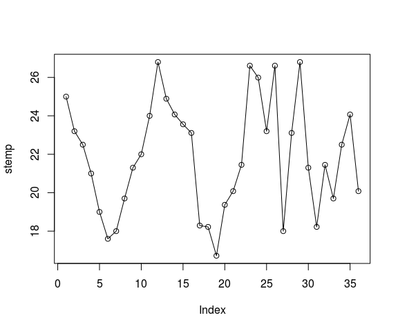
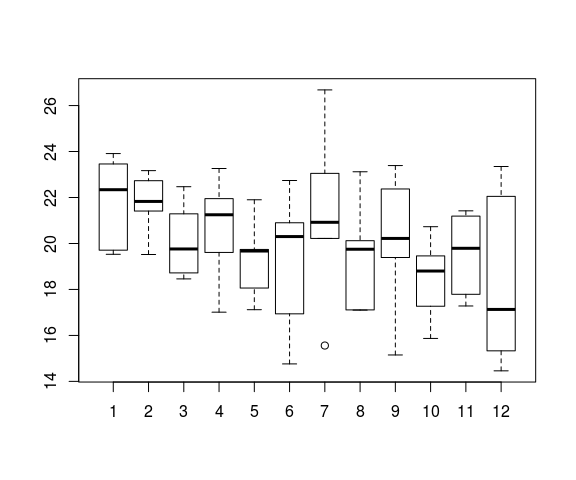
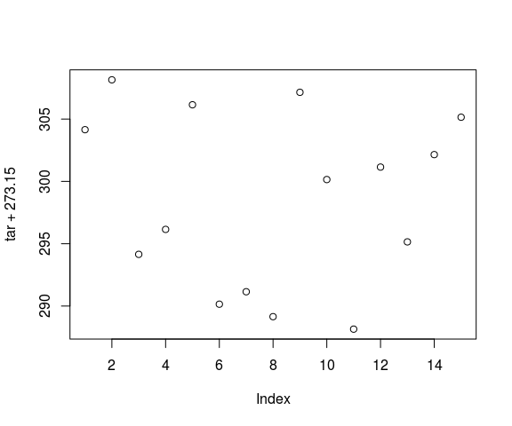

# Estrutura de dados do R
Jônatan Tatsch  
30-03-2015  


- - -


- - -

#  Estruturas de dados do R

Existem diferentes formas de objetos para armazenar dados no R. Algumas vezes os dados precisam ser armazenados de forma mais complexa do que simples vetores. O R possui uma variedade de estruturas. As mais utilizadas são *data frame* (tabela de dados), *matrix* (matriz), *list* (lista), *array* e *vector* (vetor) (**Figura 1**). Vetores foram vistos na unidade anterior. Agora veremos matrizes, arrays, listas e data frames.


# Matrix

Vetores são objetos unidimensionais. Vetores multidimensionais são denominados *arrays*. As matrizes são um caso especial de *array* em que o número de dimensões é igual a 2, uma dimensão são as linhas e a outra as colunas. Os dados armazenados em uma matriz são de uma única classe (ou `numeric`, ou `character`, por exemplo).

## Criação de matrizes

### Função `dim()` 

Podemos converter um vetor atômico em uma array de n dimensões através do atributo dimensão: `dim()`. Para fazer isso, definimos o atributo `dim`(dimensão) a um vetor numérico de tamanho `n`. 
O R reorganizará os elementos do vetor de acordo com as dimensões.


```r
v <- 1:12
length(v)
```

```
[1] 12
```

```r
attributes(v)
```

```
NULL
```

```r
class(v)
```

```
[1] "integer"
```

```r
## cópia de v0
vetor <- v
## conversão de vetor para matriz
dim(v) <- c(3, 4)  # 1a dimensão: linhas , 2a dimensão: colunas 
## vetor é vector?
is.vector(v)
```

```
[1] FALSE
```

```r
## vetor é matrix?
is.matrix(v)
```

```
[1] TRUE
```

```r
## classe de vetor
class(v)
```

```
[1] "matrix"
```

```r
attributes(v)
```

```
$dim
[1] 3 4
```

```r
v
```

```
     [,1] [,2] [,3] [,4]
[1,]    1    4    7   10
[2,]    2    5    8   11
[3,]    3    6    9   12
```

```r
## invertendo as dimensões
dim(v) <- c(4, 3)
v
```

```
     [,1] [,2] [,3]
[1,]    1    5    9
[2,]    2    6   10
[3,]    3    7   11
[4,]    4    8   12
```

```r
class(v)
```

```
[1] "matrix"
```

```r
mode(v)
```

```
[1] "numeric"
```

O R usa o primeiro valor de `dim()` para o número de linhas e o segundo para o número de colunas. De forma geral em operações que usam linhas e colunas, as linhas vem sempre em primeiro.
É importante notar que o R sempre preenche cada matriz ao longo das colunas ao invés das linhas.
Para mais controle na forma como R reorganiza os dados em linhas e colunas, podemos utilizar a função `matrix()` ou `array()`. Elas fazem a mesma coisa que a `dim()` porém com argumentos mais versáteis para este processo.

### Função `matrix` 

Note como os números foram distribuídos na matriz com 3 linhas e 4 colunas. Outra forma simples de se criar uma matriz é usando a função `matrix`.

Ao aplicarmos a função `matrix` a um vetor sem especificar nenhum argumento ela produz uma matriz de uma coluna.


```r
## atribuindo novas dimensões ao vetor
m <- matrix(vetor)  # matriz de uma coluna
m
```

```
      [,1]
 [1,]    1
 [2,]    2
 [3,]    3
 [4,]    4
 [5,]    5
 [6,]    6
 [7,]    7
 [8,]    8
 [9,]    9
[10,]   10
[11,]   11
[12,]   12
```

Se desejamos construir uma matriz com 3 linhas e 4 colunas a partir do vetor `vetor` podemos usar as seguintes expressões equivalentes:


```r
## criando a matriz gerada com dim
mat <- matrix(vetor, nrow = 3, ncol = 4)
mat
```

```
     [,1] [,2] [,3] [,4]
[1,]    1    4    7   10
[2,]    2    5    8   11
[3,]    3    6    9   12
```

```r
## não há necessidade de especificar ambos ncol e nrow
mat <- matrix(vetor, nrow = 3)
mat
```

```
     [,1] [,2] [,3] [,4]
[1,]    1    4    7   10
[2,]    2    5    8   11
[3,]    3    6    9   12
```

Poderíamos criar a matriz `mat` especificando os elementos individualmente:


```r
## criando a matriz gerada com dim
mat <- matrix(nrow = 3, ncol = 4)
mat
```

```
     [,1] [,2] [,3] [,4]
[1,]   NA   NA   NA   NA
[2,]   NA   NA   NA   NA
[3,]   NA   NA   NA   NA
```

```r
mat[1, 1] <- 1
mat[2, 1] <- 2
mat[3, 1] <- 3
mat[1, 2] <- 4
mat[2, 2] <- 5
mat[3, 2] <- 6
mat[1, 3] <- 7
mat[2, 3] <- 8
mat[3, 3] <- 9
mat[1, 4] <- 10
mat[2, 4] <- 11
mat[3, 4] <- 12
mat
```

```
     [,1] [,2] [,3] [,4]
[1,]    1    4    7   10
[2,]    2    5    8   11
[3,]    3    6    9   12
```

No exemplo a seguir os dados do vetor aparecem distribuídos ao longo das linhas e não das colunas como no caso acima. Nós definimos isso com o argumento **`byrow = TRUE`** da função `matrix`:


```r
## byrow = T
mat <- matrix(vetor, ncol = 4, byrow = T)
mat
```

```
     [,1] [,2] [,3] [,4]
[1,]    1    2    3    4
[2,]    5    6    7    8
[3,]    9   10   11   12
```

## Nomes das linhas e colunas de uma matriz

Nas matrizes, assim como nos vetores, também é possível dar nomes aos elementos para tornar a leitura da informação mais clara. 
Vamos usar os vetores de temperatura mensal dos anos de `1990:1992`para construir uma matriz com os meses ao longo das colunas e  os anos ao longo das linhas. 


```r
## temperatura do ar média mensal do ano de 1990
temp90 <- c(25, 23.2, 22.5, 21, 19, 17.6, 18, 19.7, 21.3, 22, 24, 26.8)
## temperatura do ar média mensal do ano de 1991
temp91 <- c(24.89, 24.07, 23.56, 23.11, 18.29, 18.22, 16.72, 19.37, 20.08, 21.45, 
    26.61, 25.99)
## temperatura do ar média mensal do ano de 1992
temp92 <- c(23.2, 26.61, 18, 23.11, 26.8, 21.3, 18.22, 21.45, 19.7, 22.5, 24.07, 
    20.08)
## vetor com as temperaturas dos 3 anos
vtemp <- c(temp90, temp91, temp92)
vtemp
```

```
 [1] 25.00 23.20 22.50 21.00 19.00 17.60 18.00 19.70 21.30 22.00 24.00
[12] 26.80 24.89 24.07 23.56 23.11 18.29 18.22 16.72 19.37 20.08 21.45
[23] 26.61 25.99 23.20 26.61 18.00 23.11 26.80 21.30 18.22 21.45 19.70
[34] 22.50 24.07 20.08
```

```r
## arranjar matrix com meses ao longo das colunas e anos ao longo das linhas
temp_mat <- matrix(vtemp, ncol = 12, byrow = T)
temp_mat
```

```
      [,1]  [,2]  [,3]  [,4]  [,5]  [,6]  [,7]  [,8]  [,9] [,10] [,11]
[1,] 25.00 23.20 22.50 21.00 19.00 17.60 18.00 19.70 21.30 22.00 24.00
[2,] 24.89 24.07 23.56 23.11 18.29 18.22 16.72 19.37 20.08 21.45 26.61
[3,] 23.20 26.61 18.00 23.11 26.80 21.30 18.22 21.45 19.70 22.50 24.07
     [,12]
[1,] 26.80
[2,] 25.99
[3,] 20.08
```

```r
## cópia da matriz temp_mat (sem nomes)
temp_matO <- temp_mat
```

Atribuindo nomes às linhas (`rownames`) e colunas (`colnames`) da matriz criada dos vetores de temperatura mensal (`temp_mat`).


```r
## atribuindo nomes as colunas e linhas da temp_mat
rownames(temp_mat) <- c("ano1990", "ano1991", "ano1992")
colnames(temp_mat) <- c("Jan", "Fev", "Mar", "Abr", "Mai", "Jun", "Jul", "Ago", 
    "Set", "Out", "Nov", "Dez")
temp_mat
```

```
          Jan   Fev   Mar   Abr   Mai   Jun   Jul   Ago   Set   Out   Nov
ano1990 25.00 23.20 22.50 21.00 19.00 17.60 18.00 19.70 21.30 22.00 24.00
ano1991 24.89 24.07 23.56 23.11 18.29 18.22 16.72 19.37 20.08 21.45 26.61
ano1992 23.20 26.61 18.00 23.11 26.80 21.30 18.22 21.45 19.70 22.50 24.07
          Dez
ano1990 26.80
ano1991 25.99
ano1992 20.08
```

## Indexação de matrizes

Como acessamos o valor de temperatura de maio de 1991 na matriz `temp_mat`?


```r
temp_mat  # matriz de temperaturas com nomes
```

```
          Jan   Fev   Mar   Abr   Mai   Jun   Jul   Ago   Set   Out   Nov
ano1990 25.00 23.20 22.50 21.00 19.00 17.60 18.00 19.70 21.30 22.00 24.00
ano1991 24.89 24.07 23.56 23.11 18.29 18.22 16.72 19.37 20.08 21.45 26.61
ano1992 23.20 26.61 18.00 23.11 26.80 21.30 18.22 21.45 19.70 22.50 24.07
          Dez
ano1990 26.80
ano1991 25.99
ano1992 20.08
```

```r
temp_matO  # matriz de temperaturas sem nomes
```

```
      [,1]  [,2]  [,3]  [,4]  [,5]  [,6]  [,7]  [,8]  [,9] [,10] [,11]
[1,] 25.00 23.20 22.50 21.00 19.00 17.60 18.00 19.70 21.30 22.00 24.00
[2,] 24.89 24.07 23.56 23.11 18.29 18.22 16.72 19.37 20.08 21.45 26.61
[3,] 23.20 26.61 18.00 23.11 26.80 21.30 18.22 21.45 19.70 22.50 24.07
     [,12]
[1,] 26.80
[2,] 25.99
[3,] 20.08
```

```r
## qual a linha do ano de 1991
linha <- 2
## qual a coluna do mês de maio
coluna <- 5
## extraindo
temp_mat[linha, coluna]
```

```
[1] 18.29
```

```r
## ou usando os nomes
temp_mat["ano1991", "Mai"]
```

```
[1] 18.29
```

Com o operador `[` podemos usar todos os esquemas de indexação vistos na Unidade de **Seleção e filtragem de dados**.


```r
## temperaturas de todos janeiros
temp_mat[, 1]
```

```
ano1990 ano1991 ano1992 
  25.00   24.89   23.20 
```

```r
temp_mat[, "Jan"]
```

```
ano1990 ano1991 ano1992 
  25.00   24.89   23.20 
```

```r
## só as temperaturas de 1990 e 1993
temp_mat[-2, ]
```

```
         Jan   Fev  Mar   Abr  Mai  Jun   Jul   Ago  Set  Out   Nov   Dez
ano1990 25.0 23.20 22.5 21.00 19.0 17.6 18.00 19.70 21.3 22.0 24.00 26.80
ano1992 23.2 26.61 18.0 23.11 26.8 21.3 18.22 21.45 19.7 22.5 24.07 20.08
```

```r
## só as temperaturas dos verões
temp_mat[, c(12, 1, 2)]
```

```
          Dez   Jan   Fev
ano1990 26.80 25.00 23.20
ano1991 25.99 24.89 24.07
ano1992 20.08 23.20 26.61
```

```r
## invertendo ordem das colunas
temp_mat[, ncol(temp_mat):1]
```

```
          Dez   Nov   Out   Set   Ago   Jul   Jun   Mai   Abr   Mar   Fev
ano1990 26.80 24.00 22.00 21.30 19.70 18.00 17.60 19.00 21.00 22.50 23.20
ano1991 25.99 26.61 21.45 20.08 19.37 16.72 18.22 18.29 23.11 23.56 24.07
ano1992 20.08 24.07 22.50 19.70 21.45 18.22 21.30 26.80 23.11 18.00 26.61
          Jan
ano1990 25.00
ano1991 24.89
ano1992 23.20
```

```r
## invertendo ordem das colunas e das linhas
temp_mat[3:1, 12:1]
```

```
          Dez   Nov   Out   Set   Ago   Jul   Jun   Mai   Abr   Mar   Fev
ano1992 20.08 24.07 22.50 19.70 21.45 18.22 21.30 26.80 23.11 18.00 26.61
ano1991 25.99 26.61 21.45 20.08 19.37 16.72 18.22 18.29 23.11 23.56 24.07
ano1990 26.80 24.00 22.00 21.30 19.70 18.00 17.60 19.00 21.00 22.50 23.20
          Jan
ano1992 23.20
ano1991 24.89
ano1990 25.00
```

```r
## invertendo ordem das colunas e das linhas
temp_mat[c(2, 1, 3), c(6:1, 12, 10:8)]
```

```
          Jun   Mai   Abr   Mar   Fev   Jan   Dez   Out   Set   Ago
ano1991 18.22 18.29 23.11 23.56 24.07 24.89 25.99 21.45 20.08 19.37
ano1990 17.60 19.00 21.00 22.50 23.20 25.00 26.80 22.00 21.30 19.70
ano1992 21.30 26.80 23.11 18.00 26.61 23.20 20.08 22.50 19.70 21.45
```

```r
## só as temperaturas dos invernos
temp_mat[, colnames(temp_mat) %in% c("Jun", "Jul", "Ago")]
```

```
          Jun   Jul   Ago
ano1990 17.60 18.00 19.70
ano1991 18.22 16.72 19.37
ano1992 21.30 18.22 21.45
```

```r
## exceto as temperaturas dos invernos
temp_mat[, -which(colnames(temp_mat) %in% c("Jun", "Jul", "Ago"))]
```

```
          Jan   Fev   Mar   Abr   Mai   Set   Out   Nov   Dez
ano1990 25.00 23.20 22.50 21.00 19.00 21.30 22.00 24.00 26.80
ano1991 24.89 24.07 23.56 23.11 18.29 20.08 21.45 26.61 25.99
ano1992 23.20 26.61 18.00 23.11 26.80 19.70 22.50 24.07 20.08
```

```r
## seleção de colunas intercaladas da matriz: mês sim, mês nao
temp_mat[, c(T, F)]
```

```
          Jan   Mar   Mai   Jul   Set   Nov
ano1990 25.00 22.50 19.00 18.00 21.30 24.00
ano1991 24.89 23.56 18.29 16.72 20.08 26.61
ano1992 23.20 18.00 26.80 18.22 19.70 24.07
```

```r
## 2 meses sim, 1 mes não
temp_mat[, c(T, T, F)]
```

```
          Jan   Fev   Abr   Mai   Jul   Ago   Out   Nov
ano1990 25.00 23.20 21.00 19.00 18.00 19.70 22.00 24.00
ano1991 24.89 24.07 23.11 18.29 16.72 19.37 21.45 26.61
ano1992 23.20 26.61 23.11 26.80 18.22 21.45 22.50 24.07
```

Podemos fazer uso do operador `[` de forma aninhada:


```r
temp_mat[, 1:6]
```

```
          Jan   Fev   Mar   Abr   Mai   Jun
ano1990 25.00 23.20 22.50 21.00 19.00 17.60
ano1991 24.89 24.07 23.56 23.11 18.29 18.22
ano1992 23.20 26.61 18.00 23.11 26.80 21.30
```

```r
temp_mat[, 1:6]["ano1991", ]
```

```
  Jan   Fev   Mar   Abr   Mai   Jun 
24.89 24.07 23.56 23.11 18.29 18.22 
```

```r
temp_mat[, 1:6]["ano1991", ][2:4]
```

```
  Fev   Mar   Abr 
24.07 23.56 23.11 
```

Podemos substituir valores de uma submatriz da matriz:


```r
M <- temp_mat
M
```

```
          Jan   Fev   Mar   Abr   Mai   Jun   Jul   Ago   Set   Out   Nov
ano1990 25.00 23.20 22.50 21.00 19.00 17.60 18.00 19.70 21.30 22.00 24.00
ano1991 24.89 24.07 23.56 23.11 18.29 18.22 16.72 19.37 20.08 21.45 26.61
ano1992 23.20 26.61 18.00 23.11 26.80 21.30 18.22 21.45 19.70 22.50 24.07
          Dez
ano1990 26.80
ano1991 25.99
ano1992 20.08
```

```r
## 1990 e 1992 os meses de jan e dez
M[c(1, 3), c(1, 12)]
```

```
         Jan   Dez
ano1990 25.0 26.80
ano1992 23.2 20.08
```

```r
## matriz com novos valores
matrix(c(21, 22, 23, 24), ncol = 2)
```

```
     [,1] [,2]
[1,]   21   23
[2,]   22   24
```

```r
## substituindo
M[c(1, 3), c(1, 12)] <- matrix(c(21, 22, 23, 24), ncol = 2)
M
```

```
          Jan   Fev   Mar   Abr   Mai   Jun   Jul   Ago   Set   Out   Nov
ano1990 21.00 23.20 22.50 21.00 19.00 17.60 18.00 19.70 21.30 22.00 24.00
ano1991 24.89 24.07 23.56 23.11 18.29 18.22 16.72 19.37 20.08 21.45 26.61
ano1992 22.00 26.61 18.00 23.11 26.80 21.30 18.22 21.45 19.70 22.50 24.07
          Dez
ano1990 23.00
ano1991 25.99
ano1992 24.00
```

Outro exemplo:


```r
mx <- matrix(nrow = 3, ncol = 3)
my <- matrix(c(4, 5, 2, 3), nrow = 2)
my
```

```
     [,1] [,2]
[1,]    4    2
[2,]    5    3
```

```r
mx[2:3, 2:3] <- my
mx
```

```
     [,1] [,2] [,3]
[1,]   NA   NA   NA
[2,]   NA    4    2
[3,]   NA    5    3
```

## Número de linhas e colunas de uma matriz


```r
M
```

```
          Jan   Fev   Mar   Abr   Mai   Jun   Jul   Ago   Set   Out   Nov
ano1990 21.00 23.20 22.50 21.00 19.00 17.60 18.00 19.70 21.30 22.00 24.00
ano1991 24.89 24.07 23.56 23.11 18.29 18.22 16.72 19.37 20.08 21.45 26.61
ano1992 22.00 26.61 18.00 23.11 26.80 21.30 18.22 21.45 19.70 22.50 24.07
          Dez
ano1990 23.00
ano1991 25.99
ano1992 24.00
```

```r
ncol(temp_mat)
```

```
[1] 12
```

```r
nrow(temp_mat)
```

```
[1] 3
```

```r
dim(temp_mat)
```

```
[1]  3 12
```

Existem funções específicas para saber a coluna e a linha cada elemento de uma matriz.


```r
## colunas de cada elemento da matriz
col(temp_mat)
```

```
     [,1] [,2] [,3] [,4] [,5] [,6] [,7] [,8] [,9] [,10] [,11] [,12]
[1,]    1    2    3    4    5    6    7    8    9    10    11    12
[2,]    1    2    3    4    5    6    7    8    9    10    11    12
[3,]    1    2    3    4    5    6    7    8    9    10    11    12
```

```r
## linhas de cada elemento da matriz
row(temp_mat)
```

```
     [,1] [,2] [,3] [,4] [,5] [,6] [,7] [,8] [,9] [,10] [,11] [,12]
[1,]    1    1    1    1    1    1    1    1    1     1     1     1
[2,]    2    2    2    2    2    2    2    2    2     2     2     2
[3,]    3    3    3    3    3    3    3    3    3     3     3     3
```

```r
## elementos de matriz
m <- matrix(1:16, nrow = 4, byrow = T)
m
```

```
     [,1] [,2] [,3] [,4]
[1,]    1    2    3    4
[2,]    5    6    7    8
[3,]    9   10   11   12
[4,]   13   14   15   16
```

```r
## nós veremos mais sobre a função paste futuramente
elementos <- paste("m", row(m), col(m), sep = "")
mel <- matrix(elementos, ncol = 4)
mel
```

```
     [,1]  [,2]  [,3]  [,4] 
[1,] "m11" "m12" "m13" "m14"
[2,] "m21" "m22" "m23" "m24"
[3,] "m31" "m32" "m33" "m34"
[4,] "m41" "m42" "m43" "m44"
```

```r
## qual colunas de M são idênticas a 1
col(m) == 1
```

```
     [,1]  [,2]  [,3]  [,4]
[1,] TRUE FALSE FALSE FALSE
[2,] TRUE FALSE FALSE FALSE
[3,] TRUE FALSE FALSE FALSE
[4,] TRUE FALSE FALSE FALSE
```

```r
## seleciona na M colunas idênticas a 1
mel[col(m) == 1]
```

```
[1] "m11" "m21" "m31" "m41"
```

```r
## qual colunas de M são idênticas a 1 ou 3?
col(m) == 1 | col(m) == 3
```

```
     [,1]  [,2] [,3]  [,4]
[1,] TRUE FALSE TRUE FALSE
[2,] TRUE FALSE TRUE FALSE
[3,] TRUE FALSE TRUE FALSE
[4,] TRUE FALSE TRUE FALSE
```

```r
## Usando operadores relacionais
row(m) == 1
```

```
      [,1]  [,2]  [,3]  [,4]
[1,]  TRUE  TRUE  TRUE  TRUE
[2,] FALSE FALSE FALSE FALSE
[3,] FALSE FALSE FALSE FALSE
[4,] FALSE FALSE FALSE FALSE
```

```r
col(m) == 3
```

```
      [,1]  [,2] [,3]  [,4]
[1,] FALSE FALSE TRUE FALSE
[2,] FALSE FALSE TRUE FALSE
[3,] FALSE FALSE TRUE FALSE
[4,] FALSE FALSE TRUE FALSE
```

```r
row(m) == 1 | col(m) == 3
```

```
      [,1]  [,2] [,3]  [,4]
[1,]  TRUE  TRUE TRUE  TRUE
[2,] FALSE FALSE TRUE FALSE
[3,] FALSE FALSE TRUE FALSE
[4,] FALSE FALSE TRUE FALSE
```

```r
## seleciona valores de M posicionados na linha 1 OU na coluna 6
mel[row(m) == 1 | col(m) == 4]
```

```
[1] "m11" "m12" "m13" "m14" "m24" "m34" "m44"
```

```r
m[row(m) == 1 | col(m) == 4]
```

```
[1]  1  2  3  4  8 12 16
```

```r
## seleciona valores de M posicionados na linha 1 E na coluna 6
mel[row(m) == 4 & col(m) == 4]
```

```
[1] "m44"
```

```r
m[row(m) == 4 & col(m) == 4]
```

```
[1] 16
```

## Acrescentando linhas e colunas a uma matriz


```r
(temp_mat_lin <- rbind(temp90, temp91, temp92))
```

```
        [,1]  [,2]  [,3]  [,4]  [,5]  [,6]  [,7]  [,8]  [,9] [,10] [,11]
temp90 25.00 23.20 22.50 21.00 19.00 17.60 18.00 19.70 21.30 22.00 24.00
temp91 24.89 24.07 23.56 23.11 18.29 18.22 16.72 19.37 20.08 21.45 26.61
temp92 23.20 26.61 18.00 23.11 26.80 21.30 18.22 21.45 19.70 22.50 24.07
       [,12]
temp90 26.80
temp91 25.99
temp92 20.08
```

```r
(temp_mat_col <- cbind(temp90, temp91, temp92))
```

```
      temp90 temp91 temp92
 [1,]   25.0  24.89  23.20
 [2,]   23.2  24.07  26.61
 [3,]   22.5  23.56  18.00
 [4,]   21.0  23.11  23.11
 [5,]   19.0  18.29  26.80
 [6,]   17.6  18.22  21.30
 [7,]   18.0  16.72  18.22
 [8,]   19.7  19.37  21.45
 [9,]   21.3  20.08  19.70
[10,]   22.0  21.45  22.50
[11,]   24.0  26.61  24.07
[12,]   26.8  25.99  20.08
```

```r
## recursão
rbind(1:10, 11, 21:25)
```

```
     [,1] [,2] [,3] [,4] [,5] [,6] [,7] [,8] [,9] [,10]
[1,]    1    2    3    4    5    6    7    8    9    10
[2,]   11   11   11   11   11   11   11   11   11    11
[3,]   21   22   23   24   25   21   22   23   24    25
```

```r
cbind(10:6, 5:4, 0)
```

```
Warning in cbind(10:6, 5:4, 0): number of rows of result is not a multiple
of vector length (arg 2)
```

```
     [,1] [,2] [,3]
[1,]   10    5    0
[2,]    9    4    0
[3,]    8    5    0
[4,]    7    4    0
[5,]    6    5    0
```

## Operações matriciais

A primeira entre as diversas funções de álgebra matricial no R é a transposta `t()`.

```r
temp_mat
```

```
          Jan   Fev   Mar   Abr   Mai   Jun   Jul   Ago   Set   Out   Nov
ano1990 25.00 23.20 22.50 21.00 19.00 17.60 18.00 19.70 21.30 22.00 24.00
ano1991 24.89 24.07 23.56 23.11 18.29 18.22 16.72 19.37 20.08 21.45 26.61
ano1992 23.20 26.61 18.00 23.11 26.80 21.30 18.22 21.45 19.70 22.50 24.07
          Dez
ano1990 26.80
ano1991 25.99
ano1992 20.08
```

```r
t(temp_mat)
```

```
    ano1990 ano1991 ano1992
Jan    25.0   24.89   23.20
Fev    23.2   24.07   26.61
Mar    22.5   23.56   18.00
Abr    21.0   23.11   23.11
Mai    19.0   18.29   26.80
Jun    17.6   18.22   21.30
Jul    18.0   16.72   18.22
Ago    19.7   19.37   21.45
Set    21.3   20.08   19.70
Out    22.0   21.45   22.50
Nov    24.0   26.61   24.07
Dez    26.8   25.99   20.08
```

```r
mel
```

```
     [,1]  [,2]  [,3]  [,4] 
[1,] "m11" "m12" "m13" "m14"
[2,] "m21" "m22" "m23" "m24"
[3,] "m31" "m32" "m33" "m34"
[4,] "m41" "m42" "m43" "m44"
```

```r
t(mel)
```

```
     [,1]  [,2]  [,3]  [,4] 
[1,] "m11" "m21" "m31" "m41"
[2,] "m12" "m22" "m32" "m42"
[3,] "m13" "m23" "m33" "m43"
[4,] "m14" "m24" "m34" "m44"
```

```r
## diagonal de mel
diag(mel)
```

```
[1] "m11" "m22" "m33" "m44"
```

### Multiplicação matricial

Operações algébricas, incluindo a multiplicação `*`, atuam elemento a elemento sobre matrizes. Mas se a intenção é fazer uma multiplicação matricial usamos o operador (`%*%`).


```r
## multiplicação de duas matrizes
A <- matrix(c(2, 1, 4, 3, 0, 5), ncol = 2)
A
```

```
     [,1] [,2]
[1,]    2    3
[2,]    1    0
[3,]    4    5
```

```r
B <- matrix(c(3, 2, 1, 4), ncol = 2)
B
```

```
     [,1] [,2]
[1,]    3    1
[2,]    2    4
```

```r
A * B
```

```
Error in A * B: non-conformable arrays
```

```r
prodMat <- A %*% B
prodMat
```

```
     [,1] [,2]
[1,]   12   14
[2,]    3    1
[3,]   22   24
```

```r
## multiplicação de uma matriz por um escalar
m
```

```
     [,1] [,2] [,3] [,4]
[1,]    1    2    3    4
[2,]    5    6    7    8
[3,]    9   10   11   12
[4,]   13   14   15   16
```

```r
m * 2
```

```
     [,1] [,2] [,3] [,4]
[1,]    2    4    6    8
[2,]   10   12   14   16
[3,]   18   20   22   24
[4,]   26   28   30   32
```

### Adição matricial


```r
m
```

```
     [,1] [,2] [,3] [,4]
[1,]    1    2    3    4
[2,]    5    6    7    8
[3,]    9   10   11   12
[4,]   13   14   15   16
```

```r
m + m
```

```
     [,1] [,2] [,3] [,4]
[1,]    2    4    6    8
[2,]   10   12   14   16
[3,]   18   20   22   24
[4,]   26   28   30   32
```

### Produto escalar


```r
u <- 1:3
v <- c(5, 12, 13)
u * v
```

```
[1]  5 24 39
```

```r
## produto escalar = u.v = 1*5 + 2*12 + 3*13
crossprod(u, v)
```

```
     [,1]
[1,]   68
```

### Determinante


```r
## matriz exemplo
mat_ex <- matrix(c(1, -7, 3, 5, -9, 2, 6, 6, 1), ncol = 3)
det(mat_ex)
```

```
[1] 182
```

### Solução de sistemas lineares
x1 + x2 = 2

-x1 + x2 = 4

 Qual os  valores de x1 e x2?

```r
## matrizes do sistema linear
coefs <- matrix(c(1, -1, 1, 1), ncol = 2)
y <- c(2, 4)
x <- solve(coefs, y)
x
```

```
[1] -1  3
```


## Conversão de `matrix` para `vector`

Frequentemente é mais conveniente trabalhar com um vetor do que com uma matriz, por isso precisamos saber como fazer o caminho inverso. Quando criamos uma matriz (p. ex.: `temp_mat`) no início da seção ela foi baseada em um vetor (`vtemp`). Como fazemos para voltar aquele vetor original a partir da matriz?


```r
## desmanchando matrizes
mel
```

```
     [,1]  [,2]  [,3]  [,4] 
[1,] "m11" "m12" "m13" "m14"
[2,] "m21" "m22" "m23" "m24"
[3,] "m31" "m32" "m33" "m34"
[4,] "m41" "m42" "m43" "m44"
```

```r
## note as diferenças
mel[1,1]
```

```
[1] "m11"
```

```r
mel[1]
```

```
[1] "m11"
```

```r
## resulta em uma submatriz
mel[1:4, 1:4]
```

```
     [,1]  [,2]  [,3]  [,4] 
[1,] "m11" "m12" "m13" "m14"
[2,] "m21" "m22" "m23" "m24"
[3,] "m31" "m32" "m33" "m34"
[4,] "m41" "m42" "m43" "m44"
```

```r
## resulta em um vetor
mel[1:4]
```

```
[1] "m11" "m21" "m31" "m41"
```

```r
## submatriz da temp_mat
temp_mat[1:3,1:3]
```

```
          Jan   Fev   Mar
ano1990 25.00 23.20 22.50
ano1991 24.89 24.07 23.56
ano1992 23.20 26.61 18.00
```

```r
## vetor gerado de 3 elementos de mat
temp_mat[1:3]
```

```
[1] 25.00 24.89 23.20
```

```r
## numero de elementos na matriz
nel <- nrow(temp_mat)*ncol(temp_mat)
nel
```

```
[1] 36
```

```r
temp_mat[1: nrow(temp_mat)*ncol(temp_mat) ]
```

```
[1] 23.11 21.45 20.08
```

```r
## vetor de temperaturas
vtemp <- temp_mat[1:(ncol(temp_mat)*nrow(temp_mat))]
vtemp
```

```
 [1] 25.00 24.89 23.20 23.20 24.07 26.61 22.50 23.56 18.00 21.00 23.11
[12] 23.11 19.00 18.29 26.80 17.60 18.22 21.30 18.00 16.72 18.22 19.70
[23] 19.37 21.45 21.30 20.08 19.70 22.00 21.45 22.50 24.00 26.61 24.07
[34] 26.80 25.99 20.08
```

```r
## outra forma de converte temp_mat para vetor
c(temp_mat)
```

```
 [1] 25.00 24.89 23.20 23.20 24.07 26.61 22.50 23.56 18.00 21.00 23.11
[12] 23.11 19.00 18.29 26.80 17.60 18.22 21.30 18.00 16.72 18.22 19.70
[23] 19.37 21.45 21.30 20.08 19.70 22.00 21.45 22.50 24.00 26.61 24.07
[34] 26.80 25.99 20.08
```

```r
## função formal para converter 
as.vector(temp_mat)
```

```
 [1] 25.00 24.89 23.20 23.20 24.07 26.61 22.50 23.56 18.00 21.00 23.11
[12] 23.11 19.00 18.29 26.80 17.60 18.22 21.30 18.00 16.72 18.22 19.70
[23] 19.37 21.45 21.30 20.08 19.70 22.00 21.45 22.50 24.00 26.61 24.07
[34] 26.80 25.99 20.08
```

```r
## mais uma forma de converte temp_mat para vetor
array(temp_mat)
```

```
 [1] 25.00 24.89 23.20 23.20 24.07 26.61 22.50 23.56 18.00 21.00 23.11
[12] 23.11 19.00 18.29 26.80 17.60 18.22 21.30 18.00 16.72 18.22 19.70
[23] 19.37 21.45 21.30 20.08 19.70 22.00 21.45 22.50 24.00 26.61 24.07
[34] 26.80 25.99 20.08
```

```r
## para desmanchar a matriz com os elementos seguindo a ordem das linhas 
c(t(temp_mat))
```

```
 [1] 25.00 23.20 22.50 21.00 19.00 17.60 18.00 19.70 21.30 22.00 24.00
[12] 26.80 24.89 24.07 23.56 23.11 18.29 18.22 16.72 19.37 20.08 21.45
[23] 26.61 25.99 23.20 26.61 18.00 23.11 26.80 21.30 18.22 21.45 19.70
[34] 22.50 24.07 20.08
```

```r
as.vector(t(temp_mat))
```

```
 [1] 25.00 23.20 22.50 21.00 19.00 17.60 18.00 19.70 21.30 22.00 24.00
[12] 26.80 24.89 24.07 23.56 23.11 18.29 18.22 16.72 19.37 20.08 21.45
[23] 26.61 25.99 23.20 26.61 18.00 23.11 26.80 21.30 18.22 21.45 19.70
[34] 22.50 24.07 20.08
```

```r
## serie temporal de temp_mat
stemp <- c(t(temp_mat))
plot(stemp, type = "o")
```

 

```r
## criar matriz com colunas temp e meses 1:12
cbind(rep(1:12, nrow(temp_mat)),stemp)
```

```
         stemp
 [1,]  1 25.00
 [2,]  2 23.20
 [3,]  3 22.50
 [4,]  4 21.00
 [5,]  5 19.00
 [6,]  6 17.60
 [7,]  7 18.00
 [8,]  8 19.70
 [9,]  9 21.30
[10,] 10 22.00
[11,] 11 24.00
[12,] 12 26.80
[13,]  1 24.89
[14,]  2 24.07
[15,]  3 23.56
[16,]  4 23.11
[17,]  5 18.29
[18,]  6 18.22
[19,]  7 16.72
[20,]  8 19.37
[21,]  9 20.08
[22,] 10 21.45
[23,] 11 26.61
[24,] 12 25.99
[25,]  1 23.20
[26,]  2 26.61
[27,]  3 18.00
[28,]  4 23.11
[29,]  5 26.80
[30,]  6 21.30
[31,]  7 18.22
[32,]  8 21.45
[33,]  9 19.70
[34,] 10 22.50
[35,] 11 24.07
[36,] 12 20.08
```

```r
## dados de temp e meses
tempdat <- cbind(1:12, stemp)
## plot da temperatura pelos meses (os meses repetem)
plot(tempdat, 
     type = "p", ## tipo de grafico: pontos
     pch = 20,   ## codigo numérico do simbolo do ponto
     col = rep(1:3, each = ncol(temp_mat)),  ## cores dos pontos
     cex = rep(seq(1, 2 , by = 0.5), each = ncol(temp_mat)), ## aumenta tamanho dos pontos
     las = 1,   ## orientação dos labels dos eixos perpendiculares ao eixo
     ylab = expression(Tar~(degree~C)), ## label da variável y
     xlab = "meses", ## label da variavel x
     main = "Temperatura mensal (1990-1992)" ## título
    )# end plot 
```

 

```r
## para entender a variação nas cores e símbolos usadas no gráfico
cbind(meses = 1:12, temp = stemp, 
      cores = rep(1:3, each = ncol(temp_mat)), ## cores
      simb_tam = rep(seq(1, 2 , by = 0.5), each = ncol(temp_mat))
      ) ## tamanho dos símbolos 
```

```
      meses  temp cores simb_tam
 [1,]     1 25.00     1      1.0
 [2,]     2 23.20     1      1.0
 [3,]     3 22.50     1      1.0
 [4,]     4 21.00     1      1.0
 [5,]     5 19.00     1      1.0
 [6,]     6 17.60     1      1.0
 [7,]     7 18.00     1      1.0
 [8,]     8 19.70     1      1.0
 [9,]     9 21.30     1      1.0
[10,]    10 22.00     1      1.0
[11,]    11 24.00     1      1.0
[12,]    12 26.80     1      1.0
[13,]     1 24.89     2      1.5
[14,]     2 24.07     2      1.5
[15,]     3 23.56     2      1.5
[16,]     4 23.11     2      1.5
[17,]     5 18.29     2      1.5
[18,]     6 18.22     2      1.5
[19,]     7 16.72     2      1.5
[20,]     8 19.37     2      1.5
[21,]     9 20.08     2      1.5
[22,]    10 21.45     2      1.5
[23,]    11 26.61     2      1.5
[24,]    12 25.99     2      1.5
[25,]     1 23.20     3      2.0
[26,]     2 26.61     3      2.0
[27,]     3 18.00     3      2.0
[28,]     4 23.11     3      2.0
[29,]     5 26.80     3      2.0
[30,]     6 21.30     3      2.0
[31,]     7 18.22     3      2.0
[32,]     8 21.45     3      2.0
[33,]     9 19.70     3      2.0
[34,]    10 22.50     3      2.0
[35,]    11 24.07     3      2.0
[36,]    12 20.08     3      2.0
```


# Array

*Arrays* são multidimensionais e matrizes são casos particulares de *arrays* com 2 dimensões: linhas e colunas. Mas podemos ter dados com n dimensões. Por exemplo, imagine o campo espacial de uma variável meteorológica. Uma matriz com valores de temperatura onde as colunas representam as longitudes e as linhas as latitudes. A esse campo pode ser associado um tempo em que a matriz de temperatura representa o estado térmico espacial daquele momento. Então podemos dizer que essa *array* possui 3 dimensões: latitude (linha), longitude (coluna) e tempo (camadas).

## Criação 


```r
v <- 1:12
## atribuindo novas dimensões ao vetor
dim(v) <- c(2, 2, 3)  # 1a dim: 3 linhas , 2a dim: 2 colunas, 3a dim: 2
v
```

```
, , 1

     [,1] [,2]
[1,]    1    3
[2,]    2    4

, , 2

     [,1] [,2]
[1,]    5    7
[2,]    6    8

, , 3

     [,1] [,2]
[1,]    9   11
[2,]   10   12
```

```r
## ou
a <- array(data = v, dim = c(3, 2, 2))
dim(a)
```

```
[1] 3 2 2
```

```r
length(a)
```

```
[1] 12
```

```r
class(a)
```

```
[1] "array"
```

```r
mode(a)
```

```
[1] "numeric"
```

```r
## exemplo de inicialização de uma array
array(data = 0, dim = c(3, 4, 2))
```

```
, , 1

     [,1] [,2] [,3] [,4]
[1,]    0    0    0    0
[2,]    0    0    0    0
[3,]    0    0    0    0

, , 2

     [,1] [,2] [,3] [,4]
[1,]    0    0    0    0
[2,]    0    0    0    0
[3,]    0    0    0    0
```

## Indexação

Suponha os campos espaciais médios mensais de temperatura. Podemos usar as mesmos procedimentos de seleção de matrizes para *arrays*.


```r
tempVals <- c(22.34, 19.8, 22.22, 19.27, 19.53, 19.81, 21.18, 24.44, 23.91, 
21.97, 21.14, 24.54, 23.46, 16.2, 19.93, 20.54, 19.71, 24.94, 
18.71, 21.8, 19.52, 23.44, 19.64, 15.88, 21.83, 19.16, 18.66, 
18.82, 22.73, 19.34, 18.89, 16.7, 21.41, 21.88, 14.95, 18.54, 
23.17, 17.67, 21.91, 19.93, 19.76, 24.32, 21.97, 19.65, 21.29, 
23.24, 22.59, 24.51, 22.47, 20.34, 19.82, 20.87, 18.46, 19.87, 
21.79, 21.94, 18.72, 20.17, 17.82, 16.17, 23.26, 19.83, 16.78, 
16.02, 19.61, 14.89, 19.17, 18.55, 17.01, 18.64, 18.35, 21.26, 
21.95, 18.05, 21.57, 17.86, 21.25, 21.62, 22.22, 23.26, 19.67, 
18.45, 20.38, 19.37, 19.74, 20.91, 16.01, 25.97, 21.9, 24.11, 
24.06, 17.95, 18.06, 20.06, 20.04, 21.24, 17.12, 21.29, 19.93, 
20.12, 20.3, 23.04, 19.16, 20.71, 22.74, 19.9, 20.89, 23.46, 
14.76, 19.71, 16.71, 19.72, 16.94, 23.89, 12.42, 17.01, 20.9, 
19.45, 14.89, 23.27, 20.22, 18.67, 24.12, 21.92, 26.68, 20.73, 
18.42, 19.51, 15.56, 20.6, 23.65, 19.54, 20.92, 17.52, 21.15, 
21.76, 23.05, 18.22, 20.3, 21.62, 19.75, 17.2, 22.08, 19.12, 
23.12, 19.25, 21.2, 15.85, 17.1, 18.59, 22.24, 15.2, 20.12, 18.19, 
20.14, 17.98, 17.11, 17.47, 20.25, 18.27, 22.37, 20.42, 19.87, 
20.94, 19.39, 17.53, 15.99, 21.01, 20.22, 15.18, 25.06, 19.89, 
15.15, 22.52, 20.95, 22.72, 23.39, 25.14, 18.41, 14.28, 19.46, 
20.77, 18.81, 19.74, 20.73, 15.97, 16.88, 21.55, 18.8, 19.53, 
20.31, 20.34, 17.27, 19.33, 22.75, 24.29, 15.87, 16.4, 22.8, 
22.84, 17.79, 18.97, 19.2, 20.59, 19.79, 17.8, 19.36, 22.8, 17.28, 
18.15, 16.48, 19.09, 21.19, 21.23, 22.4, 17.89, 21.42, 16.67, 
17.89, 17.18, 22.05, 19.62, 22.73, 20.12, 23.35, 19.07, 20.34, 
17.1, 15.33, 16.97, 22.93, 19.59, 17.13, 25.41, 18.74, 20.56, 
14.46, 19.47, 23.96, 17.15)
## array de temperaturas
atemp <- array(tempVals, dim=c(4,5,12))
atemp
```

```
, , 1

      [,1]  [,2]  [,3]  [,4]  [,5]
[1,] 22.34 19.53 23.91 23.46 19.71
[2,] 19.80 19.81 21.97 16.20 24.94
[3,] 22.22 21.18 21.14 19.93 18.71
[4,] 19.27 24.44 24.54 20.54 21.80

, , 2

      [,1]  [,2]  [,3]  [,4]  [,5]
[1,] 19.52 21.83 22.73 21.41 23.17
[2,] 23.44 19.16 19.34 21.88 17.67
[3,] 19.64 18.66 18.89 14.95 21.91
[4,] 15.88 18.82 16.70 18.54 19.93

, , 3

      [,1]  [,2]  [,3]  [,4]  [,5]
[1,] 19.76 21.29 22.47 18.46 18.72
[2,] 24.32 23.24 20.34 19.87 20.17
[3,] 21.97 22.59 19.82 21.79 17.82
[4,] 19.65 24.51 20.87 21.94 16.17

, , 4

      [,1]  [,2]  [,3]  [,4]  [,5]
[1,] 23.26 19.61 17.01 21.95 21.25
[2,] 19.83 14.89 18.64 18.05 21.62
[3,] 16.78 19.17 18.35 21.57 22.22
[4,] 16.02 18.55 21.26 17.86 23.26

, , 5

      [,1]  [,2]  [,3]  [,4]  [,5]
[1,] 19.67 19.74 21.90 18.06 17.12
[2,] 18.45 20.91 24.11 20.06 21.29
[3,] 20.38 16.01 24.06 20.04 19.93
[4,] 19.37 25.97 17.95 21.24 20.12

, , 6

      [,1]  [,2]  [,3]  [,4]  [,5]
[1,] 20.30 22.74 14.76 16.94 20.90
[2,] 23.04 19.90 19.71 23.89 19.45
[3,] 19.16 20.89 16.71 12.42 14.89
[4,] 20.71 23.46 19.72 17.01 23.27

, , 7

      [,1]  [,2]  [,3]  [,4]  [,5]
[1,] 20.22 26.68 15.56 20.92 23.05
[2,] 18.67 20.73 20.60 17.52 18.22
[3,] 24.12 18.42 23.65 21.15 20.30
[4,] 21.92 19.51 19.54 21.76 21.62

, , 8

      [,1]  [,2]  [,3]  [,4]  [,5]
[1,] 19.75 23.12 17.10 20.12 17.11
[2,] 17.20 19.25 18.59 18.19 17.47
[3,] 22.08 21.20 22.24 20.14 20.25
[4,] 19.12 15.85 15.20 17.98 18.27

, , 9

      [,1]  [,2]  [,3]  [,4]  [,5]
[1,] 22.37 19.39 20.22 15.15 23.39
[2,] 20.42 17.53 15.18 22.52 25.14
[3,] 19.87 15.99 25.06 20.95 18.41
[4,] 20.94 21.01 19.89 22.72 14.28

, , 10

      [,1]  [,2]  [,3]  [,4]  [,5]
[1,] 19.46 20.73 18.80 17.27 15.87
[2,] 20.77 15.97 19.53 19.33 16.40
[3,] 18.81 16.88 20.31 22.75 22.80
[4,] 19.74 21.55 20.34 24.29 22.84

, , 11

      [,1]  [,2]  [,3]  [,4]  [,5]
[1,] 17.79 19.79 17.28 21.19 21.42
[2,] 18.97 17.80 18.15 21.23 16.67
[3,] 19.20 19.36 16.48 22.40 17.89
[4,] 20.59 22.80 19.09 17.89 17.18

, , 12

      [,1]  [,2]  [,3]  [,4]  [,5]
[1,] 22.05 23.35 15.33 17.13 14.46
[2,] 19.62 19.07 16.97 25.41 19.47
[3,] 22.73 20.34 22.93 18.74 23.96
[4,] 20.12 17.10 19.59 20.56 17.15
```

```r
colnames(atemp) <- -45:-41
rownames(atemp) <- -19:-22
atemp
```

```
, , 1

      -45   -44   -43   -42   -41
-19 22.34 19.53 23.91 23.46 19.71
-20 19.80 19.81 21.97 16.20 24.94
-21 22.22 21.18 21.14 19.93 18.71
-22 19.27 24.44 24.54 20.54 21.80

, , 2

      -45   -44   -43   -42   -41
-19 19.52 21.83 22.73 21.41 23.17
-20 23.44 19.16 19.34 21.88 17.67
-21 19.64 18.66 18.89 14.95 21.91
-22 15.88 18.82 16.70 18.54 19.93

, , 3

      -45   -44   -43   -42   -41
-19 19.76 21.29 22.47 18.46 18.72
-20 24.32 23.24 20.34 19.87 20.17
-21 21.97 22.59 19.82 21.79 17.82
-22 19.65 24.51 20.87 21.94 16.17

, , 4

      -45   -44   -43   -42   -41
-19 23.26 19.61 17.01 21.95 21.25
-20 19.83 14.89 18.64 18.05 21.62
-21 16.78 19.17 18.35 21.57 22.22
-22 16.02 18.55 21.26 17.86 23.26

, , 5

      -45   -44   -43   -42   -41
-19 19.67 19.74 21.90 18.06 17.12
-20 18.45 20.91 24.11 20.06 21.29
-21 20.38 16.01 24.06 20.04 19.93
-22 19.37 25.97 17.95 21.24 20.12

, , 6

      -45   -44   -43   -42   -41
-19 20.30 22.74 14.76 16.94 20.90
-20 23.04 19.90 19.71 23.89 19.45
-21 19.16 20.89 16.71 12.42 14.89
-22 20.71 23.46 19.72 17.01 23.27

, , 7

      -45   -44   -43   -42   -41
-19 20.22 26.68 15.56 20.92 23.05
-20 18.67 20.73 20.60 17.52 18.22
-21 24.12 18.42 23.65 21.15 20.30
-22 21.92 19.51 19.54 21.76 21.62

, , 8

      -45   -44   -43   -42   -41
-19 19.75 23.12 17.10 20.12 17.11
-20 17.20 19.25 18.59 18.19 17.47
-21 22.08 21.20 22.24 20.14 20.25
-22 19.12 15.85 15.20 17.98 18.27

, , 9

      -45   -44   -43   -42   -41
-19 22.37 19.39 20.22 15.15 23.39
-20 20.42 17.53 15.18 22.52 25.14
-21 19.87 15.99 25.06 20.95 18.41
-22 20.94 21.01 19.89 22.72 14.28

, , 10

      -45   -44   -43   -42   -41
-19 19.46 20.73 18.80 17.27 15.87
-20 20.77 15.97 19.53 19.33 16.40
-21 18.81 16.88 20.31 22.75 22.80
-22 19.74 21.55 20.34 24.29 22.84

, , 11

      -45   -44   -43   -42   -41
-19 17.79 19.79 17.28 21.19 21.42
-20 18.97 17.80 18.15 21.23 16.67
-21 19.20 19.36 16.48 22.40 17.89
-22 20.59 22.80 19.09 17.89 17.18

, , 12

      -45   -44   -43   -42   -41
-19 22.05 23.35 15.33 17.13 14.46
-20 19.62 19.07 16.97 25.41 19.47
-21 22.73 20.34 22.93 18.74 23.96
-22 20.12 17.10 19.59 20.56 17.15
```

```r
## serie temporal do 1o ponto
atemp[1,1,]
```

```
 [1] 22.34 19.52 19.76 23.26 19.67 20.30 20.22 19.75 22.37 19.46 17.79
[12] 22.05
```

```r
atemp["-19","-45", ]
```

```
 [1] 22.34 19.52 19.76 23.26 19.67 20.30 20.22 19.75 22.37 19.46 17.79
[12] 22.05
```

```r
## para 1a faixa de latitude (-19), selecionamos
## os valores de temp de todas longitudes e todos tempos 
## longitudes ao longo das linhas e tempo ao longo das colunas
atemp[1,,]
```

```
     [,1]  [,2]  [,3]  [,4]  [,5]  [,6]  [,7]  [,8]  [,9] [,10] [,11]
-45 22.34 19.52 19.76 23.26 19.67 20.30 20.22 19.75 22.37 19.46 17.79
-44 19.53 21.83 21.29 19.61 19.74 22.74 26.68 23.12 19.39 20.73 19.79
-43 23.91 22.73 22.47 17.01 21.90 14.76 15.56 17.10 20.22 18.80 17.28
-42 23.46 21.41 18.46 21.95 18.06 16.94 20.92 20.12 15.15 17.27 21.19
-41 19.71 23.17 18.72 21.25 17.12 20.90 23.05 17.11 23.39 15.87 21.42
    [,12]
-45 22.05
-44 23.35
-43 15.33
-42 17.13
-41 14.46
```

```r
## plot de cada ponto
matplot(t(atemp[1, , ]), type = "l")
```

 

```r
## media zonal 
boxplot(atemp[1, , ])
```

 

```r
# para 2a faixa de longitude (-44), todas longitudes e tempos 
atemp[ , 2, ]
```

```
     [,1]  [,2]  [,3]  [,4]  [,5]  [,6]  [,7]  [,8]  [,9] [,10] [,11]
-19 19.53 21.83 21.29 19.61 19.74 22.74 26.68 23.12 19.39 20.73 19.79
-20 19.81 19.16 23.24 14.89 20.91 19.90 20.73 19.25 17.53 15.97 17.80
-21 21.18 18.66 22.59 19.17 16.01 20.89 18.42 21.20 15.99 16.88 19.36
-22 24.44 18.82 24.51 18.55 25.97 23.46 19.51 15.85 21.01 21.55 22.80
    [,12]
-19 23.35
-20 19.07
-21 20.34
-22 17.10
```

```r
## média meridional
colMeans(atemp[ , 2, ])
```

```
 [1] 21.2400 19.6175 22.9075 18.0550 20.6575 21.7475 21.3350 19.8550
 [9] 18.4800 18.7825 19.9375 19.9650
```

```r
## subdominio
atemp[3:4, 2:3, ]
```

```
, , 1

      -44   -43
-21 21.18 21.14
-22 24.44 24.54

, , 2

      -44   -43
-21 18.66 18.89
-22 18.82 16.70

, , 3

      -44   -43
-21 22.59 19.82
-22 24.51 20.87

, , 4

      -44   -43
-21 19.17 18.35
-22 18.55 21.26

, , 5

      -44   -43
-21 16.01 24.06
-22 25.97 17.95

, , 6

      -44   -43
-21 20.89 16.71
-22 23.46 19.72

, , 7

      -44   -43
-21 18.42 23.65
-22 19.51 19.54

, , 8

      -44   -43
-21 21.20 22.24
-22 15.85 15.20

, , 9

      -44   -43
-21 15.99 25.06
-22 21.01 19.89

, , 10

      -44   -43
-21 16.88 20.31
-22 21.55 20.34

, , 11

      -44   -43
-21 19.36 16.48
-22 22.80 19.09

, , 12

      -44   -43
-21 20.34 22.93
-22 17.10 19.59
```

```r
## sem a primeira linha
## sem a última coluna
## sem o primeiro e ultimo mes
atemp[ -1, -5, -c(1,12)]
```

```
, , 1

      -45   -44   -43   -42
-20 23.44 19.16 19.34 21.88
-21 19.64 18.66 18.89 14.95
-22 15.88 18.82 16.70 18.54

, , 2

      -45   -44   -43   -42
-20 24.32 23.24 20.34 19.87
-21 21.97 22.59 19.82 21.79
-22 19.65 24.51 20.87 21.94

, , 3

      -45   -44   -43   -42
-20 19.83 14.89 18.64 18.05
-21 16.78 19.17 18.35 21.57
-22 16.02 18.55 21.26 17.86

, , 4

      -45   -44   -43   -42
-20 18.45 20.91 24.11 20.06
-21 20.38 16.01 24.06 20.04
-22 19.37 25.97 17.95 21.24

, , 5

      -45   -44   -43   -42
-20 23.04 19.90 19.71 23.89
-21 19.16 20.89 16.71 12.42
-22 20.71 23.46 19.72 17.01

, , 6

      -45   -44   -43   -42
-20 18.67 20.73 20.60 17.52
-21 24.12 18.42 23.65 21.15
-22 21.92 19.51 19.54 21.76

, , 7

      -45   -44   -43   -42
-20 17.20 19.25 18.59 18.19
-21 22.08 21.20 22.24 20.14
-22 19.12 15.85 15.20 17.98

, , 8

      -45   -44   -43   -42
-20 20.42 17.53 15.18 22.52
-21 19.87 15.99 25.06 20.95
-22 20.94 21.01 19.89 22.72

, , 9

      -45   -44   -43   -42
-20 20.77 15.97 19.53 19.33
-21 18.81 16.88 20.31 22.75
-22 19.74 21.55 20.34 24.29

, , 10

      -45   -44   -43   -42
-20 18.97 17.80 18.15 21.23
-21 19.20 19.36 16.48 22.40
-22 20.59 22.80 19.09 17.89
```

```r
## compare
mean(atemp[ , , 1])
```

```
[1] 21.272
```

```r
mean(atemp[, , 2])
```

```
[1] 19.7035
```

```r
## demanchando uma array (conversão para vetor)
c(atemp)
```

```
  [1] 22.34 19.80 22.22 19.27 19.53 19.81 21.18 24.44 23.91 21.97 21.14
 [12] 24.54 23.46 16.20 19.93 20.54 19.71 24.94 18.71 21.80 19.52 23.44
 [23] 19.64 15.88 21.83 19.16 18.66 18.82 22.73 19.34 18.89 16.70 21.41
 [34] 21.88 14.95 18.54 23.17 17.67 21.91 19.93 19.76 24.32 21.97 19.65
 [45] 21.29 23.24 22.59 24.51 22.47 20.34 19.82 20.87 18.46 19.87 21.79
 [56] 21.94 18.72 20.17 17.82 16.17 23.26 19.83 16.78 16.02 19.61 14.89
 [67] 19.17 18.55 17.01 18.64 18.35 21.26 21.95 18.05 21.57 17.86 21.25
 [78] 21.62 22.22 23.26 19.67 18.45 20.38 19.37 19.74 20.91 16.01 25.97
 [89] 21.90 24.11 24.06 17.95 18.06 20.06 20.04 21.24 17.12 21.29 19.93
[100] 20.12 20.30 23.04 19.16 20.71 22.74 19.90 20.89 23.46 14.76 19.71
[111] 16.71 19.72 16.94 23.89 12.42 17.01 20.90 19.45 14.89 23.27 20.22
[122] 18.67 24.12 21.92 26.68 20.73 18.42 19.51 15.56 20.60 23.65 19.54
[133] 20.92 17.52 21.15 21.76 23.05 18.22 20.30 21.62 19.75 17.20 22.08
[144] 19.12 23.12 19.25 21.20 15.85 17.10 18.59 22.24 15.20 20.12 18.19
[155] 20.14 17.98 17.11 17.47 20.25 18.27 22.37 20.42 19.87 20.94 19.39
[166] 17.53 15.99 21.01 20.22 15.18 25.06 19.89 15.15 22.52 20.95 22.72
[177] 23.39 25.14 18.41 14.28 19.46 20.77 18.81 19.74 20.73 15.97 16.88
[188] 21.55 18.80 19.53 20.31 20.34 17.27 19.33 22.75 24.29 15.87 16.40
[199] 22.80 22.84 17.79 18.97 19.20 20.59 19.79 17.80 19.36 22.80 17.28
[210] 18.15 16.48 19.09 21.19 21.23 22.40 17.89 21.42 16.67 17.89 17.18
[221] 22.05 19.62 22.73 20.12 23.35 19.07 20.34 17.10 15.33 16.97 22.93
[232] 19.59 17.13 25.41 18.74 20.56 14.46 19.47 23.96 17.15
```

```r
c(atemp[ , , 1])
```

```
 [1] 22.34 19.80 22.22 19.27 19.53 19.81 21.18 24.44 23.91 21.97 21.14
[12] 24.54 23.46 16.20 19.93 20.54 19.71 24.94 18.71 21.80
```

```r
## para entender a forma como a matriz é convertida para vetor
matref <- cbind(mes = rep(1:12, each = 20), 
                elemat = rep(1:20, times = 12),  
                valores = c(atemp), 
                elearr = 1:(cumprod(dim(atemp))[3]))
matref
```

```
       mes elemat valores elearr
  [1,]   1      1   22.34      1
  [2,]   1      2   19.80      2
  [3,]   1      3   22.22      3
  [4,]   1      4   19.27      4
  [5,]   1      5   19.53      5
  [6,]   1      6   19.81      6
  [7,]   1      7   21.18      7
  [8,]   1      8   24.44      8
  [9,]   1      9   23.91      9
 [10,]   1     10   21.97     10
 [11,]   1     11   21.14     11
 [12,]   1     12   24.54     12
 [13,]   1     13   23.46     13
 [14,]   1     14   16.20     14
 [15,]   1     15   19.93     15
 [16,]   1     16   20.54     16
 [17,]   1     17   19.71     17
 [18,]   1     18   24.94     18
 [19,]   1     19   18.71     19
 [20,]   1     20   21.80     20
 [21,]   2      1   19.52     21
 [22,]   2      2   23.44     22
 [23,]   2      3   19.64     23
 [24,]   2      4   15.88     24
 [25,]   2      5   21.83     25
 [26,]   2      6   19.16     26
 [27,]   2      7   18.66     27
 [28,]   2      8   18.82     28
 [29,]   2      9   22.73     29
 [30,]   2     10   19.34     30
 [31,]   2     11   18.89     31
 [32,]   2     12   16.70     32
 [33,]   2     13   21.41     33
 [34,]   2     14   21.88     34
 [35,]   2     15   14.95     35
 [36,]   2     16   18.54     36
 [37,]   2     17   23.17     37
 [38,]   2     18   17.67     38
 [39,]   2     19   21.91     39
 [40,]   2     20   19.93     40
 [41,]   3      1   19.76     41
 [42,]   3      2   24.32     42
 [43,]   3      3   21.97     43
 [44,]   3      4   19.65     44
 [45,]   3      5   21.29     45
 [46,]   3      6   23.24     46
 [47,]   3      7   22.59     47
 [48,]   3      8   24.51     48
 [49,]   3      9   22.47     49
 [50,]   3     10   20.34     50
 [51,]   3     11   19.82     51
 [52,]   3     12   20.87     52
 [53,]   3     13   18.46     53
 [54,]   3     14   19.87     54
 [55,]   3     15   21.79     55
 [56,]   3     16   21.94     56
 [57,]   3     17   18.72     57
 [58,]   3     18   20.17     58
 [59,]   3     19   17.82     59
 [60,]   3     20   16.17     60
 [61,]   4      1   23.26     61
 [62,]   4      2   19.83     62
 [63,]   4      3   16.78     63
 [64,]   4      4   16.02     64
 [65,]   4      5   19.61     65
 [66,]   4      6   14.89     66
 [67,]   4      7   19.17     67
 [68,]   4      8   18.55     68
 [69,]   4      9   17.01     69
 [70,]   4     10   18.64     70
 [71,]   4     11   18.35     71
 [72,]   4     12   21.26     72
 [73,]   4     13   21.95     73
 [74,]   4     14   18.05     74
 [75,]   4     15   21.57     75
 [76,]   4     16   17.86     76
 [77,]   4     17   21.25     77
 [78,]   4     18   21.62     78
 [79,]   4     19   22.22     79
 [80,]   4     20   23.26     80
 [81,]   5      1   19.67     81
 [82,]   5      2   18.45     82
 [83,]   5      3   20.38     83
 [84,]   5      4   19.37     84
 [85,]   5      5   19.74     85
 [86,]   5      6   20.91     86
 [87,]   5      7   16.01     87
 [88,]   5      8   25.97     88
 [89,]   5      9   21.90     89
 [90,]   5     10   24.11     90
 [91,]   5     11   24.06     91
 [92,]   5     12   17.95     92
 [93,]   5     13   18.06     93
 [94,]   5     14   20.06     94
 [95,]   5     15   20.04     95
 [96,]   5     16   21.24     96
 [97,]   5     17   17.12     97
 [98,]   5     18   21.29     98
 [99,]   5     19   19.93     99
[100,]   5     20   20.12    100
[101,]   6      1   20.30    101
[102,]   6      2   23.04    102
[103,]   6      3   19.16    103
[104,]   6      4   20.71    104
[105,]   6      5   22.74    105
[106,]   6      6   19.90    106
[107,]   6      7   20.89    107
[108,]   6      8   23.46    108
[109,]   6      9   14.76    109
[110,]   6     10   19.71    110
[111,]   6     11   16.71    111
[112,]   6     12   19.72    112
[113,]   6     13   16.94    113
[114,]   6     14   23.89    114
[115,]   6     15   12.42    115
[116,]   6     16   17.01    116
[117,]   6     17   20.90    117
[118,]   6     18   19.45    118
[119,]   6     19   14.89    119
[120,]   6     20   23.27    120
[121,]   7      1   20.22    121
[122,]   7      2   18.67    122
[123,]   7      3   24.12    123
[124,]   7      4   21.92    124
[125,]   7      5   26.68    125
[126,]   7      6   20.73    126
[127,]   7      7   18.42    127
[128,]   7      8   19.51    128
[129,]   7      9   15.56    129
[130,]   7     10   20.60    130
[131,]   7     11   23.65    131
[132,]   7     12   19.54    132
[133,]   7     13   20.92    133
[134,]   7     14   17.52    134
[135,]   7     15   21.15    135
[136,]   7     16   21.76    136
[137,]   7     17   23.05    137
[138,]   7     18   18.22    138
[139,]   7     19   20.30    139
[140,]   7     20   21.62    140
[141,]   8      1   19.75    141
[142,]   8      2   17.20    142
[143,]   8      3   22.08    143
[144,]   8      4   19.12    144
[145,]   8      5   23.12    145
[146,]   8      6   19.25    146
[147,]   8      7   21.20    147
[148,]   8      8   15.85    148
[149,]   8      9   17.10    149
[150,]   8     10   18.59    150
[151,]   8     11   22.24    151
[152,]   8     12   15.20    152
[153,]   8     13   20.12    153
[154,]   8     14   18.19    154
[155,]   8     15   20.14    155
[156,]   8     16   17.98    156
[157,]   8     17   17.11    157
[158,]   8     18   17.47    158
[159,]   8     19   20.25    159
[160,]   8     20   18.27    160
[161,]   9      1   22.37    161
[162,]   9      2   20.42    162
[163,]   9      3   19.87    163
[164,]   9      4   20.94    164
[165,]   9      5   19.39    165
[166,]   9      6   17.53    166
[167,]   9      7   15.99    167
[168,]   9      8   21.01    168
[169,]   9      9   20.22    169
[170,]   9     10   15.18    170
[171,]   9     11   25.06    171
[172,]   9     12   19.89    172
[173,]   9     13   15.15    173
[174,]   9     14   22.52    174
[175,]   9     15   20.95    175
[176,]   9     16   22.72    176
[177,]   9     17   23.39    177
[178,]   9     18   25.14    178
[179,]   9     19   18.41    179
[180,]   9     20   14.28    180
[181,]  10      1   19.46    181
[182,]  10      2   20.77    182
[183,]  10      3   18.81    183
[184,]  10      4   19.74    184
[185,]  10      5   20.73    185
[186,]  10      6   15.97    186
[187,]  10      7   16.88    187
[188,]  10      8   21.55    188
[189,]  10      9   18.80    189
[190,]  10     10   19.53    190
[191,]  10     11   20.31    191
[192,]  10     12   20.34    192
[193,]  10     13   17.27    193
[194,]  10     14   19.33    194
[195,]  10     15   22.75    195
[196,]  10     16   24.29    196
[197,]  10     17   15.87    197
[198,]  10     18   16.40    198
[199,]  10     19   22.80    199
[200,]  10     20   22.84    200
[201,]  11      1   17.79    201
[202,]  11      2   18.97    202
[203,]  11      3   19.20    203
[204,]  11      4   20.59    204
[205,]  11      5   19.79    205
[206,]  11      6   17.80    206
[207,]  11      7   19.36    207
[208,]  11      8   22.80    208
[209,]  11      9   17.28    209
[210,]  11     10   18.15    210
[211,]  11     11   16.48    211
[212,]  11     12   19.09    212
[213,]  11     13   21.19    213
[214,]  11     14   21.23    214
[215,]  11     15   22.40    215
[216,]  11     16   17.89    216
[217,]  11     17   21.42    217
[218,]  11     18   16.67    218
[219,]  11     19   17.89    219
[220,]  11     20   17.18    220
[221,]  12      1   22.05    221
[222,]  12      2   19.62    222
[223,]  12      3   22.73    223
[224,]  12      4   20.12    224
[225,]  12      5   23.35    225
[226,]  12      6   19.07    226
[227,]  12      7   20.34    227
[228,]  12      8   17.10    228
[229,]  12      9   15.33    229
[230,]  12     10   16.97    230
[231,]  12     11   22.93    231
[232,]  12     12   19.59    232
[233,]  12     13   17.13    233
[234,]  12     14   25.41    234
[235,]  12     15   18.74    235
[236,]  12     16   20.56    236
[237,]  12     17   14.46    237
[238,]  12     18   19.47    238
[239,]  12     19   23.96    239
[240,]  12     20   17.15    240
```

```r
## seleção lógica e substituição
atemp > 18
```

```
, , 1

     -45  -44  -43   -42  -41
-19 TRUE TRUE TRUE  TRUE TRUE
-20 TRUE TRUE TRUE FALSE TRUE
-21 TRUE TRUE TRUE  TRUE TRUE
-22 TRUE TRUE TRUE  TRUE TRUE

, , 2

      -45  -44   -43   -42   -41
-19  TRUE TRUE  TRUE  TRUE  TRUE
-20  TRUE TRUE  TRUE  TRUE FALSE
-21  TRUE TRUE  TRUE FALSE  TRUE
-22 FALSE TRUE FALSE  TRUE  TRUE

, , 3

     -45  -44  -43  -42   -41
-19 TRUE TRUE TRUE TRUE  TRUE
-20 TRUE TRUE TRUE TRUE  TRUE
-21 TRUE TRUE TRUE TRUE FALSE
-22 TRUE TRUE TRUE TRUE FALSE

, , 4

      -45   -44   -43   -42  -41
-19  TRUE  TRUE FALSE  TRUE TRUE
-20  TRUE FALSE  TRUE  TRUE TRUE
-21 FALSE  TRUE  TRUE  TRUE TRUE
-22 FALSE  TRUE  TRUE FALSE TRUE

, , 5

     -45   -44   -43  -42   -41
-19 TRUE  TRUE  TRUE TRUE FALSE
-20 TRUE  TRUE  TRUE TRUE  TRUE
-21 TRUE FALSE  TRUE TRUE  TRUE
-22 TRUE  TRUE FALSE TRUE  TRUE

, , 6

     -45  -44   -43   -42   -41
-19 TRUE TRUE FALSE FALSE  TRUE
-20 TRUE TRUE  TRUE  TRUE  TRUE
-21 TRUE TRUE FALSE FALSE FALSE
-22 TRUE TRUE  TRUE FALSE  TRUE

, , 7

     -45  -44   -43   -42  -41
-19 TRUE TRUE FALSE  TRUE TRUE
-20 TRUE TRUE  TRUE FALSE TRUE
-21 TRUE TRUE  TRUE  TRUE TRUE
-22 TRUE TRUE  TRUE  TRUE TRUE

, , 8

      -45   -44   -43   -42   -41
-19  TRUE  TRUE FALSE  TRUE FALSE
-20 FALSE  TRUE  TRUE  TRUE FALSE
-21  TRUE  TRUE  TRUE  TRUE  TRUE
-22  TRUE FALSE FALSE FALSE  TRUE

, , 9

     -45   -44   -43   -42   -41
-19 TRUE  TRUE  TRUE FALSE  TRUE
-20 TRUE FALSE FALSE  TRUE  TRUE
-21 TRUE FALSE  TRUE  TRUE  TRUE
-22 TRUE  TRUE  TRUE  TRUE FALSE

, , 10

     -45   -44  -43   -42   -41
-19 TRUE  TRUE TRUE FALSE FALSE
-20 TRUE FALSE TRUE  TRUE FALSE
-21 TRUE FALSE TRUE  TRUE  TRUE
-22 TRUE  TRUE TRUE  TRUE  TRUE

, , 11

      -45   -44   -43   -42   -41
-19 FALSE  TRUE FALSE  TRUE  TRUE
-20  TRUE FALSE  TRUE  TRUE FALSE
-21  TRUE  TRUE FALSE  TRUE FALSE
-22  TRUE  TRUE  TRUE FALSE FALSE

, , 12

     -45   -44   -43   -42   -41
-19 TRUE  TRUE FALSE FALSE FALSE
-20 TRUE  TRUE FALSE  TRUE  TRUE
-21 TRUE  TRUE  TRUE  TRUE  TRUE
-22 TRUE FALSE  TRUE  TRUE FALSE
```

```r
which(atemp > 18)
```

```
  [1]   1   2   3   4   5   6   7   8   9  10  11  12  13  15  16  17  18
 [18]  19  20  21  22  23  25  26  27  28  29  30  31  33  34  36  37  39
 [35]  40  41  42  43  44  45  46  47  48  49  50  51  52  53  54  55  56
 [52]  57  58  61  62  65  67  68  70  71  72  73  74  75  77  78  79  80
 [69]  81  82  83  84  85  86  88  89  90  91  93  94  95  96  98  99 100
 [86] 101 102 103 104 105 106 107 108 110 112 114 117 118 120 121 122 123
[103] 124 125 126 127 128 130 131 132 133 135 136 137 138 139 140 141 143
[120] 144 145 146 147 150 151 153 154 155 159 160 161 162 163 164 165 168
[137] 169 171 172 174 175 176 177 178 179 181 182 183 184 185 188 189 190
[154] 191 192 194 195 196 199 200 202 203 204 205 207 208 210 212 213 214
[171] 215 217 221 222 223 224 225 226 227 231 232 234 235 236 238 239
```

```r
atemp[atemp > 18]
```

```
  [1] 22.34 19.80 22.22 19.27 19.53 19.81 21.18 24.44 23.91 21.97 21.14
 [12] 24.54 23.46 19.93 20.54 19.71 24.94 18.71 21.80 19.52 23.44 19.64
 [23] 21.83 19.16 18.66 18.82 22.73 19.34 18.89 21.41 21.88 18.54 23.17
 [34] 21.91 19.93 19.76 24.32 21.97 19.65 21.29 23.24 22.59 24.51 22.47
 [45] 20.34 19.82 20.87 18.46 19.87 21.79 21.94 18.72 20.17 23.26 19.83
 [56] 19.61 19.17 18.55 18.64 18.35 21.26 21.95 18.05 21.57 21.25 21.62
 [67] 22.22 23.26 19.67 18.45 20.38 19.37 19.74 20.91 25.97 21.90 24.11
 [78] 24.06 18.06 20.06 20.04 21.24 21.29 19.93 20.12 20.30 23.04 19.16
 [89] 20.71 22.74 19.90 20.89 23.46 19.71 19.72 23.89 20.90 19.45 23.27
[100] 20.22 18.67 24.12 21.92 26.68 20.73 18.42 19.51 20.60 23.65 19.54
[111] 20.92 21.15 21.76 23.05 18.22 20.30 21.62 19.75 22.08 19.12 23.12
[122] 19.25 21.20 18.59 22.24 20.12 18.19 20.14 20.25 18.27 22.37 20.42
[133] 19.87 20.94 19.39 21.01 20.22 25.06 19.89 22.52 20.95 22.72 23.39
[144] 25.14 18.41 19.46 20.77 18.81 19.74 20.73 21.55 18.80 19.53 20.31
[155] 20.34 19.33 22.75 24.29 22.80 22.84 18.97 19.20 20.59 19.79 19.36
[166] 22.80 18.15 19.09 21.19 21.23 22.40 21.42 22.05 19.62 22.73 20.12
[177] 23.35 19.07 20.34 22.93 19.59 25.41 18.74 20.56 19.47 23.96
```

```r
## verificando na matref
matref[which(atemp > 18), "valores"]
```

```
  [1] 22.34 19.80 22.22 19.27 19.53 19.81 21.18 24.44 23.91 21.97 21.14
 [12] 24.54 23.46 19.93 20.54 19.71 24.94 18.71 21.80 19.52 23.44 19.64
 [23] 21.83 19.16 18.66 18.82 22.73 19.34 18.89 21.41 21.88 18.54 23.17
 [34] 21.91 19.93 19.76 24.32 21.97 19.65 21.29 23.24 22.59 24.51 22.47
 [45] 20.34 19.82 20.87 18.46 19.87 21.79 21.94 18.72 20.17 23.26 19.83
 [56] 19.61 19.17 18.55 18.64 18.35 21.26 21.95 18.05 21.57 21.25 21.62
 [67] 22.22 23.26 19.67 18.45 20.38 19.37 19.74 20.91 25.97 21.90 24.11
 [78] 24.06 18.06 20.06 20.04 21.24 21.29 19.93 20.12 20.30 23.04 19.16
 [89] 20.71 22.74 19.90 20.89 23.46 19.71 19.72 23.89 20.90 19.45 23.27
[100] 20.22 18.67 24.12 21.92 26.68 20.73 18.42 19.51 20.60 23.65 19.54
[111] 20.92 21.15 21.76 23.05 18.22 20.30 21.62 19.75 22.08 19.12 23.12
[122] 19.25 21.20 18.59 22.24 20.12 18.19 20.14 20.25 18.27 22.37 20.42
[133] 19.87 20.94 19.39 21.01 20.22 25.06 19.89 22.52 20.95 22.72 23.39
[144] 25.14 18.41 19.46 20.77 18.81 19.74 20.73 21.55 18.80 19.53 20.31
[155] 20.34 19.33 22.75 24.29 22.80 22.84 18.97 19.20 20.59 19.79 19.36
[166] 22.80 18.15 19.09 21.19 21.23 22.40 21.42 22.05 19.62 22.73 20.12
[177] 23.35 19.07 20.34 22.93 19.59 25.41 18.74 20.56 19.47 23.96
```

```r
## substituindo temperaturas acima de 18 por 18
atemp[atemp > 18] <- 18
atemp
```

```
, , 1

    -45 -44 -43  -42 -41
-19  18  18  18 18.0  18
-20  18  18  18 16.2  18
-21  18  18  18 18.0  18
-22  18  18  18 18.0  18

, , 2

      -45 -44  -43   -42   -41
-19 18.00  18 18.0 18.00 18.00
-20 18.00  18 18.0 18.00 17.67
-21 18.00  18 18.0 14.95 18.00
-22 15.88  18 16.7 18.00 18.00

, , 3

    -45 -44 -43 -42   -41
-19  18  18  18  18 18.00
-20  18  18  18  18 18.00
-21  18  18  18  18 17.82
-22  18  18  18  18 16.17

, , 4

      -45   -44   -43   -42 -41
-19 18.00 18.00 17.01 18.00  18
-20 18.00 14.89 18.00 18.00  18
-21 16.78 18.00 18.00 18.00  18
-22 16.02 18.00 18.00 17.86  18

, , 5

    -45   -44   -43 -42   -41
-19  18 18.00 18.00  18 17.12
-20  18 18.00 18.00  18 18.00
-21  18 16.01 18.00  18 18.00
-22  18 18.00 17.95  18 18.00

, , 6

    -45 -44   -43   -42   -41
-19  18  18 14.76 16.94 18.00
-20  18  18 18.00 18.00 18.00
-21  18  18 16.71 12.42 14.89
-22  18  18 18.00 17.01 18.00

, , 7

    -45 -44   -43   -42 -41
-19  18  18 15.56 18.00  18
-20  18  18 18.00 17.52  18
-21  18  18 18.00 18.00  18
-22  18  18 18.00 18.00  18

, , 8

     -45   -44  -43   -42   -41
-19 18.0 18.00 17.1 18.00 17.11
-20 17.2 18.00 18.0 18.00 17.47
-21 18.0 18.00 18.0 18.00 18.00
-22 18.0 15.85 15.2 17.98 18.00

, , 9

    -45   -44   -43   -42   -41
-19  18 18.00 18.00 15.15 18.00
-20  18 17.53 15.18 18.00 18.00
-21  18 15.99 18.00 18.00 18.00
-22  18 18.00 18.00 18.00 14.28

, , 10

    -45   -44 -43   -42   -41
-19  18 18.00  18 17.27 15.87
-20  18 15.97  18 18.00 16.40
-21  18 16.88  18 18.00 18.00
-22  18 18.00  18 18.00 18.00

, , 11

      -45  -44   -43   -42   -41
-19 17.79 18.0 17.28 18.00 18.00
-20 18.00 17.8 18.00 18.00 16.67
-21 18.00 18.0 16.48 18.00 17.89
-22 18.00 18.0 18.00 17.89 17.18

, , 12

    -45  -44   -43   -42   -41
-19  18 18.0 15.33 17.13 14.46
-20  18 18.0 16.97 18.00 18.00
-21  18 18.0 18.00 18.00 18.00
-22  18 17.1 18.00 18.00 17.15
```

--------------------------

> 
> <----------- **Aula 7 finalizada aqui** ------------->
>

--------------------------

# List

Listas são o segundo tipo de vetor. O primeiro tipo nós já vimos, são os **vetores atômicos**, nos quais todos os elementos devem ser de uma mesma classe de objeto. Listas são uma estrutura de dados muito versátil por pelo menos 3 razões:

  1. Os elementos podem ser de diferentes classes de objetos (p.ex.: um elemento `numeric`, outro `character`);
  2. Cada elemento pode ter um tamanho diferente;
  3. Os elementos podem conter diferentes estrutura de dados (p.ex.: um elemento `matrix`, outro `vector`);
  
Dentro da lista o conjunto de objetos são ordenados e cada elemento pode conter sub-elementos.

## Criação

### `list()`

Listas podem ser criadas com a função `list()`. A especificação do conteúdo de uma lista é muito similar a da função `c()` vista anteriormente. Nós simplemente listamos os elementos da lista separados por uma vírgula dentro da função `list()`.


```r
## lista de dados heterogêneos
lst <- list(1:4, c(1.1, 2.3, 5.9), c(TRUE, FALSE), "R", list(0, 1))
lst
```

```
[[1]]
[1] 1 2 3 4

[[2]]
[1] 1.1 2.3 5.9

[[3]]
[1]  TRUE FALSE

[[4]]
[1] "R"

[[5]]
[[5]][[1]]
[1] 0

[[5]][[2]]
[1] 1
```

```r
## estrutura da lista
str(lst)
```

```
List of 5
 $ : int [1:4] 1 2 3 4
 $ : num [1:3] 1.1 2.3 5.9
 $ : logi [1:2] TRUE FALSE
 $ : chr "R"
 $ :List of 2
  ..$ : num 0
  ..$ : num 1
```

```r
## tamanho da lista (num. de componentes ou elementos)
length(lst)
```

```
[1] 5
```

Os índices em colchetes duplos `[[]]` identificam o elemento ou a componente da lista. Os índices em colchete simples `[]` indicam qual sub-elemento da lista está sendo mostrado. Por exemplo `1.1` é o primeiro sub-elemento do segundo elemento da lista `lst`. Desse aninhamento de elementos surge o sistema de indexação de listas. A estrutura de uma lista pode se tornar complicada com o aumento do grau de sub-elementos. Mas essa flexibilidade, faz das listas uma ferramenta de armazenamento de dados para todos propósitos.
Veremos que no R, listas são frequentemente usadas para armazenar a saída de funções com diversos resultados.


```r
## lista é recursiva?
is.recursive(lst)
```

```
[1] TRUE
```

Vamos ver um exemplo onde criamos uma lista com informações de duas estações meteorológicas.


```r
## matriz de dados meteorológicos da estação de Santa Maria
dados_sm <- cbind(tar = c(31, 35, 21, 23, 33, 17, 18, 16, 20, 25, 27, 30), 
                  prec = c(300, 200, 150, 120, 210, 110, 180, 140, 80, 160, 150, 100))
dados_sm
```

```
      tar prec
 [1,]  31  300
 [2,]  35  200
 [3,]  21  150
 [4,]  23  120
 [5,]  33  210
 [6,]  17  110
 [7,]  18  180
 [8,]  16  140
 [9,]  20   80
[10,]  25  160
[11,]  27  150
[12,]  30  100
```

```r
## lista com informações da estação de santa maria
sm_l <- list(c(-45, -23), 113, "Santa Maria", dados_sm)
sm_l
```

```
[[1]]
[1] -45 -23

[[2]]
[1] 113

[[3]]
[1] "Santa Maria"

[[4]]
      tar prec
 [1,]  31  300
 [2,]  35  200
 [3,]  21  150
 [4,]  23  120
 [5,]  33  210
 [6,]  17  110
 [7,]  18  180
 [8,]  16  140
 [9,]  20   80
[10,]  25  160
[11,]  27  150
[12,]  30  100
```

```r
## adicionar nomes aos elementos
names(sm_l) <- c("coords", "alt", "cidade", "dados")
sm_l
```

```
$coords
[1] -45 -23

$alt
[1] 113

$cidade
[1] "Santa Maria"

$dados
      tar prec
 [1,]  31  300
 [2,]  35  200
 [3,]  21  150
 [4,]  23  120
 [5,]  33  210
 [6,]  17  110
 [7,]  18  180
 [8,]  16  140
 [9,]  20   80
[10,]  25  160
[11,]  27  150
[12,]  30  100
```

```r
## matriz de dados meteorológicos da estação de Júlio de Castilhos
dados_jc <- cbind(tar  = c(22.5, 20, 18.75, 18, 20.25, 17.75, 19.5, 18.5, 17, 19, 18.75, 17.5),
                  prec = c(360, 310, 285, 270, 315, 265, 300, 280, 250, 290, 285, 260))
jc_l <- list(coords = c(-45.1, -23.2),
             alt = 900,
             cidade = "Júlio de Castilhos",
             dados = dados_jc)
## adicionar nomes aos elementos
names(jc_l) <- names(sm_l)
jc_l
```

```
$coords
[1] -45.1 -23.2

$alt
[1] 900

$cidade
[1] "Júlio de Castilhos"

$dados
        tar prec
 [1,] 22.50  360
 [2,] 20.00  310
 [3,] 18.75  285
 [4,] 18.00  270
 [5,] 20.25  315
 [6,] 17.75  265
 [7,] 19.50  300
 [8,] 18.50  280
 [9,] 17.00  250
[10,] 19.00  290
[11,] 18.75  285
[12,] 17.50  260
```

As informações de cada estação estão armazenadas em 2 listas. Mas é mais prático termos todas estações em um única lista:


```r
## combinando listas mantendo os elementos separadamente
dados_l <- list(sm_l, jc_l)
dados_l
```

```
[[1]]
[[1]]$coords
[1] -45 -23

[[1]]$alt
[1] 113

[[1]]$cidade
[1] "Santa Maria"

[[1]]$dados
      tar prec
 [1,]  31  300
 [2,]  35  200
 [3,]  21  150
 [4,]  23  120
 [5,]  33  210
 [6,]  17  110
 [7,]  18  180
 [8,]  16  140
 [9,]  20   80
[10,]  25  160
[11,]  27  150
[12,]  30  100


[[2]]
[[2]]$coords
[1] -45.1 -23.2

[[2]]$alt
[1] 900

[[2]]$cidade
[1] "Júlio de Castilhos"

[[2]]$dados
        tar prec
 [1,] 22.50  360
 [2,] 20.00  310
 [3,] 18.75  285
 [4,] 18.00  270
 [5,] 20.25  315
 [6,] 17.75  265
 [7,] 19.50  300
 [8,] 18.50  280
 [9,] 17.00  250
[10,] 19.00  290
[11,] 18.75  285
[12,] 17.50  260
```

```r
names(dados_l)
```

```
NULL
```

```r
names(dados_l) <- c("sm", "jc")
dados_l
```

```
$sm
$sm$coords
[1] -45 -23

$sm$alt
[1] 113

$sm$cidade
[1] "Santa Maria"

$sm$dados
      tar prec
 [1,]  31  300
 [2,]  35  200
 [3,]  21  150
 [4,]  23  120
 [5,]  33  210
 [6,]  17  110
 [7,]  18  180
 [8,]  16  140
 [9,]  20   80
[10,]  25  160
[11,]  27  150
[12,]  30  100


$jc
$jc$coords
[1] -45.1 -23.2

$jc$alt
[1] 900

$jc$cidade
[1] "Júlio de Castilhos"

$jc$dados
        tar prec
 [1,] 22.50  360
 [2,] 20.00  310
 [3,] 18.75  285
 [4,] 18.00  270
 [5,] 20.25  315
 [6,] 17.75  265
 [7,] 19.50  300
 [8,] 18.50  280
 [9,] 17.00  250
[10,] 19.00  290
[11,] 18.75  285
[12,] 17.50  260
```

```r
## como a lista é um tipo vetor, a função length() 
## fornece o número de elementos da lista
length(dados_l)
```

```
[1] 2
```

Para resumir a estrutura de uma lista (ou *data frame*) podemos usar a função `str()`:


```r
str(dados_l)
```

```
List of 2
 $ sm:List of 4
  ..$ coords: num [1:2] -45 -23
  ..$ alt   : num 113
  ..$ cidade: chr "Santa Maria"
  ..$ dados : num [1:12, 1:2] 31 35 21 23 33 17 18 16 20 25 ...
  .. ..- attr(*, "dimnames")=List of 2
  .. .. ..$ : NULL
  .. .. ..$ : chr [1:2] "tar" "prec"
 $ jc:List of 4
  ..$ coords: num [1:2] -45.1 -23.2
  ..$ alt   : num 900
  ..$ cidade: chr "Júlio de Castilhos"
  ..$ dados : num [1:12, 1:2] 22.5 20 18.8 18 20.2 ...
  .. ..- attr(*, "dimnames")=List of 2
  .. .. ..$ : NULL
  .. .. ..$ : chr [1:2] "tar" "prec"
```

As listas também poderiam ser combinadas com função concatena ou combina `c()`. 


```r
dados_l2 <- c(sm_l, jc_l)
dados_l2
```

```
$coords
[1] -45 -23

$alt
[1] 113

$cidade
[1] "Santa Maria"

$dados
      tar prec
 [1,]  31  300
 [2,]  35  200
 [3,]  21  150
 [4,]  23  120
 [5,]  33  210
 [6,]  17  110
 [7,]  18  180
 [8,]  16  140
 [9,]  20   80
[10,]  25  160
[11,]  27  150
[12,]  30  100

$coords
[1] -45.1 -23.2

$alt
[1] 900

$cidade
[1] "Júlio de Castilhos"

$dados
        tar prec
 [1,] 22.50  360
 [2,] 20.00  310
 [3,] 18.75  285
 [4,] 18.00  270
 [5,] 20.25  315
 [6,] 17.75  265
 [7,] 19.50  300
 [8,] 18.50  280
 [9,] 17.00  250
[10,] 19.00  290
[11,] 18.75  285
[12,] 17.50  260
```

```r
str(dados_l2)
```

```
List of 8
 $ coords: num [1:2] -45 -23
 $ alt   : num 113
 $ cidade: chr "Santa Maria"
 $ dados : num [1:12, 1:2] 31 35 21 23 33 17 18 16 20 25 ...
  ..- attr(*, "dimnames")=List of 2
  .. ..$ : NULL
  .. ..$ : chr [1:2] "tar" "prec"
 $ coords: num [1:2] -45.1 -23.2
 $ alt   : num 900
 $ cidade: chr "Júlio de Castilhos"
 $ dados : num [1:12, 1:2] 22.5 20 18.8 18 20.2 ...
  ..- attr(*, "dimnames")=List of 2
  .. ..$ : NULL
  .. ..$ : chr [1:2] "tar" "prec"
```

## Indexação

### Operador `[`

Assim como em vetores, podemos acessar os elementos de uma lista usando os colchetes `[` com índices numéricos positivos, negativos, caracteres (nomes dos elementos) e lógicos. As expressões abaixo, ilustram o uso dessas diferentes formas de seleçã de elementos e produzem o mesmo resultado.


```r
sm_l[1:2]
```

```
$coords
[1] -45 -23

$alt
[1] 113
```

```r
sm_l[-(3:length(sm_l))]
```

```
$coords
[1] -45 -23

$alt
[1] 113
```

```r
sm_l[c(TRUE, TRUE, FALSE, FALSE, FALSE)]
```

```
$coords
[1] -45 -23

$alt
[1] 113
```

```r
sm_l[c("coords", "alt", "cidade")]
```

```
$coords
[1] -45 -23

$alt
[1] 113

$cidade
[1] "Santa Maria"
```

O resultado da seleção do 1º e 2º elemento é uma lista menor que a original. Isso não é muito útil, uma vez que muitas funções do R não lidam com listas.  Por exemplo, se quiséssemos calcular a soma do vetor contido do primeiro elemento da lista `lst` obtém-se um erro.


```r
## seleção do 1º elemento da lst
lst[1]
```

```
[[1]]
[1] 1 2 3 4
```

```r
## o resultado da seleção é uma lista
mode(lst[1])
```

```
[1] "list"
```

```r
## a função sum() espera como entrada um vetor
sum(lst[1])
```

```
Error in sum(lst[1]): invalid 'type' (list) of argument
```

```r
## acessando elemento inexistente
lst[6]
```

```
[[1]]
NULL
```

Então ao selecionar elementos de uma lista com o operador `[` o resultado preserva a estrutura original do objeto. `lst` é uma lista e o resultado da seleção `lst[1]` também é uma lista.
**Portanto, a seleção de elementos com o operador `[` preserva a estrutura do objeto original**.   

### Operador `[[` e `$`

Entretanto na maioria das vezes estamos interessados no conteúdo dos elementos de uma lista. Para fazer isso há dois operadores: o duplo colchetes `[[` e o `$`. Para acessar elementos individuais de uma lista usamos o duplo colchetes `[[` especificando o número do elemento ou o nome. Essa forma de seleção de dados permite o acesso a um elemento por vez. 


```r
## 1º elemento de sm_l
sm_l[[1]]
```

```
[1] -45 -23
```

```r
sm_l[["coords"]]
```

```
[1] -45 -23
```

```r
## modo de sm_l
mode(sm_l)
```

```
[1] "list"
```

```r
## ultimo elemento de sm_l
sm_l[[length(sm_l)]]
```

```
      tar prec
 [1,]  31  300
 [2,]  35  200
 [3,]  21  150
 [4,]  23  120
 [5,]  33  210
 [6,]  17  110
 [7,]  18  180
 [8,]  16  140
 [9,]  20   80
[10,]  25  160
[11,]  27  150
[12,]  30  100
```

```r
sm_l[["dados"]]
```

```
      tar prec
 [1,]  31  300
 [2,]  35  200
 [3,]  21  150
 [4,]  23  120
 [5,]  33  210
 [6,]  17  110
 [7,]  18  180
 [8,]  16  140
 [9,]  20   80
[10,]  25  160
[11,]  27  150
[12,]  30  100
```

```r
## subelementos
dados_l[["sm"]][["cidade"]]
```

```
[1] "Santa Maria"
```

Para acessar o conteúdo de elementos de uma lista que possui nomes podemos também usar o  operador `$`. Ele funciona de forma similar ao duplo colchetes usado com o nome do elemento da lista. Mas esse operador tem duas vantagens: a IDE RStudio autocompleta o nome do elemento (usando a tecla `<tab>`) e o R aceita o nome parcial dos nomes dos elementos.


```r
## seleção de dados por nomes usando o símbolo $
dados_l$s
```

```
$coords
[1] -45 -23

$alt
[1] 113

$cidade
[1] "Santa Maria"

$dados
      tar prec
 [1,]  31  300
 [2,]  35  200
 [3,]  21  150
 [4,]  23  120
 [5,]  33  210
 [6,]  17  110
 [7,]  18  180
 [8,]  16  140
 [9,]  20   80
[10,]  25  160
[11,]  27  150
[12,]  30  100
```

```r
dados_l$j
```

```
$coords
[1] -45.1 -23.2

$alt
[1] 900

$cidade
[1] "Júlio de Castilhos"

$dados
        tar prec
 [1,] 22.50  360
 [2,] 20.00  310
 [3,] 18.75  285
 [4,] 18.00  270
 [5,] 20.25  315
 [6,] 17.75  265
 [7,] 19.50  300
 [8,] 18.50  280
 [9,] 17.00  250
[10,] 19.00  290
[11,] 18.75  285
[12,] 17.50  260
```

```r
dados_l$sm$dados
```

```
      tar prec
 [1,]  31  300
 [2,]  35  200
 [3,]  21  150
 [4,]  23  120
 [5,]  33  210
 [6,]  17  110
 [7,]  18  180
 [8,]  16  140
 [9,]  20   80
[10,]  25  160
[11,]  27  150
[12,]  30  100
```

```r
dados_l$sm$dados[5:8,1:2]
```

```
     tar prec
[1,]  33  210
[2,]  17  110
[3,]  18  180
[4,]  16  140
```

```r
dados_l$sm$dados[, "tar"]
```

```
 [1] 31 35 21 23 33 17 18 16 20 25 27 30
```

```r
dados_l$sm$dados[, "tar", drop = FALSE]
```

```
      tar
 [1,]  31
 [2,]  35
 [3,]  21
 [4,]  23
 [5,]  33
 [6,]  17
 [7,]  18
 [8,]  16
 [9,]  20
[10,]  25
[11,]  27
[12,]  30
```

### `vector()`

Outra forma de criar uma lista é usando a função `vector`. Para acessar os elementos da lista usamos o operador "[[" ou o operador "$".


```r
z <- vector(mode = "list")
## usando '[[' para criar os elementos que serão chamados a e b
z[[1]] <- 1:10
z[["b"]] <- "teste"
z
```

```
[[1]]
 [1]  1  2  3  4  5  6  7  8  9 10

$b
[1] "teste"
```

```r
## usando '$' para criar o elemento chamado c
z$c <- c(F, T)
```

## Conversão de lista para vetor e vice-versa.


```r
vet <- 1:10
vet
```

```
 [1]  1  2  3  4  5  6  7  8  9 10
```

```r
vet.list <- as.list(vet)
vet.list
```

```
[[1]]
[1] 1

[[2]]
[1] 2

[[3]]
[1] 3

[[4]]
[1] 4

[[5]]
[1] 5

[[6]]
[1] 6

[[7]]
[1] 7

[[8]]
[1] 8

[[9]]
[1] 9

[[10]]
[1] 10
```

```r
## desmanchando a lista
unlist(vet.list)
```

```
 [1]  1  2  3  4  5  6  7  8  9 10
```

```r
## deletando um elemento de uma lista
length(vet.list)
```

```
[1] 10
```

```r
vet.list[8] <- NULL
vet.list
```

```
[[1]]
[1] 1

[[2]]
[1] 2

[[3]]
[1] 3

[[4]]
[1] 4

[[5]]
[1] 5

[[6]]
[1] 6

[[7]]
[1] 7

[[8]]
[1] 9

[[9]]
[1] 10
```

```r
length(vet.list)
```

```
[1] 9
```

## Conversão de `list` para `data.frame`.


```r
sm_l
```

```
$coords
[1] -45 -23

$alt
[1] 113

$cidade
[1] "Santa Maria"

$dados
      tar prec
 [1,]  31  300
 [2,]  35  200
 [3,]  21  150
 [4,]  23  120
 [5,]  33  210
 [6,]  17  110
 [7,]  18  180
 [8,]  16  140
 [9,]  20   80
[10,]  25  160
[11,]  27  150
[12,]  30  100
```

```r
## ao inves da componente coords, criamos uma lon e lat
sm_l$lon <- sm_l$coords[1]
sm_l$lat <- sm_l$coords[2]
sm_l$coords <- NULL
sm_l
```

```
$alt
[1] 113

$cidade
[1] "Santa Maria"

$dados
      tar prec
 [1,]  31  300
 [2,]  35  200
 [3,]  21  150
 [4,]  23  120
 [5,]  33  210
 [6,]  17  110
 [7,]  18  180
 [8,]  16  140
 [9,]  20   80
[10,]  25  160
[11,]  27  150
[12,]  30  100

$lon
[1] -45

$lat
[1] -23
```

```r
## convertendo para data.frame
sm_df <- data.frame(sm_l)
sm_df
```

```
   alt      cidade dados.tar dados.prec lon lat
1  113 Santa Maria        31        300 -45 -23
2  113 Santa Maria        35        200 -45 -23
3  113 Santa Maria        21        150 -45 -23
4  113 Santa Maria        23        120 -45 -23
5  113 Santa Maria        33        210 -45 -23
6  113 Santa Maria        17        110 -45 -23
7  113 Santa Maria        18        180 -45 -23
8  113 Santa Maria        16        140 -45 -23
9  113 Santa Maria        20         80 -45 -23
10 113 Santa Maria        25        160 -45 -23
11 113 Santa Maria        27        150 -45 -23
12 113 Santa Maria        30        100 -45 -23
```


# Data-frame (*tabela de dados*)

Um `data-frame` é um objeto do R que é normalmente usado para guardar conjunto de dados na forma de tabela. A estrutura de um `data-frame`, é muito semelhante a de uma matriz. Mas a principal diferença e vantagem do `data-frame` é possibilidade de armazenar dados de diferentes modos (`character`, `numeric`, `logical` e etc) nas suas colunas, o que não é possível em uma matriz. Ou seja é uma estrutura de aramazenamento de dados heterogêneos. Matrizes, arrays e vetores só armazenam dados homogêneos.
Cada linha do `data-frame` corresponde a um registro da tabela. Cada coluna corresponde a uma variável a ser armazenada para cada registro da tabela.

## Criação

Uma das formas mais simples de se criar um data frame é através da função `data.frame()`.


```r
## criando um dataframe
dados.df <- data.frame(dates = c("2013-01-01", "2013-01-02", "2013-01-03", "2013-01-04", "2013-01-05", 
                                 "2013-01-06", "2013-01-07", "2013-01-08", "2013-01-09", "2013-01-10", 
                                 "2013-01-11", "2013-01-12", "2013-01-13", "2013-01-14", "2013-01-15"), 
                       cidade = rep("Santa Maria", 15),    
                       tar = c(31, 35, 21, 23, 33, 17, 18, 16, 34, 27, 15, 28, 22, 29, 32))  
dados.df
```

```
        dates      cidade tar
1  2013-01-01 Santa Maria  31
2  2013-01-02 Santa Maria  35
3  2013-01-03 Santa Maria  21
4  2013-01-04 Santa Maria  23
5  2013-01-05 Santa Maria  33
6  2013-01-06 Santa Maria  17
7  2013-01-07 Santa Maria  18
8  2013-01-08 Santa Maria  16
9  2013-01-09 Santa Maria  34
10 2013-01-10 Santa Maria  27
11 2013-01-11 Santa Maria  15
12 2013-01-12 Santa Maria  28
13 2013-01-13 Santa Maria  22
14 2013-01-14 Santa Maria  29
15 2013-01-15 Santa Maria  32
```

```r
class(dados.df)
```

```
[1] "data.frame"
```

```r
is.data.frame(dados.df)
```

```
[1] TRUE
```

Para um diagnóstico rápido das variáveis de um `data frame` usamos a função `str()`: 


```r
## Obtendo informações sobre o conjunto de dados
str(dados.df)
```

```
'data.frame':	15 obs. of  3 variables:
 $ dates : Factor w/ 15 levels "2013-01-01","2013-01-02",..: 1 2 3 4 5 6 7 8 9 10 ...
 $ cidade: Factor w/ 1 level "Santa Maria": 1 1 1 1 1 1 1 1 1 1 ...
 $ tar   : num  31 35 21 23 33 17 18 16 34 27 ...
```

A saída da função `str()`indica que há duas variáveis da classe `factor`.
Em um *data frame* vetores do tipo `character` são automaticamente convertidos em `factor`. Este comportamento *default* pode ser modificado configurando o parâmetro `stringsAsFactors = FALSE` na função `data.frame()`. Vamos recriar o *data frame* `dados.df` sem a conversão de `character` para `factor`.


```r
## criando um dataframe
dados.df <- data.frame(dates = c("2013-01-01", "2013-01-02", "2013-01-03", "2013-01-04", "2013-01-05", 
                                 "2013-01-06", "2013-01-07", "2013-01-08", "2013-01-09", "2013-01-10", 
                                 "2013-01-11", "2013-01-12", "2013-01-13", "2013-01-14", "2013-01-15"), 
                       cidade = rep("Santa Maria", 15),    
                       tar = c(31, 35, 21, 23, 33, 17, 18, 16, 34, 27, 15, 28, 22, 29, 32),
                       stringsAsFactors = FALSE)  
str(dados.df)
```

```
'data.frame':	15 obs. of  3 variables:
 $ dates : chr  "2013-01-01" "2013-01-02" "2013-01-03" "2013-01-04" ...
 $ cidade: chr  "Santa Maria" "Santa Maria" "Santa Maria" "Santa Maria" ...
 $ tar   : num  31 35 21 23 33 17 18 16 34 27 ...
```

A função `summary()` fornece um resumo estatísticos dos valores das variáveis de um *data frame*.


```r
## resumo estatístico dos dados
summary(dados.df)
```

```
    dates              cidade               tar      
 Length:15          Length:15          Min.   :15.0  
 Class :character   Class :character   1st Qu.:19.5  
 Mode  :character   Mode  :character   Median :27.0  
                                       Mean   :25.4  
                                       3rd Qu.:31.5  
                                       Max.   :35.0  
```

## Atributos de um `data frame`

*Data frame* é uma estrutura de dados avançada e possui diversos atributos. 


```r
## atributos
length(dados.df)
```

```
[1] 3
```

```r
## número de colunas
ncol(dados.df)
```

```
[1] 3
```

```r
## número de linhas
nrow(dados.df)
```

```
[1] 15
```

```r
## dimensões
dim(dados.df)
```

```
[1] 15  3
```

```r
## nomes podem ser atribuídos as linhas e as colunas
rownames(dados.df)
```

```
 [1] "1"  "2"  "3"  "4"  "5"  "6"  "7"  "8"  "9"  "10" "11" "12" "13" "14"
[15] "15"
```

```r
## novos nomes para as linhas de dados.df
rownames(dados.df) <- paste0("linha", rownames(dados.df))
dados.df
```

```
             dates      cidade tar
linha1  2013-01-01 Santa Maria  31
linha2  2013-01-02 Santa Maria  35
linha3  2013-01-03 Santa Maria  21
linha4  2013-01-04 Santa Maria  23
linha5  2013-01-05 Santa Maria  33
linha6  2013-01-06 Santa Maria  17
linha7  2013-01-07 Santa Maria  18
linha8  2013-01-08 Santa Maria  16
linha9  2013-01-09 Santa Maria  34
linha10 2013-01-10 Santa Maria  27
linha11 2013-01-11 Santa Maria  15
linha12 2013-01-12 Santa Maria  28
linha13 2013-01-13 Santa Maria  22
linha14 2013-01-14 Santa Maria  29
linha15 2013-01-15 Santa Maria  32
```

```r
## removendo nomes das linhas
rownames(dados.df) <- NULL
dados.df
```

```
        dates      cidade tar
1  2013-01-01 Santa Maria  31
2  2013-01-02 Santa Maria  35
3  2013-01-03 Santa Maria  21
4  2013-01-04 Santa Maria  23
5  2013-01-05 Santa Maria  33
6  2013-01-06 Santa Maria  17
7  2013-01-07 Santa Maria  18
8  2013-01-08 Santa Maria  16
9  2013-01-09 Santa Maria  34
10 2013-01-10 Santa Maria  27
11 2013-01-11 Santa Maria  15
12 2013-01-12 Santa Maria  28
13 2013-01-13 Santa Maria  22
14 2013-01-14 Santa Maria  29
15 2013-01-15 Santa Maria  32
```

```r
## mesmo que names(dados.df)
colnames(dados.df)
```

```
[1] "dates"  "cidade" "tar"   
```

```r
dimnames(dados.df)
```

```
[[1]]
 [1] "1"  "2"  "3"  "4"  "5"  "6"  "7"  "8"  "9"  "10" "11" "12" "13" "14"
[15] "15"

[[2]]
[1] "dates"  "cidade" "tar"   
```

```r
attributes(dados.df)
```

```
$names
[1] "dates"  "cidade" "tar"   

$row.names
 [1]  1  2  3  4  5  6  7  8  9 10 11 12 13 14 15

$class
[1] "data.frame"
```

```r
class(attributes(dados.df))
```

```
[1] "list"
```

## Acesso as variáveis de um `dataframe`

Existem várias formas de acessar as variáveis de um `dataframe`. Os operadores para extração de elementos são os mesmos utilizados para extração de elementos de uma lista: `[`, `[[` e `$`. Mas observe a diferença nos resultados extraídos com cada operador.


```r
## variáveis do dataframe
names(dados.df)
```

```
[1] "dates"  "cidade" "tar"   
```

```r
## acessando os dados de temperatura
dados.df[, 3]
```

```
 [1] 31 35 21 23 33 17 18 16 34 27 15 28 22 29 32
```

```r
## ou
dados.df[, "tar"]
```

```
 [1] 31 35 21 23 33 17 18 16 34 27 15 28 22 29 32
```

```r
## ou
dados.df$tar
```

```
 [1] 31 35 21 23 33 17 18 16 34 27 15 28 22 29 32
```

```r
is.vector(dados.df$tar)
```

```
[1] TRUE
```

```r
## note a diferença no resultado da extração
dados.df["tar"]
```

```
   tar
1   31
2   35
3   21
4   23
5   33
6   17
7   18
8   16
9   34
10  27
11  15
12  28
13  22
14  29
15  32
```

```r
class(dados.df["tar"])
```

```
[1] "data.frame"
```

```r
dados.df[["tar"]]
```

```
 [1] 31 35 21 23 33 17 18 16 34 27 15 28 22 29 32
```

```r
class(dados.df[["tar"]])
```

```
[1] "numeric"
```

```r
dados.df[, "tar"]
```

```
 [1] 31 35 21 23 33 17 18 16 34 27 15 28 22 29 32
```

```r
class(dados.df[, "tar"])
```

```
[1] "numeric"
```

Poratanto *data frames* tem as mesmas propriedades que matrizes (são retangulares)e algumas de listas (diferentes colunas podem conter diferentes tipos de objetos).

### Função `with()`

O acesso as variáveis de um data frame também é possível com a função `with(data, expr)`.


```r
## acesso a variáveis de um data frame
with(data = dados.df, expr = tar)
```

```
 [1] 31 35 21 23 33 17 18 16 34 27 15 28 22 29 32
```

```r
tar_k <- with(data = dados.df, expr = tar + 273.15)
tar_k
```

```
 [1] 304.15 308.15 294.15 296.15 306.15 290.15 291.15 289.15 307.15 300.15
[11] 288.15 301.15 295.15 302.15 305.15
```

```r
with(data = dados.df, expr = plot(tar + 273.15))
```

 

O arquimento pode ser substituído por qualquer expressão ou conjunto de expressões que envolvam as variáveis do *data frame* de entrada.

### Editando um `data frame` manualmente

É possível também editar os dados manualmente.


```r
## editar dados
fix(dados.df)
## inicializando um dataframe
x <- data.frame()
## digitando so dados
fix(x)
```

## Indexação, seleção e alteração 

Todos esquemas de  indexação usados para matrizes (seleção por índices, nomes, vetores lógicos - *ver Aula9*) podem ser usados com *data frames*.


```r
## todos dados exceto o primeiro e último registro
dados.df[-c(1, nrow(dados.df)), ]
```

```
        dates      cidade tar
2  2013-01-02 Santa Maria  35
3  2013-01-03 Santa Maria  21
4  2013-01-04 Santa Maria  23
5  2013-01-05 Santa Maria  33
6  2013-01-06 Santa Maria  17
7  2013-01-07 Santa Maria  18
8  2013-01-08 Santa Maria  16
9  2013-01-09 Santa Maria  34
10 2013-01-10 Santa Maria  27
11 2013-01-11 Santa Maria  15
12 2013-01-12 Santa Maria  28
13 2013-01-13 Santa Maria  22
14 2013-01-14 Santa Maria  29
```

```r
## temperatura dos primeiros 5 dias
dados.df[1:5, 3]
```

```
[1] 31 35 21 23 33
```

```r
## temperatura no dia 2013-01-09
dados.df[dados.df$dates == "2013-01-09", "tar"]
```

```
[1] 34
```

```r
## acrescentar uma nova variavel
dados.df$prec <- c(rep(0, 5), 10, 18, 4, 0, 0, 5, 0, 0, 2, 0)
dados.df
```

```
        dates      cidade tar prec
1  2013-01-01 Santa Maria  31    0
2  2013-01-02 Santa Maria  35    0
3  2013-01-03 Santa Maria  21    0
4  2013-01-04 Santa Maria  23    0
5  2013-01-05 Santa Maria  33    0
6  2013-01-06 Santa Maria  17   10
7  2013-01-07 Santa Maria  18   18
8  2013-01-08 Santa Maria  16    4
9  2013-01-09 Santa Maria  34    0
10 2013-01-10 Santa Maria  27    0
11 2013-01-11 Santa Maria  15    5
12 2013-01-12 Santa Maria  28    0
13 2013-01-13 Santa Maria  22    0
14 2013-01-14 Santa Maria  29    2
15 2013-01-15 Santa Maria  32    0
```

Uma função específica para gerar subconjunto de dados em `data frames` é a `subset()`. 


```r
## subconjunto baseado em condição lógica
ss1 <- subset(dados.df, dates == "2013-01-09", select = "tar")
ss1
```

```
  tar
9  34
```

```r
## subconjunto baseado em condição lógica
ss2 <- subset(dados.df, tar > 26 & prec > 0)
ss2
```

```
        dates      cidade tar prec
14 2013-01-14 Santa Maria  29    2
```

```r
## subconjunto baseado em condição lógica
ss3 <- subset(dados.df, tar > 26 | prec > 0)
ss3
```

```
        dates      cidade tar prec
1  2013-01-01 Santa Maria  31    0
2  2013-01-02 Santa Maria  35    0
5  2013-01-05 Santa Maria  33    0
6  2013-01-06 Santa Maria  17   10
7  2013-01-07 Santa Maria  18   18
8  2013-01-08 Santa Maria  16    4
9  2013-01-09 Santa Maria  34    0
10 2013-01-10 Santa Maria  27    0
11 2013-01-11 Santa Maria  15    5
12 2013-01-12 Santa Maria  28    0
14 2013-01-14 Santa Maria  29    2
15 2013-01-15 Santa Maria  32    0
```

```r
## subconjunto baseado em condição lógica
ss4 <- subset(dados.df, dates %in% c("2013-01-09", "2013-01-13", "2013-01-15"), select = -cidade)
ss4
```

```
        dates tar prec
9  2013-01-09  34    0
13 2013-01-13  22    0
15 2013-01-15  32    0
```

```r
## subconjunto baseado em condição lógica
ss4 <- subset(dados.df, ! dates %in% c("2013-01-09", "2013-01-13", "2013-01-15"), select = -cidade)
ss4
```

```
        dates tar prec
1  2013-01-01  31    0
2  2013-01-02  35    0
3  2013-01-03  21    0
4  2013-01-04  23    0
5  2013-01-05  33    0
6  2013-01-06  17   10
7  2013-01-07  18   18
8  2013-01-08  16    4
10 2013-01-10  27    0
11 2013-01-11  15    5
12 2013-01-12  28    0
14 2013-01-14  29    2
```

Uma função específica para alteração, remoção e inclusão de variáveis em um data frame é a `transform()`. Essa função é mais indicada para alteração de mais de uma variável de um *data frame*.


```r
## mudança do dataframe, alteração de várias variáveis
dados.df <- transform(dados.df,
                      cidade = ifelse(1:nrow(dados.df) > 8, "Sao Sepe", cidade),
                      dates = c(dates[1:8], dates[1:7]),
                      anomalias = ifelse(cidade == "Santa Maria", 
                                         tar-mean(tar[cidade == "Santa Maria"]), 
                                         tar-mean(tar[cidade == "Sao Sepe"]))
            )
## alterar so uma variavel
dados.df$anomalias.norm = ifelse(dados.df$cidade == "Santa Maria", 
                                dados.df$anomalias/sd(dados.df$anomalias[dados.df$cidade == "Santa Maria"]), 
                                dados.df$anomalias/sd(dados.df$anomalias[dados.df$cidade == "Sao Sepe"]) )
dados.df
```

```
        dates      cidade tar prec anomalias anomalias.norm
1  2013-01-01 Santa Maria  31    0       5.6      0.7321669
2  2013-01-02 Santa Maria  35    0       9.6      1.2551433
3  2013-01-03 Santa Maria  21    0      -4.4     -0.5752740
4  2013-01-04 Santa Maria  23    0      -2.4     -0.3137858
5  2013-01-05 Santa Maria  33    0       7.6      0.9936551
6  2013-01-06 Santa Maria  17   10      -8.4     -1.0982504
7  2013-01-07 Santa Maria  18   18      -7.4     -0.9675063
8  2013-01-08 Santa Maria  16    4      -9.4     -1.2289944
9  2013-01-01    Sao Sepe  34    0       8.6      1.3392114
10 2013-01-02    Sao Sepe  27    0       1.6      0.2491556
11 2013-01-03    Sao Sepe  15    5     -10.4     -1.6195115
12 2013-01-04    Sao Sepe  28    0       2.6      0.4048779
13 2013-01-05    Sao Sepe  22    0      -3.4     -0.5294557
14 2013-01-06    Sao Sepe  29    2       3.6      0.5606001
15 2013-01-07    Sao Sepe  32    0       6.6      1.0277669
```

## Combinando `dataframes`


```r
coords.df <- data.frame(lon = c(rep(-45, 8), rep(-45.1, 7)),  # longitudes
                        lat = c(rep(-23, 8), rep(-23.1, 7)))  # latitudes
d <- cbind(dados.df, coords.df)
d
```

```
        dates      cidade tar prec anomalias anomalias.norm   lon   lat
1  2013-01-01 Santa Maria  31    0       5.6      0.7321669 -45.0 -23.0
2  2013-01-02 Santa Maria  35    0       9.6      1.2551433 -45.0 -23.0
3  2013-01-03 Santa Maria  21    0      -4.4     -0.5752740 -45.0 -23.0
4  2013-01-04 Santa Maria  23    0      -2.4     -0.3137858 -45.0 -23.0
5  2013-01-05 Santa Maria  33    0       7.6      0.9936551 -45.0 -23.0
6  2013-01-06 Santa Maria  17   10      -8.4     -1.0982504 -45.0 -23.0
7  2013-01-07 Santa Maria  18   18      -7.4     -0.9675063 -45.0 -23.0
8  2013-01-08 Santa Maria  16    4      -9.4     -1.2289944 -45.0 -23.0
9  2013-01-01    Sao Sepe  34    0       8.6      1.3392114 -45.1 -23.1
10 2013-01-02    Sao Sepe  27    0       1.6      0.2491556 -45.1 -23.1
11 2013-01-03    Sao Sepe  15    5     -10.4     -1.6195115 -45.1 -23.1
12 2013-01-04    Sao Sepe  28    0       2.6      0.4048779 -45.1 -23.1
13 2013-01-05    Sao Sepe  22    0      -3.4     -0.5294557 -45.1 -23.1
14 2013-01-06    Sao Sepe  29    2       3.6      0.5606001 -45.1 -23.1
15 2013-01-07    Sao Sepe  32    0       6.6      1.0277669 -45.1 -23.1
```

```r
## usando a própria função data.frame()
d2 <- data.frame(dados.df, coords.df, stringsAsFactors = FALSE)
d2
```

```
        dates      cidade tar prec anomalias anomalias.norm   lon   lat
1  2013-01-01 Santa Maria  31    0       5.6      0.7321669 -45.0 -23.0
2  2013-01-02 Santa Maria  35    0       9.6      1.2551433 -45.0 -23.0
3  2013-01-03 Santa Maria  21    0      -4.4     -0.5752740 -45.0 -23.0
4  2013-01-04 Santa Maria  23    0      -2.4     -0.3137858 -45.0 -23.0
5  2013-01-05 Santa Maria  33    0       7.6      0.9936551 -45.0 -23.0
6  2013-01-06 Santa Maria  17   10      -8.4     -1.0982504 -45.0 -23.0
7  2013-01-07 Santa Maria  18   18      -7.4     -0.9675063 -45.0 -23.0
8  2013-01-08 Santa Maria  16    4      -9.4     -1.2289944 -45.0 -23.0
9  2013-01-01    Sao Sepe  34    0       8.6      1.3392114 -45.1 -23.1
10 2013-01-02    Sao Sepe  27    0       1.6      0.2491556 -45.1 -23.1
11 2013-01-03    Sao Sepe  15    5     -10.4     -1.6195115 -45.1 -23.1
12 2013-01-04    Sao Sepe  28    0       2.6      0.4048779 -45.1 -23.1
13 2013-01-05    Sao Sepe  22    0      -3.4     -0.5294557 -45.1 -23.1
14 2013-01-06    Sao Sepe  29    2       3.6      0.5606001 -45.1 -23.1
15 2013-01-07    Sao Sepe  32    0       6.6      1.0277669 -45.1 -23.1
```

```r
## verificando se os dois data frames são idênticos
identical(d, d2)
```

```
[1] TRUE
```

```r
## dados de Caçapava
cacapava <- data.frame(dates = "2013-01-01", 
                       cidade = "Cacapava", 
                       tar = 19,
                       prec= 0,
                       anomalias = NA, 
                       anomalias.norm = NA,
                       lon = -45.1,
                       lat = -23.2)
d <- rbind(d, cacapava)
d
```

```
        dates      cidade tar prec anomalias anomalias.norm   lon   lat
1  2013-01-01 Santa Maria  31    0       5.6      0.7321669 -45.0 -23.0
2  2013-01-02 Santa Maria  35    0       9.6      1.2551433 -45.0 -23.0
3  2013-01-03 Santa Maria  21    0      -4.4     -0.5752740 -45.0 -23.0
4  2013-01-04 Santa Maria  23    0      -2.4     -0.3137858 -45.0 -23.0
5  2013-01-05 Santa Maria  33    0       7.6      0.9936551 -45.0 -23.0
6  2013-01-06 Santa Maria  17   10      -8.4     -1.0982504 -45.0 -23.0
7  2013-01-07 Santa Maria  18   18      -7.4     -0.9675063 -45.0 -23.0
8  2013-01-08 Santa Maria  16    4      -9.4     -1.2289944 -45.0 -23.0
9  2013-01-01    Sao Sepe  34    0       8.6      1.3392114 -45.1 -23.1
10 2013-01-02    Sao Sepe  27    0       1.6      0.2491556 -45.1 -23.1
11 2013-01-03    Sao Sepe  15    5     -10.4     -1.6195115 -45.1 -23.1
12 2013-01-04    Sao Sepe  28    0       2.6      0.4048779 -45.1 -23.1
13 2013-01-05    Sao Sepe  22    0      -3.4     -0.5294557 -45.1 -23.1
14 2013-01-06    Sao Sepe  29    2       3.6      0.5606001 -45.1 -23.1
15 2013-01-07    Sao Sepe  32    0       6.6      1.0277669 -45.1 -23.1
16 2013-01-01    Cacapava  19    0        NA             NA -45.1 -23.2
```

## Teste e Coerção

Podemos converter um objeto para *data frame* com `as.data.frame()`:

+ Um vetor é transformado em um *data frame* de uma coluna;

+ Uma lista terá uma coluna para elemento, se os elementos não forem de mesmo tamanho haverá um erro;
+ Uma matriz cria um *data frame* com mesma estrutura de uma matriz;


```r
## convertendo lista para data frame
sm_l
```

```
$alt
[1] 113

$cidade
[1] "Santa Maria"

$dados
      tar prec
 [1,]  31  300
 [2,]  35  200
 [3,]  21  150
 [4,]  23  120
 [5,]  33  210
 [6,]  17  110
 [7,]  18  180
 [8,]  16  140
 [9,]  20   80
[10,]  25  160
[11,]  27  150
[12,]  30  100

$lon
[1] -45

$lat
[1] -23
```

```r
sm_l_df <- as.data.frame(sm_l)
## convertendo array para data frame
v
```

```
, , 1

     [,1] [,2]
[1,]    1    3
[2,]    2    4

, , 2

     [,1] [,2]
[1,]    5    7
[2,]    6    8

, , 3

     [,1] [,2]
[1,]    9   11
[2,]   10   12
```

```r
v_df <- as.data.frame(v)
## convertendo vetor para data frame
temp90_df <- as.data.frame(temp90)
## convertendo matrix para data frame
mat_ex
```

```
     [,1] [,2] [,3]
[1,]    1    5    6
[2,]   -7   -9    6
[3,]    3    2    1
```

```r
mat_ex_df <- as.data.frame(mat_ex)
names(mat_ex_df)
```

```
[1] "V1" "V2" "V3"
```

```r
## testes
is.data.frame(mat_ex_df)
```

```
[1] TRUE
```

```r
class(v_df)
```

```
[1] "data.frame"
```

```r
mode(v_df)
```

```
[1] "list"
```

--------------------------

> 
> <----------- **Aula 8 finalizada aqui** ------------->
>

--------------------------

